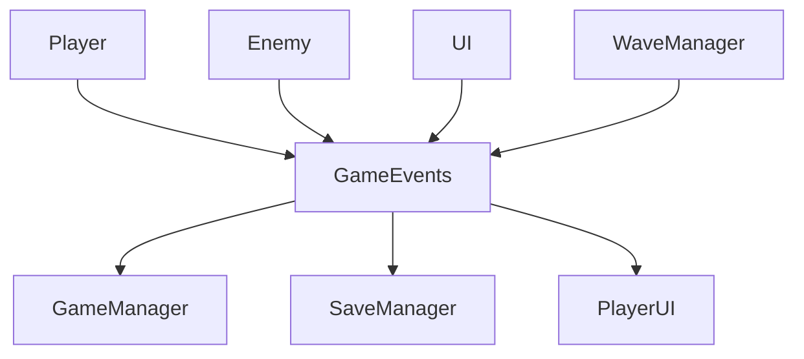

# System Architecture

## Overview

The FFS Wizard RPG implements a **component-based entity system** with **event-driven communication** and **modular singleton architecture**. The design emphasizes loose coupling, maintainability, and extensibility across all game systems.

## Architecture Pattern

### Component-Based Entity System

The game uses a hybrid approach combining Godot's scene system with component patterns:

- **Entities**: Game objects (Player, Enemy, Projectile) built from scene compositions
- **Components**: Modular systems that can be attached to entities
- **Systems**: Singleton managers that process components and handle game logic

### Event-Driven Communication

Systems communicate through the **GameEvents** singleton (`scripts/GameEvents.gd:1`) rather than direct references:



## Scene Tree Organization

### Core Scene Hierarchy

**Main Scene** (`res://scenes/Main.tscn`):
```
Main (Node2D)
├── GameWorld/
│   ├── Player
│   ├── UnifiedWorldManager
│   └── [Dynamic entities]
└── UI/
    ├── PlayerUI
    ├── SpellToolbar
    └── [UI overlays]
```

### Scene Composition Pattern

Entities follow a consistent composition pattern:

**Player Entity** (`scenes/gameplay/Player.tscn`):
```
Player (CharacterBody2D)
├── HealthComponent
├── MovementComponent
├── SpellComponent
├── PlayerVisuals
├── CameraComponent
└── [Collision shapes]
```

**Enemy Entity** (`scenes/Enemy.tscn`):
```
Enemy (CharacterBody2D)
├── HealthComponent
├── MovementComponent
├── AbilityManager
├── EnemyAIController
└── [Visual components]
```

## Node Hierarchy Patterns

### Component Attachment Pattern

Components are attached as child nodes with standardized names:
- `HealthComponent` - Health and damage management
- `MovementComponent` - Physics and movement
- `SpellComponent` - Spell casting for players
- `AbilityManager` - Enemy abilities and AI
- `PlayerVisuals` - Visual state management

### Manager-Component Relationship

Singleton managers orchestrate components:
- **GameManager** (`scripts/GameManager.gd:1`) - Core game state
- **WaveManager** (`scripts/WaveManager.gd`) - Enemy spawning
- **InputHandler** (`scripts/InputHandler.gd`) - Input processing
- **BiomeService** (`scripts/BiomeService.gd`) - World generation

## Signal/Event System Usage

### Primary Event Bus

**GameEvents** singleton provides centralized event management:

#### Core Events
- `player_moved(Vector2)` - Player position updates
- `player_health_changed(float, float)` - Health state changes
- `enemy_died(String, int)` - Enemy death with XP rewards
- `spell_cast(String, float)` - Spell casting events
- `wave_completed(int)` - Wave progression

#### Validation and Safety
Events include validation to prevent invalid data:
```gdscript
func emit_player_moved(new_position: Vector2) -> void:
    if new_position == Vector2.INF or new_position.length() > 100000:
        push_error("Invalid player position: " + str(new_position))
        return
    player_moved.emit(new_position)
```

### Signal Connection Patterns

Systems connect to events in `_ready()`:
```gdscript
func _ready():
    GameEvents.player_health_changed.connect(_on_player_health_changed)
    GameEvents.enemy_died.connect(_on_enemy_died)
```

## Singleton/Autoload Structure

### Core Management Layer

**Tier 1 - Foundation Systems:**
- `UnifiedDebugSystem` - Development and logging
- `GameEvents` - Event bus
- `GameConfig` - Global configuration
- `CollisionValidator` - Physics validation

**Tier 2 - Game Logic:**
- `GameManager` - Primary game state coordination
- `GameStateManager` - State persistence and transitions
- `WaveManager` - Enemy wave management
- `InputHandler` - Input processing

**Tier 3 - Data Management:**
- `SaveManager` - Game save/load operations
- `MetaSaveManager` - Meta-progression
- `RunSaveManager` - Run-specific data
- `SettingsManager` - Configuration management

**Tier 4 - Specialized Systems:**
- `BiomeService` - Procedural generation
- `PlayerTracker` - Player statistics
- `SceneTransition` - Scene management
- `AchievementNotificationManager` - Achievement UI

### Dependency Management

Singletons are loaded in dependency order via `project.godot` autoload configuration (18 total):

```ini
[autoload]
UnifiedDebugSystem="*res://scripts/debug/UnifiedDebugSystem.gd"
CollisionValidator="*res://scripts/CollisionValidator.gd"
GameEvents="*res://scripts/GameEvents.gd"
GameManager="*res://scripts/GameManager.gd"
MetaSaveManager="*res://scripts/core/MetaSaveManager.gd"
RunSaveManager="*res://scripts/core/RunSaveManager.gd"
GameStateManager="*res://scripts/core/GameStateManager.gd"
SettingsManager="*res://scripts/core/SettingsManager.gd"
SceneTransition="*res://scripts/ui/SceneTransition.gd"
WaveManager="*res://scripts/WaveManager.gd"
InputHandler="*res://scripts/InputHandler.gd"
StatAllocationManager="*res://scripts/items/managers/StatAllocationManager.gd"
CharacterSheetManager="*res://scripts/items/managers/CharacterSheetManager.gd"
AchievementNotificationManager="*res://scripts/singletons/AchievementNotificationManager.gd"
SaveManager="*res://scripts/core/save/SaveManager.gd"
GameConfig="*res://scripts/singletons/GameConfig.gd"
PlayerTracker="*res://scripts/singletons/PlayerTracker.gd"
BiomeService="*res://scripts/BiomeService.gd"
```

## Resource Management Approach

### Resource Organization

**Data Resources** (`data/` directory):
- `.tres` files for enemy data, abilities, and constants
- Centralized configuration through `GameConstants.tres`
- Modular ability definitions in `abilities/` subdirectory

**Asset Resources** (`assets/` directory):
- Sprites organized by category (`sprites/`, `effects/`)
- Procedural texture generation in code
- Import settings optimized for 2D performance

### Memory Management

**Object Pooling** implemented for high-frequency objects:
- `ProjectilePool.gd` - Spell projectile recycling
- `EnemyPool.gd` - Enemy instance management
- `ObjectPool.gd` - Generic pooling system

**Resource Loading Patterns:**
- Preload critical resources at startup
- Dynamic loading for optional content
- Cleanup through Godot's reference counting

## Data Flow Architecture

### Game Loop Flow

1. **Input Processing** (`InputHandler`) → Events
2. **Game Logic** (`GameManager`) → State updates
3. **Component Updates** → Entity behaviors
4. **Event Propagation** (`GameEvents`) → System notifications
5. **UI Updates** → Visual feedback
6. **Save State** → Persistence

### Component Communication

Components communicate through:
- **Direct references** for parent-child relationships
- **Events** for cross-system communication
- **Shared data** through singleton accessors

### Performance Considerations

**Optimization Strategies:**
- Event batching for high-frequency updates
- Component pooling for dynamic entities
- LOD systems for visual effects
- Spatial partitioning for collision detection

## Error Handling & Validation

### Validation Layer

**Runtime Validation:**
- `CollisionValidator` - Physics system integrity
- `SaveDataValidator` - Save file validation
- `DependencyValidator` - Component dependency checking

**Debug Systems:**
- `UnifiedDebugSystem` - Centralized logging
- Quality gates for critical systems
- Comprehensive error reporting

### Fault Tolerance

**Graceful Degradation:**
- Fallback systems for missing components
- Safe defaults for invalid data
- Recovery mechanisms for corrupted saves

## Extensibility Patterns

### Plugin Architecture

Systems designed for extension:
- Component interfaces (`IHealthComponent`, `IEnemyComponent`)
- Event-driven communication allows new system integration
- Modular ability system supports new spell types

### Configuration-Driven Design

**Data-Driven Systems:**
- Enemy behaviors defined in `.tres` files
- Spell parameters externalized to data files
- UI layouts configurable through scenes

This architecture supports the game's complexity while maintaining clean separation of concerns and enabling future expansion.