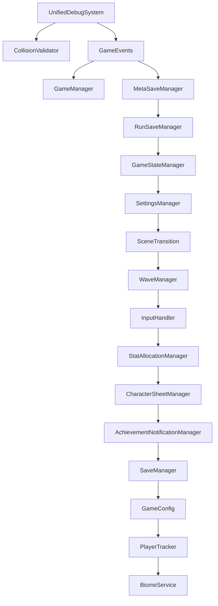
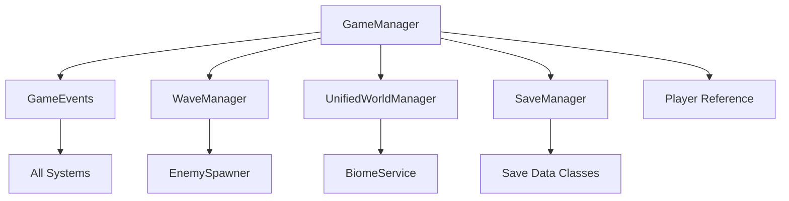
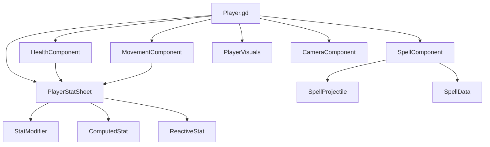
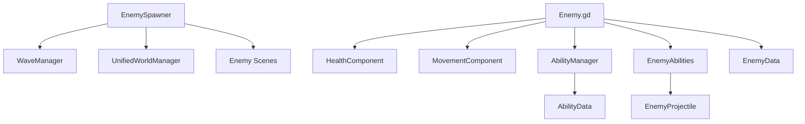

# Dependency Mapping

## Overview

This document maps the dependency relationships between all systems in the FFS Wizard RPG project. Dependencies are categorized by type and visualized through graphs to show the project's architectural structure.

---

## Dependency Categories

### 1. Singleton Dependencies (Autoload Order)
The project uses 18 autoloaded singletons with specific loading order:



### 2. Core System Dependencies

#### GameManager Ecosystem


#### Player System Dependencies


#### Enemy System Dependencies


---

## Script-to-Script Dependencies

### Core Dependencies

#### High-Level System Connections
```
GameManager.gd
├── depends on: GameEvents.gd
├── depends on: WaveManager.gd
├── depends on: UnifiedWorldManager.gd
├── depends on: SaveManager.gd
└── used by: Main.gd, PlayerUI.gd

GameEvents.gd
├── depends on: UnifiedDebugSystem.gd
└── used by: [ALL SYSTEMS] - Event bus pattern

Player.gd
├── depends on: HealthComponent.gd
├── depends on: MovementComponent.gd
├── depends on: SpellComponent.gd
├── depends on: PlayerVisuals.gd
├── depends on: CameraComponent.gd
├── depends on: PlayerStatSheet.gd
├── depends on: GameEvents.gd
└── used by: Main.gd, PlayerBuilder.gd
```

#### Component Dependencies
```
HealthComponent.gd
├── depends on: PlayerStatSheet.gd
├── depends on: GameEvents.gd
└── used by: Player.gd, Enemy.gd

MovementComponent.gd
├── depends on: PlayerStatSheet.gd
└── used by: Player.gd, Enemy.gd

SpellComponent.gd
├── depends on: SpellProjectile.gd
├── depends on: SpellData.gd
├── depends on: PlayerStatSheet.gd
├── depends on: GameEvents.gd
└── used by: Player.gd

PlayerStatSheet.gd
├── depends on: StatSheet.gd
├── depends on: ComputedStat.gd
├── depends on: ReactiveStat.gd
├── depends on: StatModifier.gd
├── depends on: GameEvents.gd
└── used by: Player.gd, HealthComponent.gd, MovementComponent.gd, SpellComponent.gd
```

### UI System Dependencies
```
PlayerUI.gd
├── depends on: GameEvents.gd
├── depends on: Player.gd (indirect)
├── depends on: SpellToolbar.gd
└── used by: Main.gd

SpellToolbar.gd
├── depends on: SpellComponent.gd
├── depends on: SpellData.gd
├── depends on: InputHandler.gd
└── used by: PlayerUI.gd

MainMenu.gd
├── depends on: SaveManager.gd
├── depends on: SceneTransition.gd
├── depends on: SettingsManager.gd
└── used by: Scene transitions

EscapeMenu.gd
├── depends on: GameManager.gd
├── depends on: SaveManager.gd
├── depends on: SceneTransition.gd
└── used by: Main.gd
```

---

## Scene-to-Script Relationships

### Primary Scene Dependencies

#### Main Scene Structure
```
Main.tscn
├── script: Main.gd
├── instances: Player.tscn
├── instances: PlayerUI.tscn
├── instances: GameOverScreen.tscn
├── instances: EscapeMenu.tscn
└── child scripts: 
    ├── GameplayController.gd
    ├── EnemySpawner.gd
    ├── UnifiedWorldManager.gd
    └── StatSystemTester.gd
```

#### Player Scene Composition
```
Player.tscn
├── script: Player.gd
└── child scripts:
    ├── HealthComponent.gd
    ├── MovementComponent.gd
    ├── SpellComponent.gd
    ├── PlayerVisuals.gd
    ├── CameraComponent.gd
    └── PlayerStatSheet.gd
```

#### Enemy Scene Pattern
```
[Enemy].tscn (Wizard, Golem, etc.)
├── script: Enemy.gd
└── child scripts:
    ├── HealthComponent.gd
    ├── MovementComponent.gd
    ├── AbilityManager.gd
    └── EnemyAbilities.gd
```

### Dynamic Scene Loading Dependencies
```
EnemySpawner.gd
├── loads: res://scenes/enemies/Wizard.tscn
├── loads: res://scenes/enemies/Golem.tscn
├── loads: res://scenes/enemies/Goblin.tscn
├── loads: res://scenes/enemies/Orc.tscn
├── loads: res://scenes/enemies/Skeleton.tscn
└── loads: res://scenes/enemies/Slime.tscn

SpellComponent.gd
├── loads: res://scenes/SpellProjectile.tscn
└── creates: ImpactEffect instances

EnemyAbilities.gd
├── loads: res://scenes/projectiles/EnemyProjectile.tscn
└── creates: Effect instances
```

---

## Resource Dependencies

### Data Resource Dependencies
```
Enemy.gd
├── uses: res://data/enemies/goblin_data.tres
├── uses: res://data/enemies/orc_data.tres
├── uses: res://data/enemies/skeleton_data.tres
├── uses: res://data/enemies/wizard_data.tres
├── uses: res://data/enemies/golem_data.tres
└── uses: res://data/enemies/slime_data.tres

AbilityManager.gd
├── uses: res://data/abilities/goblin_claw.tres
├── uses: res://data/abilities/orc_cleave.tres
├── uses: res://data/abilities/skeleton_bone_arrow.tres
├── uses: res://data/abilities/wizard_fireball.tres
├── uses: res://data/abilities/golem_earth_slam.tres
└── uses: res://data/abilities/slime_bounce.tres

GameConstants
└── uses: res://data/game_constants.tres
```

### Texture Resource Dependencies
```
SpellProjectile.gd
├── loads: res://textures/spell_projectiles/fireball_projectile.png
├── loads: res://textures/spell_projectiles/ice_shard_projectile.png
├── loads: res://textures/spell_projectiles/lightning_bolt_projectile.png
└── [13 spell textures total]

SpellToolbar.gd
├── loads: res://textures/spell_icons/fireball_icon.png
├── loads: res://textures/spell_icons/ice_shard_icon.png
├── loads: res://textures/spell_icons/lightning_bolt_icon.png
└── [13 spell icons total]

Enemy Sprites
├── loads: res://assets/sprites/goblin2.png
├── loads: res://assets/sprites/orc_cut-removebg-preview.png
├── loads: res://assets/sprites/skeleton_archer-removebg-preview.png
├── loads: res://assets/sprites/evil_wizard_cut-removebg-preview.png
├── loads: res://assets/sprites/golem_cut-removebg-preview.png
└── loads: res://assets/sprites/slime_generated.png
```

---

## Circular Dependency Identification

### Resolved Circular Dependencies

#### Player-Component-StatSheet Cycle (RESOLVED)
**Original Problem**:
```
Player.gd → HealthComponent.gd → PlayerStatSheet.gd → Player.gd
```

**Resolution**: Dependency injection pattern
```
Player.gd creates PlayerStatSheet.gd
Player.gd initializes HealthComponent.gd with StatSheet reference
HealthComponent.gd uses StatSheet without direct Player reference
```

#### GameManager-GameEvents Cycle (RESOLVED)
**Original Problem**:
```
GameManager.gd → GameEvents.gd → GameManager.gd
```

**Resolution**: Event-driven communication
```
GameManager.gd connects to GameEvents signals
GameEvents.gd emits events without direct GameManager calls
Other systems communicate through GameEvents hub
```

### Current Safe Patterns

#### Event Bus Pattern
```
All Systems → GameEvents (emit/connect only)
GameEvents → No direct system calls
Communication flows one-way through events
```

#### Factory Pattern
```
PlayerBuilder.gd → Player.gd
PlayerBuilder.gd → Component scripts
Components receive dependencies via initialization
No circular constructor calls
```

---

## External Addon/Plugin Dependencies

### Godot Engine Dependencies
```
All Scripts
├── extends: Godot base classes (Node, Control, CharacterBody2D, etc.)
├── uses: Godot singletons (Input, Time, etc.)
└── uses: Godot resource system

Project Settings
├── autoload configuration
├── input map definitions
├── physics layer configuration
└── display settings
```

### No Third-Party Addons
The project uses only built-in Godot 4.4.1 functionality:
- No GDExtensions
- No external plugins
- No C# components
- Pure GDScript implementation

---

## Dependency Analysis Summary

### Dependency Health
✅ **Healthy Patterns**:
- Clear singleton hierarchy with proper loading order
- Component-based architecture with dependency injection
- Event-driven communication preventing tight coupling
- Factory patterns for complex object creation

✅ **Resolved Issues**:
- Former circular dependencies resolved through architectural changes
- Proper separation of concerns between systems
- Clean interfaces between major system boundaries

⚠️ **Areas of Concern**:
- High number of singleton dependencies (17 autoloads)
- Complex component interdependencies in Player system
- Heavy reliance on GameEvents for all communication

### Dependency Metrics
- **Total Scripts**: 100+ GDScript files
- **Singleton Dependencies**: 17 autoloaded systems
- **Component Dependencies**: 6 major components per entity
- **Resource Dependencies**: 50+ .tres data files
- **Scene Dependencies**: 60+ .tscn files

### Maintainability Assessment
The dependency structure is well-organized with clear separation of concerns. The event-driven architecture and component system provide good modularity, though the large number of singletons suggests some complexity that should be monitored for future refactoring opportunities.

### Performance Impact
Current dependency structure has minimal performance impact:
- Singleton initialization occurs at startup
- Component dependencies resolved at entity creation
- Event communication is lightweight
- Resource loading optimized through preloading patterns

This dependency structure supports the game's complexity while maintaining reasonable coupling between systems and enabling future expansion.