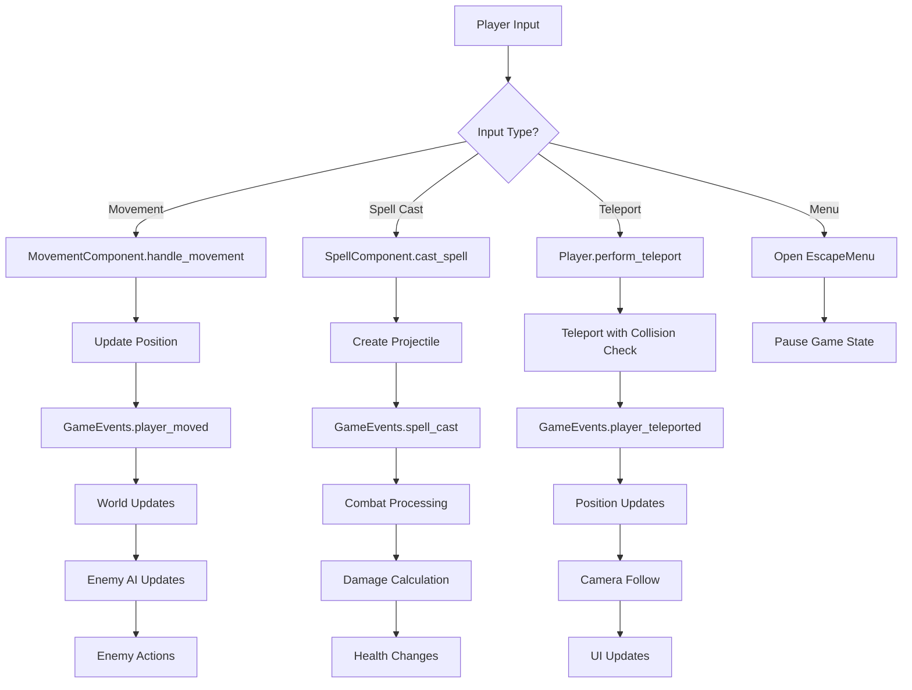
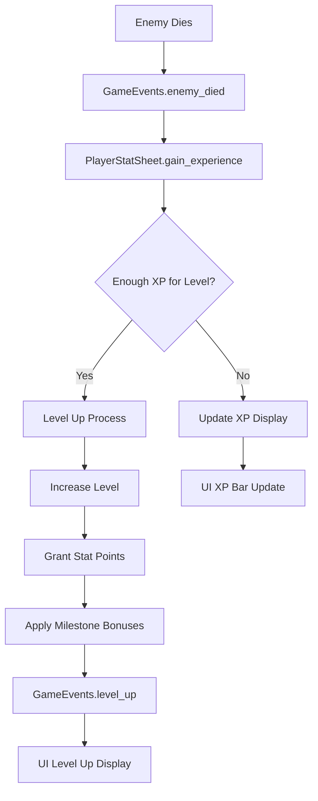
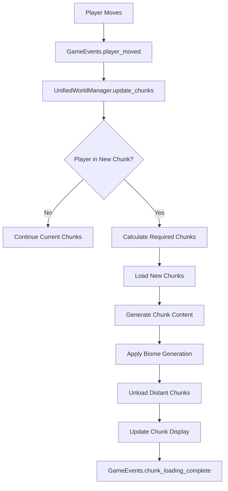
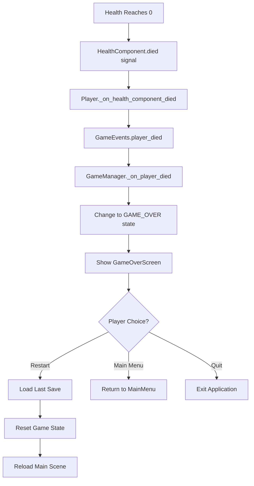

# Game Flow Analysis

## Overview

This document analyzes the complete gameplay flow in the FFS Wizard RPG, from game initialization through player progression. The game follows a structured flow with multiple branching paths and state management systems.

---

## Game Initialization Sequence

### 1. Engine Startup
**Entry Point**: Godot Engine starts with `project.godot` configuration

#### Autoload Initialization Order
```
1. UnifiedDebugSystem    - Logging and debug infrastructure
2. CollisionValidator    - Physics system validation
3. GameEvents           - Event bus system
4. GameManager          - Core game state
5. MetaSaveManager      - Meta-progression persistence
6. RunSaveManager       - Run-specific data
7. GameStateManager     - State machine management
8. SettingsManager      - Configuration management
9. SceneTransition      - Scene loading system
10. WaveManager         - Enemy wave progression
11. InputHandler        - Input processing
12. [Additional managers] - Specialized systems
```

### 2. Main Scene Loading
**Primary Scene**: `res://scenes/ui/MainMenu.tscn` (via main_scene setting)

#### MainMenu Initialization (`scripts/ui/MainMenu.gd`)
```gdscript
func _ready():
    initialize_save_slot_ui()
    check_existing_saves()
    setup_button_connections()
    apply_settings()
    fade_in_menu()
```

**Save Slot Detection**:
- Scans for existing save files in slots 0-2
- Updates continue button availability
- Displays save slot information (level, playtime, etc.)

---

## Main Menu Flow

### Menu Navigation Tree
```
MainMenu
├── New Game → Save Slot Selection → Character Creation → Gameplay
├── Continue → Save Slot Selection → Load Game → Gameplay
├── Settings → Settings Menu → Return to Main
└── Quit → Application Exit
```

### Save Slot Selection Process
**Script**: `scripts/ui/MainMenu.gd`

#### New Game Flow
```gdscript
func _on_new_game_pressed():
    show_save_slot_selector()
    current_action = "new_game"

func _on_save_slot_selected(slot_index: int):
    if current_action == "new_game":
        if SaveManager.has_save_in_slot(slot_index):
            show_overwrite_confirmation(slot_index)
        else:
            start_new_game(slot_index)
```

#### Continue Game Flow
```gdscript
func _on_continue_pressed():
    show_save_slot_selector()
    current_action = "continue"
    filter_slots_with_saves()

func start_continue_game(slot_index: int):
    SaveManager.set_current_slot(slot_index)
    SceneTransition.change_scene("res://scenes/Main.tscn")
```

---

## Gameplay Initialization

### Scene Transition to Gameplay
**Target Scene**: `res://scenes/Main.tscn`  
**Controller**: `scripts/Main.gd`

#### Main Scene Initialization Sequence
```gdscript
func _ready():
    # 1. Set initial game state
    GameStateManager.change_state(GameStateManager.Phase4GameState.LOADING)
    
    # 2. Setup loading screen
    _setup_chunk_loading_screen()
    
    # 3. Initialize save/load system
    await _initialize_game_state()
    
    # 4. Setup world system
    _setup_unified_world_system()
    
    # 5. Setup debug UI
    _setup_debug_ui()
    
    # 6. Setup autosave
    _setup_autosave()
    
    # 7. Transition to playing state
    GameStateManager.change_state(GameStateManager.Phase4GameState.PLAYING)
    SceneTransition.fade_in()
```

### Save Data Loading Process
```gdscript
func _initialize_game_state():
    if SaveManager.get_current_slot() >= 0:
        # Load existing game
        var load_success = await SaveManager.load_from_slot(SaveManager.get_current_slot())
        if load_success:
            apply_loaded_data()
        else:
            start_new_run()
    else:
        # New game
        start_new_run()

func start_new_run():
    GameManager.generate_new_world_seed()
    initialize_default_player_stats()
    set_starting_position()
```

---

## Core Gameplay Loop

### Primary Gameplay State
**State**: `GameStateManager.Phase4GameState.PLAYING`  
**Scene**: `res://scenes/Main.tscn` active

#### Player Action Cycle


### Enemy AI Cycle
**Primary Controller**: `scripts/enemies/EnemyAIController.gd`

#### AI Decision Loop
```gdscript
func _process(delta):
    if not is_instance_valid(player):
        return
    
    update_ai_state()
    
    match current_ai_state:
        AIState.IDLE:
            check_for_player()
        AIState.PURSUING:
            move_toward_player()
            check_ability_usage()
        AIState.ATTACKING:
            execute_current_ability()
        AIState.RETREATING:
            move_away_from_player()
```

### Wave Progression System
**Manager**: `scripts/WaveManager.gd`

#### Wave Advancement Logic
```gdscript
func _ready():
    GameEvents.enemy_died.connect(_on_enemy_died)

func _on_enemy_died(enemy_name: String, xp_awarded: int):
    enemies_killed_this_wave += 1
    total_enemies_killed += 1
    
    check_wave_completion()

func check_wave_completion():
    var required_kills = get_kills_required_for_wave(current_wave)
    if enemies_killed_this_wave >= required_kills:
        advance_to_next_wave()

func advance_to_next_wave():
    current_wave += 1
    enemies_killed_this_wave = 0
    apply_wave_scaling()
    unlock_new_enemy_types()
    GameEvents.emit_wave_completed(current_wave)
```

---

## Player Progression Flow

### Experience and Leveling
**System**: `scripts/stats/PlayerStatSheet.gd`

#### XP Gain Process


#### Level Up Implementation
```gdscript
func gain_experience(amount: int):
    current_xp += amount
    GameEvents.emit_experience_gained(amount)
    
    while current_xp >= xp_needed_for_next_level():
        level_up()

func level_up():
    current_level += 1
    current_xp -= xp_needed_for_level(current_level - 1)
    available_stat_points += stat_points_per_level
    
    apply_milestone_bonuses()
    recalculate_all_stats()
    
    GameEvents.emit_level_up(current_level)
```

### Stat Allocation Flow
**UI**: `scripts/ui/stats/StatAllocationUI.gd`

#### Stat Point Distribution
```gdscript
# Player opens character sheet (C key)
func _on_character_sheet_opened():
    show_stat_allocation_panel()
    update_available_points_display()
    update_stat_preview()

# Player allocates stat point
func _on_stat_increase_pressed(stat_name: String):
    if can_allocate_stat_point(stat_name):
        PlayerStatSheet.allocate_stat_point(stat_name)
        update_stat_displays()
        update_computed_stats_preview()
```

---

## Combat Flow

### Spell Casting Process
**Component**: `scripts/components/SpellComponent.gd`

#### Spell Cast Sequence
```mermaid
graph TD
    A[Player Presses Spell Key] --> B[InputHandler.handle_spell_input]
    B --> C[SpellComponent.cast_spell]
    C --> D{Can Cast?}
    
    D -->|No| E[Display Error Message]
    D -->|Yes| F[Consume Mana]
    
    F --> G[Create SpellProjectile]
    G --> H[Apply Spell Visual Effects]
    H --> I[Start Cooldown Timer]
    I --> J[GameEvents.spell_cast]
    
    J --> K[UI Cooldown Display]
    J --> L[Audio Feedback]
    J --> M[Camera Shake (if configured)]
```

#### Projectile Impact Flow
```gdscript
# SpellProjectile.gd collision handling
func _on_body_entered(body):
    if body.is_in_group("enemies"):
        apply_damage_to_enemy(body)
        create_impact_effect()
        GameEvents.emit_spell_hit(body, damage)
        queue_free()

func apply_damage_to_enemy(enemy: Node):
    if enemy.has_method("take_damage"):
        enemy.take_damage(damage, "spell")
```

### Enemy Death Sequence
**Script**: `scripts/Enemy.gd`

#### Death Processing
```gdscript
func handle_death():
    # Create death effects
    create_death_particles()
    
    # Drop XP orb
    create_xp_drop()
    
    # Update statistics
    GameEvents.emit_enemy_died(enemy_name, xp_reward)
    
    # Remove from spawn tracking
    EnemySpawner.remove_enemy_from_tracking(self)
    
    # Cleanup
    queue_free()

func create_xp_drop():
    var xp_orb_scene = preload("res://scenes/items/XPOrb.tscn")
    var xp_orb = xp_orb_scene.instantiate()
    xp_orb.xp_value = xp_reward
    xp_orb.global_position = global_position
    get_tree().current_scene.add_child(xp_orb)
```

---

## World Generation Flow

### Chunk Loading System
**Manager**: `scripts/world/UnifiedWorldManager.gd`

#### Dynamic World Loading


#### Chunk Generation Process
```gdscript
func generate_chunk(chunk_coords: Vector2i):
    var chunk_data = ChunkData.new()
    chunk_data.coordinates = chunk_coords
    chunk_data.world_position = chunk_coords * chunk_size
    
    # Determine biome
    var biome = BiomeService.get_biome_at_position(chunk_data.world_position)
    
    # Generate terrain
    generate_terrain(chunk_data, biome)
    
    # Generate features
    generate_biome_features(chunk_data, biome)
    
    # Store chunk
    active_chunks[chunk_coords] = chunk_data
    
    return chunk_data
```

---

## Pause and Menu Flow

### Escape Menu System
**Trigger**: Escape key press  
**Script**: `scripts/ui/EscapeMenu.gd`

#### Pause State Transition
```gdscript
func _on_escape_pressed():
    if GameStateManager.current_state == GameStateManager.Phase4GameState.PLAYING:
        pause_game()
        show_escape_menu()
    elif GameStateManager.current_state == GameStateManager.Phase4GameState.PAUSED:
        unpause_game()
        hide_escape_menu()

func pause_game():
    get_tree().paused = true
    GameStateManager.change_state(GameStateManager.Phase4GameState.PAUSED)
    GameEvents.emit_game_paused()

func unpause_game():
    get_tree().paused = false
    GameStateManager.change_state(GameStateManager.Phase4GameState.PLAYING)
    GameEvents.emit_game_resumed()
```

### Save/Load During Gameplay
```gdscript
# EscapeMenu save option
func _on_save_game_pressed():
    var save_success = SaveManager.save_to_slot(SaveManager.get_current_slot())
    if save_success:
        show_save_confirmation()
    else:
        show_save_error()

# Quick save functionality
func _on_quick_save_pressed():
    SaveManager.quick_save()
    show_quick_save_feedback()
```

---

## Death and Game Over Flow

### Player Death Sequence
**Trigger**: HealthComponent health reaches 0

#### Death Processing


#### Game Over Screen Options
**Script**: `scripts/ui/GameOverScreen.gd`

```gdscript
func _ready():
    restart_button.pressed.connect(_on_restart_pressed)
    main_menu_button.pressed.connect(_on_main_menu_pressed)
    quit_button.pressed.connect(_on_quit_pressed)

func _on_restart_pressed():
    # Load from last save or restart current run
    if SaveManager.has_recent_save():
        SaveManager.load_last_save()
        SceneTransition.change_scene("res://scenes/Main.tscn")
    else:
        restart_current_run()
```

---

## Autosave and Persistence

### Autosave Trigger System
**Manager**: `scripts/core/save/SaveManager.gd`

#### Autosave Conditions
```gdscript
func _ready():
    GameEvents.level_up.connect(_trigger_autosave)
    GameEvents.wave_completed.connect(_trigger_autosave)
    GameEvents.significant_progress.connect(_trigger_autosave)

func _trigger_autosave(data = null):
    if autosave_enabled and not is_saving:
        perform_autosave()

func perform_autosave():
    is_saving = true
    var save_success = save_to_slot(current_slot, true)  # true = autosave
    if save_success:
        show_autosave_indicator()
    is_saving = false
```

### Data Persistence Points
- **Level Up**: Character progression saved
- **Wave Completion**: Progress milestone saved
- **Manual Save**: Player-initiated save
- **Scene Transition**: State preserved during transitions
- **Application Exit**: Emergency save if enabled

This comprehensive gameplay flow ensures smooth player experience with robust state management, progression tracking, and data persistence throughout all game phases.