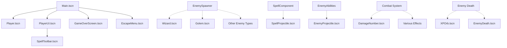

# Complete Scene Analysis

## Overview

This document provides a comprehensive analysis of all scene files (`.tscn`) in the FFS Wizard RPG project, organized by functional categories. Each scene entry includes its purpose, node structure, dependencies, and usage patterns.

---

## Core Game Scenes

### 1. Main.tscn
**Location**: `res://scenes/Main.tscn`  
**Purpose**: Primary gameplay scene that orchestrates the entire game experience  
**Script**: `res://scripts/Main.gd`

**Node Tree Structure**:
```
Main (Node2D)
├── GameWorld/ (Node2D)
│   ├── Player (instance: Player.tscn)
│   ├── UnifiedWorldManager (UnifiedWorldManager.gd)
│   ├── EnemySpawner (EnemySpawner.gd)
│   ├── GameplayController (GameplayController.gd)
│   └── StatSystemTester (StatSystemTester.gd)
└── UI/ (CanvasLayer)
    ├── PlayerUI (instance: PlayerUI.tscn)
    ├── WaveDisplay (instance: WaveDisplay.tscn)
    ├── SimpleStatsDisplay (instance: SimpleStatsDisplay.tscn)
    ├── EscapeMenu (instance: EscapeMenu.tscn)
    ├── GameOverScreen (instance: GameOverScreen.tscn)
    └── ToolbarManager (scripts/items/managers/ToolbarManager.gd)
```

**Dependencies**:
- `scenes/gameplay/Player.tscn`
- `scenes/ui/PlayerUI.tscn`
- `scenes/ui/WaveDisplay.tscn`
- `scenes/ui/SimpleStatsDisplay.tscn`
- `scenes/ui/EscapeMenu.tscn`
- `scenes/ui/GameOverScreen.tscn`

**Scene Transitions**: Entry point for gameplay, loaded via SceneTransition from MainMenu

### 2. GameplayMain.tscn
**Location**: `res://scenes/GameplayMain.tscn`  
**Purpose**: Simplified gameplay scene for focused testing and development  
**Script**: Similar to Main.gd but with reduced systems

**Node Tree Structure**: Simplified version of Main.tscn with core gameplay elements only

**Dependencies**: 
- `scenes/gameplay/Player.tscn`
- `scenes/ui/PlayerUI.tscn`

**Usage**: Alternative entry point for development and testing scenarios

### 3. MainMenu.tscn
**Location**: `res://scenes/ui/MainMenu.tscn`  
**Purpose**: Game's main menu with save slot management and settings (PROJECT ENTRY POINT)  
**Script**: `res://scripts/ui/MainMenu.gd`

**Node Tree Structure**:
```
MainMenu (Control)
├── MainPanel/ (VBoxContainer)
│   ├── NewGameButton (Button)
│   ├── ContinueButton (Button)
│   ├── SettingsButton (Button)
│   └── QuitButton (Button)
├── SaveSlotSelector/ (Control)
│   ├── SlotButton1 (Button)
│   ├── SlotButton2 (Button)
│   └── SlotButton3 (Button)
├── ConfirmationDialog (AcceptDialog)
└── CharacterManagementDialog (AcceptDialog)
```

**Dependencies**: Dynamically loads settings scenes via SceneTransition

**Scene Transitions**: Transitions to Main.tscn for gameplay

---

## Player and Character Scenes

### 4. Player.tscn
**Location**: `res://scenes/gameplay/Player.tscn`  
**Purpose**: Player character entity with component-based architecture  
**Script**: `res://scripts/entities/Player.gd`

**Node Tree Structure**:
```
Player (CharacterBody2D)
├── PlayerSprite (Sprite2D)
├── PlayerCollision (CollisionShape2D)
├── DamageReceiver (Area2D)
├── MovementComponent (scripts/components/MovementComponent.gd)
├── HealthComponent (scripts/components/HealthComponent.gd)
├── PlayerVisuals (scripts/components/PlayerVisuals.gd)
├── SpellComponent (scripts/components/SpellComponent.gd)
├── CameraComponent (scripts/components/CameraComponent.gd)
└── StatSheet (scripts/stats/PlayerStatSheet.gd)
```

**Resources Used**:
- Player sprite texture
- Collision shape resources
- Component scripts

**Dependencies**: All component scripts in `scripts/components/`

**Instantiation**: Created by PlayerBuilder.gd factory, instantiated in gameplay scenes

---

## Enemy Scenes

### 5. Enemy.tscn (Base Template)
**Location**: `res://scenes/Enemy.tscn`  
**Purpose**: Base enemy template for all enemy types  
**Script**: `res://scripts/Enemy.gd`

**Node Tree Structure**:
```
Enemy (CharacterBody2D)
├── EnemySprite (Sprite2D)
├── EnemyCollision (CollisionShape2D)
├── HealthBar (ProgressBar)
├── HealthComponent (scripts/components/HealthComponent.gd)
├── MovementComponent (scripts/components/MovementComponent.gd)
├── AbilityManager (scripts/components/AbilityManager.gd)
└── EnemyAIController (scripts/enemies/EnemyAIController.gd)
```

**Dependencies**: Component scripts and AI controller

### Enemy Type Scenes

#### Wizard.tscn
**Location**: `res://scenes/enemies/Wizard.tscn`  
**Purpose**: Magic-based enemy with ranged attacks  
**Special Features**: Fireball casting abilities

#### Golem.tscn
**Location**: `res://scenes/enemies/Golem.tscn`  
**Purpose**: Large tanky enemy with area attacks  
**Special Features**: Stone slam and earthquake abilities

#### Goblin.tscn, Orc.tscn, Skeleton.tscn, Slime.tscn, Elemental.tscn
**Locations**: `res://scenes/enemies/[Type].tscn`  
**Purpose**: Various enemy types with unique behaviors and abilities

**Loading Pattern**: Dynamically loaded by EnemySpawner using pattern:
```gdscript
"res://scenes/enemies/" + enemy_type.capitalize() + ".tscn"
```

---

## Projectile Scenes

### 6. SpellProjectile.tscn
**Location**: `res://scenes/SpellProjectile.tscn` and `res://scenes/combat/SpellProjectile.tscn`  
**Purpose**: Player spell projectiles with collision detection  
**Script**: `res://scripts/SpellProjectile.gd`

**Node Tree Structure**:
```
SpellProjectile (Area2D)
├── ProjectileSprite (Sprite2D)
├── ProjectileCollision (CollisionShape2D)
├── LifetimeTimer (Timer)
└── VisualEffect (optional)
```

**Instantiation**: Created by SpellComponent when casting spells

### 7. EnemyProjectile.tscn
**Location**: `res://scenes/projectiles/EnemyProjectile.tscn`  
**Purpose**: Enemy ranged attack projectiles  
**Script**: `res://scripts/enemies/EnemyProjectile.gd`

**Variants**:
- `EnemyProjectile_FIXED.tscn` - Corrected version with improved collision

**Usage**: Instantiated by EnemyAbilities system for ranged attacks

---

## UI Scenes

### 8. PlayerUI.tscn
**Location**: `res://scenes/ui/PlayerUI.tscn`  
**Purpose**: Main player interface during gameplay  
**Script**: `res://scripts/ui/PlayerUI.gd`

**Node Tree Structure**:
```
PlayerUI (Control)
├── HealthBar (ProgressBar)
├── ManaBar (ProgressBar)
├── XPDisplay (Label)
├── StatsPanel (Control)
└── SpellToolbar (instance: SpellToolbar.tscn)
```

**Dependencies**: `scenes/ui/SpellToolbar.tscn`

### 9. SpellToolbar.tscn
**Location**: `res://scenes/ui/SpellToolbar.tscn`  
**Purpose**: Spell selection and casting interface  
**Script**: `res://scripts/ui/SpellToolbar.gd`

**Node Tree Structure**:
```
SpellToolbar (Control)
└── SpellContainer (HBoxContainer)
    ├── SpellSlot1 (Button)
    ├── SpellSlot2 (Button)
    └── [... up to 10 slots]
```

**Management**: Controlled by ToolbarManager singleton

### Menu and Dialog Scenes

#### EscapeMenu.tscn
**Location**: `res://scenes/ui/EscapeMenu.tscn`  
**Purpose**: In-game pause menu with save/settings options  
**Script**: `res://scripts/ui/EscapeMenu.gd`

#### GameOverScreen.tscn
**Location**: `res://scenes/ui/GameOverScreen.tscn`  
**Purpose**: Player death/failure screen with restart options  
**Script**: `res://scripts/ui/GameOverScreen.gd`

#### SaveLoadMenu.tscn
**Location**: `res://scenes/ui/SaveLoadMenu.tscn`  
**Purpose**: Save file management interface  
**Script**: `res://scripts/ui/SaveLoadMenu.gd`

#### Settings Menus
- **UnifiedSettingsMenu.tscn**: Main settings interface
- **DebugSettingsMenu.tscn**: Developer debug options
- **TowerPage.tscn**: Special game mode interface

#### Stats UI
- **StatAllocationUI.tscn**: Character stat point distribution
- **StatsPanelUI.tscn**: Character statistics display
- **SimpleStatsDisplay.tscn**: Simplified stats for gameplay

---

## Effect Scenes

### Visual Effects

#### 10. HealEffect.tscn
**Location**: `res://scenes/effects/HealEffect.tscn`  
**Purpose**: Healing spell visual effects  
**Script**: `res://scenes/effects/HealEffect.gd`

**Node Tree Structure**:
```
HealEffect (Node2D)
├── Particles (GPUParticles2D)
├── OrbitalClusters/ (multiple Node2D)
└── EffectTimer (Timer)
```

**Features**: Procedural green particle effects with orbital motion

#### 11. EnemyDeath.tscn
**Location**: `res://scenes/effects/EnemyDeath.tscn`  
**Purpose**: Enemy death particle effects  

**Components**: CPUParticles2D with death animation sequences

#### 12. DamageNumber.tscn
**Location**: `res://scenes/ui/DamageNumber.tscn`  
**Purpose**: Floating damage text feedback  
**Script**: `res://scripts/ui/DamageNumber.gd`

**Features**: Color-coded damage types, performance optimization, fade animations

### Combat Effects

#### Combat Indicators
- **MeleeTelegraph.tscn**: Melee attack warning indicators
- **RangedTelegraph.tscn**: Ranged attack warning indicators  
- **SlamAreaIndicator.tscn**: Area of effect attack previews

#### Impact Effects
- **MuzzleFlash.tscn**: Projectile launch effects
- **MeleeSlash.tscn**: Melee attack visual feedback
- **Shockwave.tscn**: Area attack wave effects

#### Environmental Effects
- **GroundCrack.tscn**: Ground damage effects
- **GroundDebris.tscn**: Particle debris from impacts
- **DustBurst.tscn**: Environmental dust effects
- **HeavyFootstep.tscn**: Large enemy movement effects
- **HeavySlamImpact.tscn**: Heavy attack impact effects

---

## Item Scenes

### 13. XPOrb.tscn
**Location**: `res://scenes/items/XPOrb.tscn`  
**Purpose**: Experience point pickups dropped by enemies  
**Script**: `res://scripts/items/XPOrb.gd`

**Node Tree Structure**:
```
XPOrb (Area2D)
├── Sprite2D (animated orb)
├── CollisionShape2D
└── PickupTimer (Timer)
```

**Features**: Magnet behavior, floating animation, collection effects

**Instantiation**: Created when enemies die, managed by enemy death system

---

## Debug and Test Scenes

### Development Scenes

#### ChunkDebugUI.tscn
**Location**: `res://scenes/debug/ChunkDebugUI.tscn`  
**Purpose**: World chunk system debugging interface  
**Script**: `res://scripts/debug/ChunkDebugUI.gd`

#### DebugMenu.tscn
**Location**: `res://scenes/debug/DebugMenu.tscn`  
**Purpose**: Developer debugging tools and options

#### Test Scenes
- **EnemyTestScene.tscn**: Enemy behavior testing
- **GolemTest.tscn**: Specific golem enemy testing
- **MovementDemo.tscn**: Player movement testing
- **BiomeTestScene.tscn**: World generation testing

#### Procedural Test Scenes
- **TestWizardScene.tscn**: Procedural wizard testing
- **TestWizardScene_Fixed.tscn**: Corrected wizard testing
- **TestWizardScene_Working.tscn**: Functional wizard testing
- **EnhancedWizardTestScene.tscn**: Advanced wizard system testing

### Validation Scenes

#### InstallationValidation.tscn
**Location**: `res://scenes/InstallationValidation.tscn`  
**Purpose**: System integrity checking and validation
**Script**: `res://scripts/InstallationValidator.gd`

**Usage**: Verifies proper installation and configuration of game systems

---

## Scene Loading Patterns

### Static Scene References

Scenes load dependencies through Godot's resource system:
```gdscript
[ext_resource type="PackedScene" path="res://scenes/gameplay/Player.tscn"]
```

### Dynamic Scene Loading

Scripts load scenes programmatically:
```gdscript
# Enemy spawning pattern
var scene_path = "res://scenes/enemies/" + enemy_type.capitalize() + ".tscn"
var enemy_scene = load(scene_path)

# Effect spawning
var damage_number_scene = preload("res://scenes/ui/DamageNumber.tscn")
var heal_effect_scene = preload("res://scenes/effects/HealEffect.tscn")
```

### Object Pooling

High-frequency scenes use pooling:
- **Projectiles**: SpellProjectile.tscn, EnemyProjectile.tscn
- **Effects**: DamageNumber.tscn, various particle effects
- **Enemies**: Enemy scene variants for performance

---

## Scene Dependency Graph



**Legend**: 
- Solid lines (→): Static scene dependencies
- Dashed lines (-.->): Dynamic scene loading

---

## Scene Organization Principles

### Functional Grouping
- **Core**: Main gameplay scenes
- **UI**: User interface components  
- **Enemies**: Enemy entity variants
- **Effects**: Visual feedback systems
- **Debug**: Development tools

### Hierarchical Structure
- **Atomic**: Self-contained scenes (Player, Enemy types)
- **Composite**: Scenes that instance others (Main, PlayerUI)
- **Dynamic**: Runtime-instantiated scenes (Effects, Projectiles)

### Performance Considerations
- **Preloading**: Critical scenes loaded at startup
- **Lazy Loading**: Optional content loaded on demand
- **Pooling**: High-frequency scenes recycled rather than destroyed

This scene architecture provides a maintainable, modular structure that supports both static composition and dynamic content generation while maintaining clear separation of concerns.