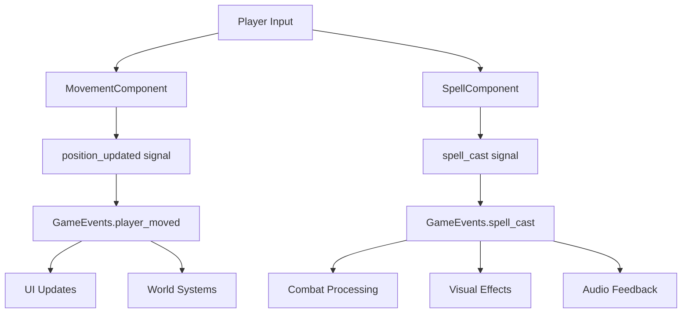
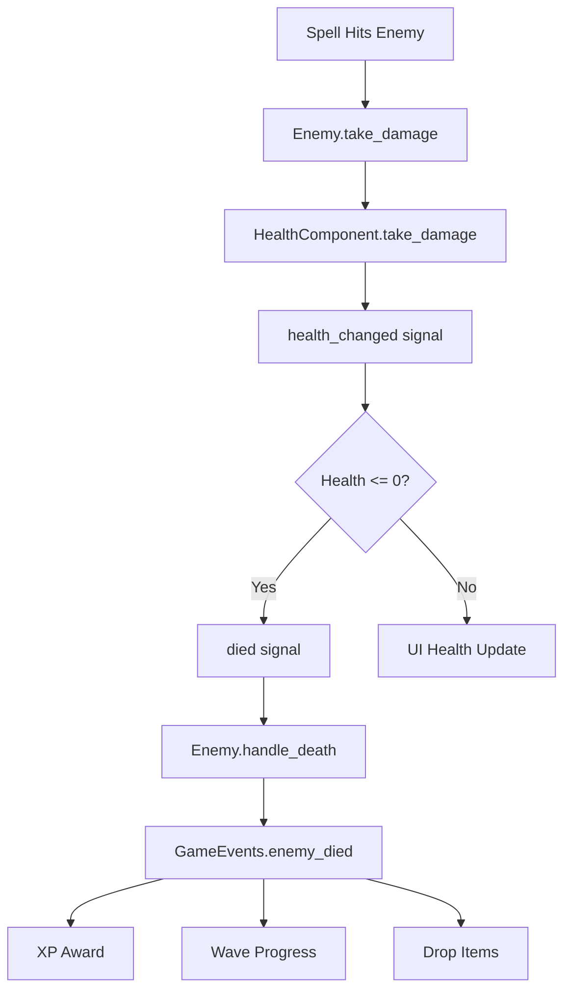
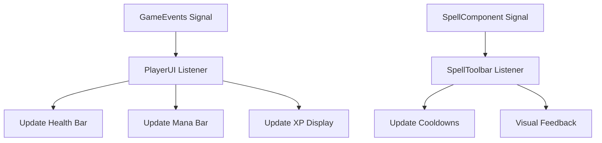

# Signal Flow Documentation

## Overview

This document maps the complete signal and event system used throughout the FFS Wizard RPG project. The game uses a centralized event bus pattern through the GameEvents singleton, complemented by direct signal connections for component communication.

---

## GameEvents Signal Hub

### Primary Event Bus
**Script**: `scripts/GameEvents.gd` (singleton)  
**Purpose**: Centralized event system preventing tight coupling between systems

#### Core Gameplay Signals

##### Player Events
```gdscript
# Player movement and state
signal player_moved(new_position: Vector2)
signal player_health_changed(current: float, maximum: float)
signal player_mana_changed(current: float, maximum: float)
signal player_died()
signal player_teleported()
signal player_damaged(damage: float, source: String)

# Player progression
signal experience_gained(amount: int)
signal level_up(new_level: int)
```

##### Combat Events
```gdscript
# Spell system
signal spell_cast(spell_name: String, damage: float)
signal spell_cast_enhanced(spell_data: Dictionary)

# Enemy interactions
signal enemy_died(enemy_name: String, xp_awarded: int)
signal enemy_spawned(enemy: Node)
signal enemy_attack_hit(enemy: Node, target: Node, damage: float)
```

##### Wave and Progression Events
```gdscript
# Wave management
signal wave_started(wave_number: int, enemy_multipliers: Dictionary)
signal wave_completed(wave_number: int)

# Visual feedback
signal screen_shake(duration: float, intensity: float)
```

#### Event Emission Functions

##### Validated Event Emission
```gdscript
# Player movement with validation
func emit_player_moved(new_position: Vector2) -> void:
    if new_position == Vector2.INF or new_position.length() > 100000:
        push_error("Invalid player position: " + str(new_position))
        return
    player_moved.emit(new_position)

# Health changes with bounds checking
func emit_player_health_changed(current: float, maximum: float) -> void:
    if maximum <= 0:
        push_error("Invalid maximum health: " + str(maximum))
        return
    if current < -maximum:
        push_error("Invalid current health: " + str(current))
        return
    player_health_changed.emit(current, maximum)

# Enemy death with XP validation
func emit_enemy_died(enemy_name: String, xp_awarded: int) -> void:
    if enemy_name.is_empty():
        push_error("Enemy name cannot be empty")
        return
    if xp_awarded < 0:
        push_error("XP reward cannot be negative")
        return
    enemy_died.emit(enemy_name, xp_awarded)
```

---

## Component Signal Patterns

### Player Component Signals

#### HealthComponent Signals
**Script**: `scripts/components/HealthComponent.gd`

```gdscript
# Health component signals
signal health_changed(current: float, maximum: float)
signal mana_changed(current: float, maximum: float)
signal died()
signal healed(amount: float)
signal mana_regenerated(amount: float)

# Connection pattern in Player.gd
func _ready():
    health_component.health_changed.connect(_on_health_changed)
    health_component.mana_changed.connect(_on_mana_changed)
    health_component.died.connect(_on_player_died)

func _on_health_changed(current: float, maximum: float):
    # Update UI and forward to GameEvents
    GameEvents.emit_player_health_changed(current, maximum)
```

#### SpellComponent Signals
**Script**: `scripts/components/SpellComponent.gd`

```gdscript
# Spell component signals
signal spell_cast(spell_name: String, damage: float)
signal spell_cooldown_started(spell_index: int, duration: float)
signal mana_insufficient(required: float, available: float)

# Usage in spell casting
func cast_spell(spell_index: int, target_position: Vector2):
    var spell_data = spells[spell_index]
    if can_cast_spell(spell_index):
        create_projectile(spell_data, target_position)
        spell_cast.emit(spell_data.spell_name, spell_data.damage)
        GameEvents.emit_spell_cast(spell_data.spell_name, spell_data.damage)
```

#### MovementComponent Signals
**Script**: `scripts/components/MovementComponent.gd`

```gdscript
# Movement component signals
signal movement_speed_changed(new_speed: float)
signal position_updated(new_position: Vector2)

# Connection to GameEvents
func update_position(new_pos: Vector2):
    position_updated.emit(new_pos)
    GameEvents.emit_player_moved(new_pos)
```

### Enemy Component Signals

#### AbilityManager Signals
**Script**: `scripts/components/AbilityManager.gd`

```gdscript
# Enemy ability signals
signal ability_used(ability_name: String, target: Node)
signal ability_cooldown_started(ability_index: int, duration: float)
signal no_valid_abilities()

# AI decision making
func select_and_use_ability(target: Node):
    var best_ability = select_best_ability(target.global_position)
    if best_ability:
        execute_ability(best_ability, target)
        ability_used.emit(best_ability.ability_name, target)
```

#### EnemyAIController Signals
**Script**: `scripts/enemies/EnemyAIController.gd`

```gdscript
# AI state signals
signal state_changed(old_state: String, new_state: String)
signal target_acquired(target: Node)
signal target_lost()

# State machine integration
func change_ai_state(new_state: String):
    var old_state = current_state
    current_state = new_state
    state_changed.emit(old_state, new_state)
```

---

## UI Signal Connections

### PlayerUI Signal Management
**Script**: `scripts/ui/PlayerUI.gd`

#### Health and Mana Display
```gdscript
func _ready():
    # Connect to GameEvents for player state updates
    GameEvents.player_health_changed.connect(_on_player_health_changed)
    GameEvents.player_mana_changed.connect(_on_player_mana_changed)
    GameEvents.experience_gained.connect(_on_experience_gained)
    GameEvents.level_up.connect(_on_level_up)

func _on_player_health_changed(current: float, maximum: float):
    health_bar.value = (current / maximum) * 100.0
    health_label.text = "%d/%d" % [current, maximum]
    
    # Visual feedback for low health
    if current / maximum < 0.3:
        health_bar.modulate = Color.RED
    else:
        health_bar.modulate = Color.WHITE
```

### SpellToolbar Signal Integration
**Script**: `scripts/ui/SpellToolbar.gd`

```gdscript
# Spell toolbar signals
signal spell_selected(spell_index: int)
signal spell_assignment_changed(slot: int, spell: SpellData)

func _ready():
    # Connect to spell casting events for cooldown display
    GameEvents.spell_cast.connect(_on_spell_cast)
    
    # Connect each spell slot
    for i in range(spell_slots.size()):
        spell_slots[i].pressed.connect(_on_spell_slot_pressed.bind(i))

func _on_spell_cast(spell_name: String, damage: float):
    # Update cooldown visual for cast spell
    update_spell_cooldown_display(spell_name)
```

### Menu Signal Patterns
**Script**: `scripts/ui/MainMenu.gd`

```gdscript
# Menu navigation signals
signal save_slot_selected(slot_index: int)
signal game_start_requested(slot: int)
signal settings_opened()

func _ready():
    # Connect menu buttons
    new_game_button.pressed.connect(_on_new_game_pressed)
    continue_button.pressed.connect(_on_continue_pressed)
    settings_button.pressed.connect(_on_settings_pressed)
    quit_button.pressed.connect(_on_quit_pressed)

func _on_new_game_pressed():
    game_start_requested.emit(selected_save_slot)
    SceneTransition.change_scene("res://scenes/Main.tscn")
```

---

## System Signal Integration

### Wave Management Signals
**Script**: `scripts/WaveManager.gd`

```gdscript
# Wave manager signals
signal wave_progression_updated(current_wave: int, kills_needed: int)
signal enemy_type_unlocked(enemy_type: String, wave: int)

func _ready():
    # Listen for enemy deaths
    GameEvents.enemy_died.connect(_on_enemy_died)

func _on_enemy_died(enemy_name: String, xp_awarded: int):
    enemies_killed_this_wave += 1
    check_wave_completion()

func check_wave_completion():
    if enemies_killed_this_wave >= enemies_needed_for_wave:
        advance_to_next_wave()
        GameEvents.emit_wave_completed(current_wave)
```

### Save System Signals
**Script**: `scripts/core/save/SaveManager.gd`

```gdscript
# Save system signals
signal save_completed(slot_index: int, success: bool)
signal load_completed(slot_index: int, success: bool)
signal save_corrupted(slot_index: int, error: String)

# Autosave integration
func _ready():
    GameEvents.level_up.connect(_trigger_autosave)
    GameEvents.wave_completed.connect(_trigger_autosave)

func _trigger_autosave(data = null):
    if autosave_enabled:
        save_to_slot(current_slot)
```

---

## Event Flow Diagrams

### Player Action Event Flow


### Combat Event Flow


### UI Update Event Flow


---

## Signal Connection Patterns

### Centralized Connection Pattern
```gdscript
# GameManager.gd - Central event coordination
func _ready():
    # Player events
    GameEvents.player_died.connect(_on_player_died)
    GameEvents.level_up.connect(_on_player_level_up)
    
    # Wave events
    GameEvents.wave_completed.connect(_on_wave_completed)
    GameEvents.enemy_died.connect(_on_enemy_died)
    
    # System events
    GameEvents.spell_cast.connect(_on_spell_cast)
```

### Component-to-Component Pattern
```gdscript
# Direct component communication
# Player.gd connecting to its components
func _ready():
    health_component.died.connect(_on_health_component_died)
    spell_component.spell_cast.connect(_on_spell_component_cast)
    movement_component.position_updated.connect(_on_position_updated)

# Forward component events to global events
func _on_health_component_died():
    GameEvents.emit_player_died()
```

### One-Shot Signal Pattern
```gdscript
# Temporary signal connections for specific events
func start_spell_casting():
    # Connect for single use
    spell_component.spell_cast.connect(_on_spell_cast_complete, CONNECT_ONE_SHOT)

func _on_spell_cast_complete(spell_name: String, damage: float):
    # Handle completion, signal automatically disconnects
    show_spell_feedback(spell_name)
```

---

## Signal Performance Optimization

### Signal Batching
```gdscript
# Batch multiple updates to reduce signal overhead
var pending_health_update: bool = false

func update_health(new_health: float):
    current_health = new_health
    if not pending_health_update:
        pending_health_update = true
        # Defer signal emission to next frame
        call_deferred("_emit_health_update")

func _emit_health_update():
    health_changed.emit(current_health, max_health)
    pending_health_update = false
```

### Conditional Signal Emission
```gdscript
# Only emit signals when values actually change
func set_health(new_value: float):
    if abs(current_health - new_value) > 0.01:  # Threshold for change
        current_health = new_value
        health_changed.emit(current_health, max_health)
```

### Signal Disconnection Management
```gdscript
# Proper cleanup to prevent memory leaks
func _exit_tree():
    # Disconnect all signals when node is removed
    if GameEvents.player_health_changed.is_connected(_on_health_changed):
        GameEvents.player_health_changed.disconnect(_on_health_changed)
```

---

## Observer Pattern Implementation

### Event Subscription System
```gdscript
# Advanced observer pattern for complex events
class_name EventSubscriber

var subscribed_events: Dictionary = {}

func subscribe_to_event(event_name: String, callback: Callable):
    if not subscribed_events.has(event_name):
        subscribed_events[event_name] = []
    subscribed_events[event_name].append(callback)

func unsubscribe_from_event(event_name: String, callback: Callable):
    if subscribed_events.has(event_name):
        subscribed_events[event_name].erase(callback)

func emit_event(event_name: String, data = null):
    if subscribed_events.has(event_name):
        for callback in subscribed_events[event_name]:
            callback.call(data)
```

This comprehensive signal system provides robust, performant communication between all game systems while maintaining loose coupling and clear event flow patterns. The centralized GameEvents hub ensures consistent event handling while component-level signals provide fine-grained control for entity-specific behaviors.