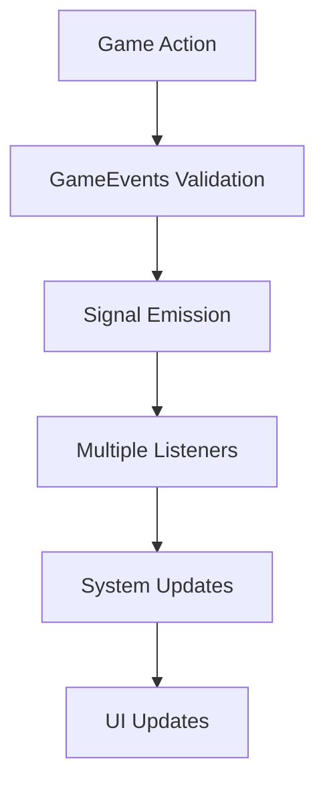

# System Architecture

## Overall Architecture Pattern

The FFS Wizard RPG follows a **hybrid architecture** combining multiple design patterns:

1. **Event-Driven Architecture** - Primary communication via GameEvents singleton
2. **Singleton Coordination Pattern** - 18 autoload singletons for global state management
3. **Component-Based Design** - Player and enemy entities use component composition
4. **Phase-Based Development** - Maintains compatibility between Phase 3.7 and Phase 4+ systems

## Core Architectural Principles

### 1. Loose Coupling via Events
- **GameEvents** singleton provides centralized, validated event dispatch
- Systems communicate through validated signals rather than direct references
- Prevents cascading failures and maintains clean separation

### 2. Singleton Coordination
- **GameManager** acts as central state coordinator for game flow
- **GameStateManager** handles pause/unpause and scene transitions
- 18 total singletons with specific initialization order

### 3. Error Recovery & Validation
- Comprehensive input validation in GameEvents before signal emission
- Fallback mechanisms for missing components or corrupted data
- Graceful degradation when optional systems are unavailable

### 4. Performance Optimization
- Reduced logging overhead for production performance
- Chunk-based world generation with 0.5s update intervals
- Event-driven UI updates only when state changes

## Scene Tree Organization

```
Main (Root - Node2D)
├── GameWorld (Node2D)
│   ├── UnifiedWorldManager (Node) - Infinite world generation
│   ├── Player (CharacterBody2D) - Instance of Player.tscn
│   ├── EnemySpawner (Node) - Dynamic enemy spawning
│   ├── GameplayController (Node) - Gameplay coordination
│   └── StatSystemTester (Node) - Development testing
└── UI (CanvasLayer)
    ├── PlayerUI (Instance) - Health, mana, stats display
    ├── WaveDisplay (Instance) - Wave progress tracking
    ├── GameplayHUD (Control) - Real-time wave info labels
    ├── SimpleStatsDisplay (Instance) - Basic stat display
    ├── EscapeMenu (Instance) - Pause menu functionality
    ├── GameOverScreen (Instance) - End game statistics
    └── ToolbarManager (Node) - Spell toolbar management
```

## Node Hierarchy Patterns

### Player Entity Pattern
```
Player (CharacterBody2D)
├── PlayerVisuals (Node2D) - Visual components
├── HealthComponent (Node) - HP management
├── MovementComponent (Node) - Movement logic
├── SpellComponent (Node) - Spell casting
└── PlayerStatSheet (Node) - Character stats
```

### Enemy Entity Pattern
```
Enemy (CharacterBody2D)
├── Sprite2D (Visual)
├── CollisionShape2D (Physics)
├── HealthComponent (Node) - HP system
├── EnemyAI (Node) - Behavior logic
└── AbilityManager (Node) - Enemy abilities
```

### UI Component Pattern
```
UI Container (Control)
├── Background (NinePatchRect/ColorRect)
├── Content (VBoxContainer/HBoxContainer)
└── Controls (Buttons, Labels, etc.)
```

## Signal/Event System Usage

### Core Event Flow


### Primary Signal Categories

#### 1. Player State Events
- `player_moved(Vector2)` - Position updates
- `player_health_changed(current, max)` - HP changes
- `player_mana_changed(current, max)` - Mana changes
- `player_died()` - Death event

#### 2. Combat Events
- `enemy_died(enemy_type, xp_value)` - Enemy elimination
- `enemy_spawned(enemy: Node)` - Enemy creation tracking
- `spell_cast(spell_name, mana_cost)` - Basic spell usage
- `spell_cast_enhanced(data_dict)` - Enhanced spell data for Phase 5
- `player_damaged(damage, source)` - Damage tracking
- `enemy_attack_hit(enemy, target, damage)` - Combat resolution

#### 3. Progression Events  
- `wave_started(wave_num, config)` - Wave initialization
- `wave_completed(wave_num)` - Wave completion
- `experience_gained(xp_amount)` - XP acquisition
- `level_up(new_level)` - Character level progression

#### 4. Special Game Events
- `player_teleported()` - Phase 3.7 teleport system
- `screen_shake(duration, intensity)` - Visual effects
- `chunk_loading_started()` - World generation begins
- `chunk_loading_progress(percent)` - Loading updates
- `chunk_loading_complete()` - World ready

## Singleton/Autoload Structure

### Complete Autoload List (18 Singletons)

**Actual initialization order from project.godot:**

1. **UnifiedDebugSystem** - `*res://scripts/debug/UnifiedDebugSystem.gd`
2. **CollisionValidator** - `*res://scripts/CollisionValidator.gd`
3. **GameEvents** - `*res://scripts/GameEvents.gd`
4. **GameManager** - `*res://scripts/GameManager.gd`
5. **MetaSaveManager** - `*res://scripts/core/MetaSaveManager.gd`
6. **RunSaveManager** - `*res://scripts/core/RunSaveManager.gd`
7. **GameStateManager** - `*res://scripts/core/GameStateManager.gd`
8. **SettingsManager** - `*res://scripts/core/SettingsManager.gd`
9. **SceneTransition** - `*res://scripts/ui/SceneTransition.gd`
10. **WaveManager** - `*res://scripts/WaveManager.gd`
11. **InputHandler** - `*res://scripts/InputHandler.gd`
12. **StatAllocationManager** - `*res://scripts/items/managers/StatAllocationManager.gd`
13. **CharacterSheetManager** - `*res://scripts/items/managers/CharacterSheetManager.gd`
14. **AchievementNotificationManager** - `*res://scripts/singletons/AchievementNotificationManager.gd`
15. **SaveManager** - `*res://scripts/core/save/SaveManager.gd`
16. **GameConfig** - `*res://scripts/singletons/GameConfig.gd`
17. **PlayerTracker** - `*res://scripts/singletons/PlayerTracker.gd`
18. **BiomeService** - `*res://scripts/BiomeService.gd`

### Functional Categories

#### Core Systems (1-4)
- **UnifiedDebugSystem**: Comprehensive logging and debug framework
- **CollisionValidator**: Physics validation and collision integrity checking
- **GameEvents**: Centralized event system with validation
- **GameManager**: Phase 4+ game state coordination with Phase 3.7 compatibility

#### Save System (5-7)  
- Meta progression, run data, and game state management

#### UI & Input (8-9, 11)
- Settings, scene transitions, and input processing

#### Gameplay Systems (10, 18)
- Wave progression and biome generation

#### Specialized Managers (12-18)
- **StatAllocationManager**: Character stat distribution
- **CharacterSheetManager**: UI character sheet coordination 
- **AchievementNotificationManager**: Achievement system
- **SaveManager**: Comprehensive save/load operations
- **GameConfig**: Game configuration management
- **PlayerTracker**: Player state and position tracking
- **BiomeService**: Phase 5 environmental system coordination

## Resource Management Approach

### Asset Organization
```
assets/
├── sprites/          # Character and object graphics
├── audio/            # Music and sound effects
├── fonts/            # UI typography
├── scenes/           # Reusable scene components
└── data/             # Game configuration files
```

### Memory Management Strategies

#### 1. Object Pooling (Verified Implementation)
- **Enemy Pool**: `/scripts/pools/EnemyPool.gd` - Sophisticated enemy instance reuse
- **Projectile Pool**: `/scripts/pools/ProjectilePool.gd` - Spell effect optimization
- **General Object Pool**: `/scripts/pools/ObjectPool.gd` - Generic pooling framework
- **Hit/Miss Tracking**: Pool efficiency monitoring for optimization

#### 2. Resource Preloading
- Critical assets loaded at game start
- Scene preloading for smooth transitions
- Audio sample caching

#### 3. Dynamic Loading & World Management
- **UnifiedWorldManager**: Efficient chunk-based world generation
- **BiomeService**: Environmental data loading and management
- **Automatic cleanup**: Distance-based chunk unloading
- **Performance monitoring**: Built-in FPS tracking and optimization

## Phase Compatibility Architecture

### Legacy Support (Phase 3.7) ⚠️ **Compatibility Layer**
- **GameManager** maintains backwards compatibility with deprecated warnings
- **GameplayController** bridges old and new systems
- **Legacy Signals**: `player_teleported()`, `screen_shake()` still supported
- Event system supports both legacy and modern patterns

### Modern Architecture (Phase 4+) ✅ **Current Standard**
- **Component-based entities** for new features
- **Enhanced save system** with comprehensive validation
- **UnifiedWorldManager** replaces deprecated chunk systems
- **Collision validation** via CollisionValidator singleton

### **⚠️ Deprecated Systems (Removed)**
- **ChunkVisualManager**: Consolidated into UnifiedWorldManager
- **HeavyChunkLoader**: Replaced by efficient UnifiedWorldManager

### Future Integration (Phase 5+) 🚧 **In Development**
- **Environmental spell interactions** via BiomeService singleton
- **Enhanced AI systems** with AbilityManager components
- **Biome-aware spell effects** and environmental reactions
- **Advanced progression systems** with meta-unlocks

## Key Architectural Decisions

### 1. Event-Driven Communication
**Decision**: Use GameEvents singleton for validated inter-system communication  
**Rationale**: Prevents tight coupling, enables error handling at event boundaries  
**Trade-off**: Validation overhead vs. system reliability and debugging

### 2. 18-Singleton Architecture
**Decision**: Extensive use of autoload singletons for specialized systems  
**Rationale**: Clear separation of concerns, guaranteed initialization order  
**Trade-off**: Memory overhead vs. system accessibility and organization

### 3. Component-Based Player Architecture
**Decision**: Player uses component composition (HealthComponent, MovementComponent, etc.)  
**Rationale**: Modularity allows individual component testing and development  
**Trade-off**: Additional nodes and references vs. maintainable code structure

### 4. Phase Compatibility System
**Decision**: Maintain Phase 3.7 compatibility while building Phase 4+ features  
**Rationale**: Allows gradual migration without breaking existing functionality  
**Trade-off**: Code complexity and deprecated warnings vs. development stability

## Performance Considerations

### Event System Optimization
- Input validation prevents invalid events
- Removed event logging for performance
- Batched UI updates to reduce draw calls

### World System Optimization
- Chunk-based loading with configurable thresholds
- Level-of-detail systems for distant objects
- Efficient collision detection with layers/masks

### Save System Optimization
- Incremental saving for large world states
- Compressed data storage
- Background saving to prevent frame drops

## Error Handling Patterns

### Validation Layer
- All external inputs validated at system boundaries
- GameEvents validates all event data before emission
- Save data validated before loading

### Fallback Mechanisms
- Missing dependencies handled gracefully
- Default values for corrupted save data
- Alternative code paths for system failures

### Debug Integration
- Comprehensive logging via UnifiedDebugSystem
- Performance monitoring built into core systems
- Validation results logged for debugging

This architecture enables the game to support complex features like infinite world generation, sophisticated save/load systems, and extensive character progression while maintaining performance and stability.