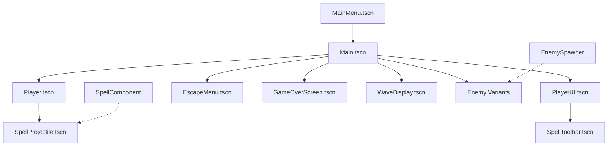

# Complete Scene Analysis

## Scene Structure Overview

The FFS Game uses a modular scene architecture with clear separation between gameplay systems, UI components, and entity management. All scenes follow Godot 4.4.1 best practices with component-based design.

## 1. Main Game Scene

### `/godot/Game10/scenes/Main.tscn`

**Purpose**: Primary game scene orchestrating all gameplay systems and UI elements  
**Scene Type**: Node2D (root scene)  
**Script**: `res://scripts/Main.gd`

**Complete Node Tree**:
```
Main (Node2D) - res://scripts/Main.gd
├── GameWorld (Node2D)
│   ├── UnifiedWorldManager (Node) - res://scripts/world/UnifiedWorldManager.gd
│   ├── Player (Instance: Player.tscn) - Position: Vector2(640, 360)
│   ├── EnemySpawner (Node) - res://scripts/EnemySpawner.gd
│   ├── GameplayController (Node) - res://scripts/GameplayController.gd
│   └── StatSystemTester (Node) - res://scripts/StatSystemTester.gd
└── UI (CanvasLayer)
    ├── PlayerUI (Instance: PlayerUI.tscn)
    ├── WaveDisplay (Instance: WaveDisplay.tscn)
    ├── GameplayHUD (Control)
    │   └── WaveInfo (VBoxContainer)
    │       ├── WaveLabel (Label) - "Wave: 1"
    │       ├── KillsLabel (Label) - "Kills: 0"
    │       └── EnemiesLabel (Label) - "Enemies: 0"
    ├── SimpleStatsDisplay (Instance: SimpleStatsDisplay.tscn)
    ├── EscapeMenu (Instance: EscapeMenu.tscn)
    ├── GameOverScreen (Instance: GameOverScreen.tscn)
    └── ToolbarManager (Node) - res://scripts/items/managers/ToolbarManager.gd
```

**External Scene Dependencies**:
- `res://scenes/gameplay/Player.tscn`
- `res://scenes/ui/PlayerUI.tscn` 
- `res://scenes/ui/WaveDisplay.tscn`
- `res://scenes/ui/SimpleStatsDisplay.tscn`
- `res://scenes/ui/EscapeMenu.tscn`
- `res://scenes/ui/GameOverScreen.tscn`

**Scene Loading**: Auto-loaded as main scene at project startup

**Scene Transitions**: 
- From MainMenu.tscn → Main.tscn via scene transition
- To GameOverScreen when player dies (managed by GameStateManager)

## 2. Player Entity Scene

### `/godot/Game10/scenes/gameplay/Player.tscn`

**Purpose**: Complete player character entity with component architecture  
**Scene Type**: CharacterBody2D  
**Script**: `res://scripts/entities/Player.gd`

**Complete Node Tree**:
```
Player (CharacterBody2D) - res://scripts/entities/Player.gd
├── PlayerSprite (Sprite2D) - texture: pixel_wizard-removebg-preview.png, scale: 0.5
├── PlayerCollision (CollisionShape2D) - RectangleShape2D (82x142)
├── DamageReceiver (Area2D) 
│   └── PlayerDamageCollision (CollisionShape2D) - RectangleShape2D (79x159)
├── MovementComponent (Node) - res://scripts/components/MovementComponent.gd
├── HealthComponent (Node) - res://scripts/components/HealthComponent.gd  
├── PlayerVisuals (Node) - res://scripts/components/PlayerVisuals.gd
├── SpellComponent (Node) - res://scripts/components/SpellComponent.gd
├── PlayerCamera (Camera2D) - res://scripts/components/CameraComponent.gd
└── StatSheet (Node) - res://scripts/stats/PlayerStatSheet.gd
```

**Resource Dependencies**:
- **Texture**: `res://assets/sprites/pixel_wizard-removebg-preview.png`

**Collision Configuration** (Verified):
- **CharacterBody2D**: collision_layer = 1, collision_mask = 4 (environment collision)
- **DamageReceiver Area2D**: collision_layer = 6, collision_mask = 2 (enemy damage detection)
- **Groups**: ["players"] for easy scene tree access

**Component Architecture**: Modular component design for extensibility

**Instantiation**: Created once in Main.tscn, persistent throughout gameplay

## 3. User Interface Scenes

### 3.1 `/godot/Game10/scenes/ui/PlayerUI.tscn`

**Purpose**: Main player interface showing health, mana, stats, and spell toolbar  
**Scene Type**: Control  
**Script**: `res://scripts/ui/PlayerUI.gd`

**Complete Node Tree**:
```
PlayerUI (Control) - res://scripts/ui/PlayerUI.gd
├── StatsPanel (Panel) - custom StyleBoxFlat
│   ├── Layout: Position (20, 20), Size (320, 280)
│   └── VBoxContainer
│       ├── Title (Label) - "Player Stats"
│       ├── HealthContainer (VBoxContainer)
│       │   ├── HealthLabel (Label) - "Health: 100/100"
│       │   └── HealthBar (ProgressBar) - custom green theme
│       ├── ManaContainer (VBoxContainer)
│       │   ├── ManaLabel (Label) - "Mana: 100/100"
│       │   └── ManaBar (ProgressBar) - custom blue theme
│       ├── RegenStatus (Label) - "Regenerating..."
│       ├── LevelLabel (Label) - "Level: 1"
│       ├── XPLabel (Label) - "XP: 0/100"
│       └── XPBar (ProgressBar) - custom purple theme
└── SpellToolbar (Instance: SpellToolbar.tscn)
```

**Signals Connected**:
- Connected to `GameEvents` for player stat updates
- UI updates triggered by events rather than polling

**Custom Styling**: 
- Rounded corner panels
- Color-coded progress bars (Health: green, Mana: blue, XP: purple)

### 3.2 `/godot/Game10/scenes/ui/EscapeMenu.tscn`

**Purpose**: In-game pause menu with game management options  
**Scene Type**: Control  
**Script**: `res://scripts/ui/EscapeMenuController.gd`

**Complete Node Tree**:
```
EscapeMenu (Control) - res://scripts/ui/EscapeMenuController.gd
├── Background (ColorRect) - Color: (0, 0, 0, 0.6)
├── MenuPanel (Panel) - Size: 400x500, anchored center
│   └── VBox (VBoxContainer) - margin: 20px
│       ├── TitleLabel (Label) - "Game Paused"
│       ├── ButtonContainer (VBoxContainer)
│       │   ├── ResumeButton (Button) - "Resume (ESC)"
│       │   ├── SaveButton (Button) - "Save Game (F5)"
│       │   ├── LoadButton (Button) - "Load Game (F9)"
│       │   ├── SettingsButton (Button) - "Settings"
│       │   ├── MainMenuButton (Button) - "Main Menu"
│       │   └── QuitButton (Button) - "Quit Game"
│       ├── FeedbackLabel (Label) - Status messages
│       └── ShortcutsLabel (Label) - Keyboard shortcuts info
└── ConfirmationDialog (ConfirmationDialog) - "Are you sure?"
```

**Signals Connected**:
- Button pressed signals to respective handlers
- ConfirmationDialog confirmed signal

**Features**:
- Keyboard shortcuts displayed and functional
- Confirmation dialogs for destructive actions
- Semi-transparent background overlay

### 3.3 `/godot/Game10/scenes/ui/GameOverScreen.tscn`

**Purpose**: End-game statistics and restart options  
**Scene Type**: Control  
**Script**: `res://scripts/ui/GameOverScreen.gd`

**Complete Node Tree**:
```
GameOverScreen (Control) - res://scripts/ui/GameOverScreen.gd
├── Background (ColorRect) - Color: (0, 0, 0, 0.8)
├── Panel (Panel) - Size: 500x400, anchored center
│   ├── Title (Label) - "Game Over"
│   ├── Stats (VBoxContainer)
│   │   ├── WaveLabel (Label) - "Waves Survived: X"
│   │   ├── KillsLabel (Label) - "Enemies Defeated: X"
│   │   ├── TimeLabel (Label) - "Time Played: X"
│   │   ├── LevelLabel (Label) - "Final Level: X"
│   │   └── XPLabel (Label) - "Total XP: X"
│   └── Buttons (HBoxContainer)
│       ├── NewRunButton (Button) - "New Run"
│       └── MainMenuButton (Button) - "Main Menu"
```

**Data Sources**: Populated with statistics from GameManager and WaveManager

**Scene Activation**: Triggered automatically when player dies via GameStateManager

### 3.4 `/godot/Game10/scenes/ui/SpellToolbar.tscn`

**Purpose**: Bottom-screen spell casting interface  
**Scene Type**: Control  
**Script**: `res://scripts/ui/SpellToolbar.gd`

**Complete Node Tree** (Verified):
```
SpellToolbar (Control) - res://scripts/ui/SpellToolbar.gd
├── Layout: Anchored bottom-center, Size: 300x80
└── ToolbarContainer (HBoxContainer) - centered layout
    └── [Empty - slots created dynamically in script]
```

**Implementation Notes**:
- **Dynamic Content**: All spell slots created programmatically
- **Script-Managed**: No pre-built UI elements in scene file
- **Integration**: Communicates with Player SpellComponent via events
- **Responsive**: Adapts to available spell count automatically

### 3.5 `/godot/Game10/scenes/ui/WaveDisplay.tscn`

**Purpose**: Current wave progress and enemy kill tracking  
**Scene Type**: Control  
**Script**: `res://scripts/ui/WaveDisplay.gd`

**Complete Node Tree**:
```
WaveDisplay (Control) - res://scripts/ui/WaveDisplay.gd
├── Layout: Position (20, 320), Size: 200x120
└── Panel (Panel) - custom orange border style
    └── VBoxContainer - margin: 10px
        ├── WaveLabel (Label) - "Wave 1"
        ├── KillProgressLabel (Label) - "Kills: 0/10"
        └── ProgressBar (ProgressBar) - visual progress
```

**Update Triggers**: Connected to WaveManager events for real-time updates

### 3.6 `/godot/Game10/scenes/ui/MainMenu.tscn` ⭐ **PROJECT ENTRY POINT**

**Purpose**: **Primary project entry point** with sophisticated save slot management  
**Scene Type**: Control  
**Script**: `res://scripts/ui/MainMenu.gd`  
**Project Role**: Configured as main scene in project.godot

**Complete Node Tree**:
```
MainMenu (Control) - res://scripts/ui/MainMenu.gd
├── Background (ColorRect) - gradient background
├── SlotSelection (Panel) - initial save slot screen
│   ├── Title (Label) - "Select Save Slot"
│   ├── VBox (VBoxContainer)
│   │   ├── Slot1Button (Button) - "Slot 1: [Character Name]"
│   │   ├── Slot2Button (Button) - "Slot 2: [Character Name]"
│   │   └── Slot3Button (Button) - "Slot 3: [Character Name]"
│   └── ActionButtonsPanel (Panel)
│       └── HBox (HBoxContainer)
│           ├── LoadButton (Button) - "Load Selected"
│           ├── RenameButton (Button) - "Rename"
│           └── DeleteButton (Button) - "Delete"
├── MainPanel (Panel) - main menu after slot selection
│   ├── Title (Label) - "Wizard RPG"
│   ├── SlotInfo (Label) - current slot information
│   ├── VBox (VBoxContainer)
│   │   ├── NewGameButton (Button) - "New Game"
│   │   ├── ContinueButton (Button) - "Continue"
│   │   ├── SettingsButton (Button) - "Settings"
│   │   ├── ChangeSlotButton (Button) - "Change Slot"
│   │   └── QuitButton (Button) - "Quit"
│   └── VersionLabel (Label) - "Version: v0.4.0"
├── ConfirmDialog (ConfirmationDialog)
├── DeleteConfirmDialog (ConfirmationDialog)
└── RenameDialog (AcceptDialog)
    └── RenameInput (LineEdit)
```

**Save System Integration**: Manages 3 save slots with character information display

**Scene Transition**: Loads Main.tscn when starting/continuing game

## 4. Enemy System Scenes

### 4.1 `/godot/Game10/scenes/Enemy.tscn`

**Purpose**: Base enemy template for all enemy types  
**Scene Type**: CharacterBody2D  
**Script**: `res://scripts/Enemy.gd`

**Complete Node Tree**:
```
Enemy (CharacterBody2D) - res://scripts/Enemy.gd
├── EnemySprite (Sprite2D) - texture: icon.svg (placeholder)
├── EnemyCollision (CollisionShape2D) - CircleShape2D (radius: 20)
└── HealthBar (ProgressBar) - HP display above enemy
# Note: DamageArea and components are handled in Enemy.gd script logic
```

**Template Usage**: All enemies use identical scene structure with Enemy.gd script
**Differentiation**: Enemy behavior controlled by `enemy_type` property
**Implementation**: Health, AI, and abilities managed in script rather than child nodes

### 4.2 Enemy Variants Directory: `/godot/Game10/scenes/enemies/`

**Available Enemy Types**:

#### Standard Enemy Structure (All Variants)
```
[EnemyType] (CharacterBody2D) - res://scripts/Enemy.gd
├── EnemySprite (Sprite2D) - variant-specific texture/scale
├── EnemyCollision (CollisionShape2D) - CircleShape2D (variant radius)
└── HealthBar (ProgressBar) - standard HP display
```

**Enemy Variant Configurations**:
- **Goblin.tscn** - radius: 49.1, scale: 0.5, enemy_type: "goblin"
- **Golem.tscn** - radius: 162.9, scale: 0.72, enemy_type: "golem"
- **Wizard.tscn** - enemy_type: "wizard", ability_manager_type: "wizard"
- **Skeleton.tscn** - enemy_type: "skeleton"
- **Slime.tscn** - radius: 13.4, enemy_type: "slime" (smallest)
- **Elemental.tscn** - enemy_type: "elemental"
- **Orc.tscn** - enemy_type: "orc"

**Key Insight**: All enemies share identical scene structure but differ in sprite, collision size, and script properties.

**Spawning**: All enemies instantiated dynamically by EnemySpawner based on wave configuration

## 5. Projectile System Scenes

### `/godot/Game10/scenes/SpellProjectile.tscn`

**Purpose**: Player spell projectiles  
**Scene Type**: Area2D  
**Script**: `res://scripts/SpellProjectile.gd`

**Complete Node Tree**:
```
SpellProjectile (Area2D) - res://scripts/SpellProjectile.gd
├── CollisionShape2D - RectangleShape2D (16x16)
├── Sprite2D - PlaceholderTexture2D (orange tint)
└── LifetimeTimer (Timer) - wait_time: 6.0, one_shot: true
```

**Signals Connected**:
- `area_entered` → `_on_area_entered` (enemy collision)
- `body_entered` → `_on_body_entered` (world collision)
- `LifetimeTimer.timeout` → `_on_lifetime_timer_timeout` (cleanup)

**Instantiation**: Created dynamically by Player's SpellComponent

## 6. Scene Dependencies Graph



## 7. Collision Layer Configuration

| Layer | Purpose | Used By |
|-------|---------|---------|
| 1 | Player Movement | Player CharacterBody2D |
| 2 | Enemies | Enemy CharacterBody2D |
| 4 | World/Environment | Static collision |
| 6 | Damage Detection | Player DamageReceiver, Spell Areas |

## 8. Scene Loading Patterns

### Static Loading (Main.tscn)
- All UI scenes instantiated at scene load
- Player scene instantiated once
- Management systems created as nodes

### Dynamic Loading (Runtime)
- Enemies spawned based on wave configuration
- Projectiles created when spells are cast
- UI elements updated via event system

### Scene Transitions
- **MainMenu → Main**: Via SceneTransition.change_scene()
- **Main → GameOver**: UI overlay, no scene change
- **GameOver → Main**: Restart current scene
- **Any → MainMenu**: Via SceneTransition.change_scene()

This modular scene architecture provides clean separation of concerns, efficient resource management, and extensible design patterns that support the game's complex feature set including infinite world generation, component-based entities, and sophisticated UI systems.