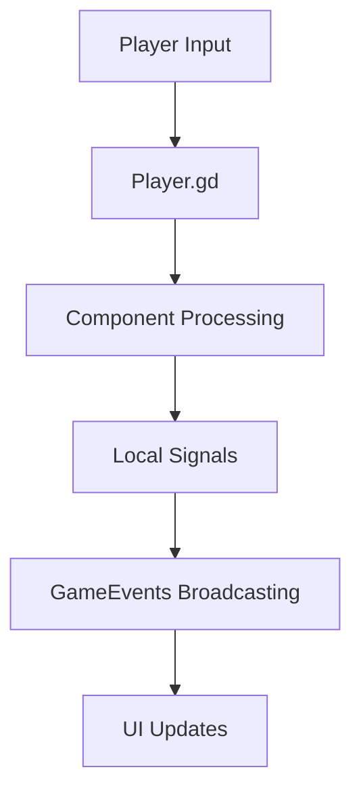

# Player Entity Analysis

## Overview

The FFS Wizard RPG implements a sophisticated player entity system through a component-based architecture. The main player entity coordinates specialized components for health, movement, visuals, and spell casting while maintaining clean separation of concerns.

## Core Player Entity

### Player.gd - Main Coordinator

**File Path**: `res://scripts/entities/Player.gd`  
**Class Type**: CharacterBody2D  
**Scene**: `res://scenes/gameplay/Player.tscn`

#### Architecture Pattern

The Player class follows a **Component Coordination** pattern where it manages specialized components rather than implementing functionality directly. This demonstrates proper separation of concerns and dependency injection patterns.

```gdscript
# Key components managed by Player
@onready var health_component: HealthComponent = $HealthComponent
@onready var movement_component: Node = $MovementComponent
@onready var player_visuals: Node = $PlayerVisuals
@onready var spell_component: Node = $SpellComponent
@onready var stat_sheet: PlayerStatSheet = $StatSheet
```

#### Key Features

1. **Factory Pattern Integration**: Works with PlayerBuilder for proper dependency injection
2. **Teleportation System**: Complex teleportation with collision handling and immunity
3. **Damage System**: Sophisticated damage handling with immunity windows
4. **Event Broadcasting**: Integrates with GameEvents for global system communication
5. **Defensive Programming**: Extensive error handling and fallback systems

#### Component Initialization

The Player uses a multi-phase initialization to prevent circular dependencies:

```gdscript
func setup_components():
    # Phase 1: Ensure components exist (defensive creation)
    if not health_component:
        health_component = HealthComponent.new()
        add_child(health_component)
    
    # Phase 2: Set up dependencies without initialization
    if stat_sheet:
        stat_sheet.set_owner_entity(self)
    
    # Phase 3: Initialize in dependency order
    if stat_sheet and stat_sheet.has_method("initialize"):
        stat_sheet.initialize()
    
    if health_component and health_component.has_method("initialize"):
        health_component.initialize()
```

## Component Architecture Analysis

### 1. HealthComponent - Life Management

**File Path**: `res://scripts/components/HealthComponent.gd`  
**Purpose**: Manages health, mana, regeneration, and damage processing

#### Key Features

- **Dynamic Max Values**: Health/mana maximums read from stats in real-time using properties
- **Regeneration System**: Timer-based health/mana recovery with stat integration
- **Damage Processing**: Includes dodge mechanics and immunity systems
- **Reactive Integration**: Automatically responds to stat changes

```gdscript
# Dynamic properties that always read from StatSheet
var max_health: float:
    get:
        if stat_sheet and stat_sheet.has_method("get_stat_value"):
            return stat_sheet.get_stat_value("max_health")
        return 100.0  # Fallback default
```

#### Dependency Injection Pattern

The HealthComponent uses explicit initialization to eliminate circular dependencies:

```gdscript
func initialize():
    if not owner_entity or not stat_sheet:
        push_error("Cannot initialize without dependencies")
        return
    
    _setup_from_dependencies()
    _is_initialized = true
```

### 2. MovementComponent - Physics Handler

**File Path**: `res://scripts/components/MovementComponent.gd`  
**Purpose**: Handles player movement physics with stat integration

#### Key Features

- **Stat-Driven Movement**: All movement values calculated from player stats
- **Reactive Updates**: Movement automatically updates when stats change
- **Dodge System Integration**: Coordinates with Player.gd's teleport system
- **Performance Bounds**: Safety checks for invalid positions

```gdscript
func _initialize_from_stats() -> void:
    base_speed = player_stat_sheet.get_stat_value("movement_speed")
    
    if player_stat_sheet.has_stat("dodge_speed"):
        dodge_speed = player_stat_sheet.get_stat_value("dodge_speed")
```

#### Stat Integration

The component connects to stat changes for real-time updates:

```gdscript
func _on_stat_changed(stat_name: String, old_value: float, new_value: float) -> void:
    match stat_name:
        "movement_speed":
            base_speed = new_value
        "dexterity":
            var new_speed = player_stat_sheet.get_stat_value("movement_speed")
            base_speed = new_speed
```

### 3. PlayerStatSheet - Character Progression

**File Path**: `res://scripts/stats/PlayerStatSheet.gd`  
**Purpose**: Manages character stats, progression, and computed values

#### Architecture

Extends the base StatSheet with player-specific functionality including experience, leveling, and attribute allocation.

```gdscript
# Player progression tracking
var available_stat_points: int = 0
var current_xp: float = 0.0
var xp_to_next_level: float = 100.0
var total_xp: float = 0.0
```

#### Direct Function Optimization

Uses direct function calls instead of computed stat formulas for performance:

```gdscript
func get_max_health() -> float:
    var base_value = 100.0 + get_stat_value("vitality") * 5.0 + get_stat_value("level") * 3.0
    return apply_modifiers_to_stat("max_health", base_value)

func get_spell_damage_multiplier() -> float:
    var base_value = 1.0 + get_stat_value("intelligence") * 0.02
    return apply_modifiers_to_stat("spell_damage_multiplier", base_value)
```

#### Experience and Leveling

Implements a scaling experience system with automatic level-up handling:

```gdscript
func gain_experience(amount: float) -> void:
    current_xp += amount
    total_xp += amount
    
    while current_xp >= xp_to_next_level:
        current_xp -= xp_to_next_level
        var current_level = int(get_stat_value("level"))
        current_level += 1
        set_stat_base_value("level", current_level)
        available_stat_points += 5  # 5 points per level
```

### 4. PlayerUI - Interface Integration

**File Path**: `res://scripts/ui/PlayerUI.gd`  
**Purpose**: Real-time UI updates for player stats and resources

#### Live Stat Integration

The UI connects directly to components and stat sheets for real-time updates:

```gdscript
func _get_live_max_health() -> float:
    if player_stat_sheet:
        return player_stat_sheet.get_stat_value("max_health")
    return 100.0

func _on_player_health_changed(new_current: float, _signal_maximum: float) -> void:
    current_health = new_current
    _schedule_update()
```

#### Performance Optimization

Uses deferred updates to prevent recursion and excessive redraws:

```gdscript
func _schedule_update():
    if not _update_scheduled:
        _update_scheduled = true
        call_deferred("_perform_update")
```

## Advanced Systems

### Teleportation Mechanics

The Player implements sophisticated teleportation with collision handling:

```gdscript
func start_teleport():
    is_teleporting = true
    teleport_timer = teleport_duration
    
    # Disable collision during teleport
    collision_layer = 0
    collision_mask = 4  # Environment only
    
    # Disable damage receiver
    if damage_receiver:
        damage_receiver.set_collision_mask_value(2, false)
```

#### Safe Position Finding

Includes systems to find safe positions after teleportation:

```gdscript
func find_safe_position_for_collision_restore() -> Vector2:
    # Check for overlaps at current position
    var shape_query = PhysicsShapeQueryParameters2D.new()
    shape_query.shape = collision_shape.shape
    shape_query.collision_mask = 2  # Enemy layer
    
    var overlaps = space_state.intersect_shape(shape_query, 5)
    if overlaps.size() == 0:
        return global_position  # Current position is safe
```

### Damage and Immunity System

Implements multiple immunity types with careful timing:

```gdscript
func take_damage(amount: float, source: Node = null, damage_type: String = "physical") -> bool:
    if damage_immunity_timer > 0:
        teleports_successful += 1
        show_teleport_success()
        return false
    
    var damage_taken = health_component.take_damage(amount)
    if damage_taken:
        show_damage_feedback(damage, damage_type)
        GameEvents.emit_player_damaged(damage, damage_type)
```

## Integration Patterns

### Component Communication

1. **Direct References**: Components access related components through the Player
2. **Signal Broadcasting**: Local signals bubble up to GameEvents for global communication
3. **Reactive Stats**: Changes automatically propagate through the stat system

### Event Flow



### Factory Pattern Integration

The Player integrates with PlayerBuilder for proper dependency injection:

```gdscript
func finalize_initialization():
    if not _is_factory_created:
        return
    
    if not stat_sheet or not health_component:
        push_error("Cannot finalize without dependencies")
        return
    
    _setup_from_dependencies()
```

## Performance Considerations

### Caching and Optimization

- **Emergency Teleport Caching**: Caches nearest enemy for performance
- **Direct Function Calls**: Critical calculations bypass signal overhead
- **Deferred Updates**: UI updates batched to reduce processing

### Memory Management

- **Pooled Effects**: Afterimages and visual effects use object pooling
- **Safe References**: Extensive validation prevents memory leaks
- **Cleanup Systems**: Proper component cleanup on destruction

## Error Handling

### Defensive Programming

```gdscript
func get_current_health() -> float:
    if health_component:
        return health_component.current_health
    return fallback_health  # Graceful degradation

# Properties for save system compatibility
var level: int:
    get:
        if stat_sheet and stat_sheet.has_method("get_stat_value"):
            return int(stat_sheet.get_stat_value("level"))
        return 1  # Safe default
```

### Validation Systems

The Player includes comprehensive validation for component states and provides fallback values for all critical systems, ensuring the game remains functional even when components are missing or misconfigured.

This player entity architecture demonstrates excellent separation of concerns, performance optimization, and robust error handling while supporting complex gameplay mechanics through clean component composition.