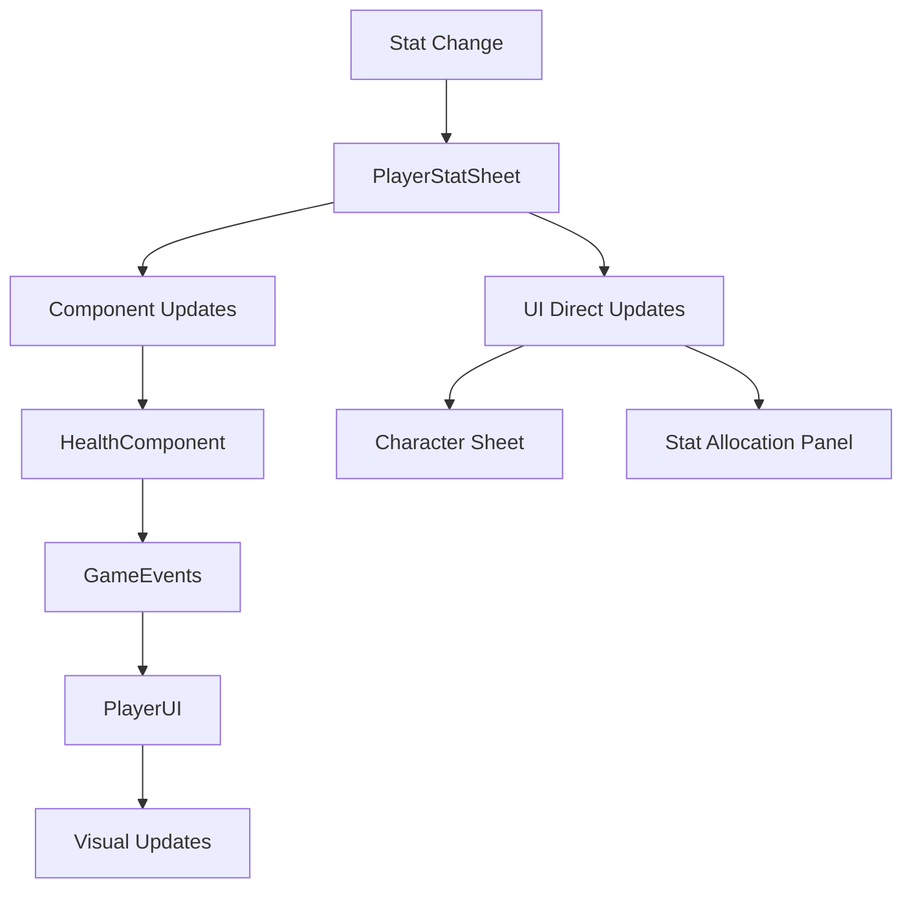

# Player UI Integration

## Overview

The Player UI Integration system in the FFS Wizard RPG demonstrates sophisticated real-time data binding, reactive UI updates, and performance-optimized interface management. The system provides seamless communication between player systems and UI components while maintaining clean separation of concerns through multiple specialized UI classes.

## Core UI Architecture

### Main Player UI System

**File Path**: `res://scripts/ui/PlayerUI.gd`  
**Scene Path**: `res://scenes/ui/PlayerUI.tscn`

#### Component Hierarchy

```
PlayerUI (Control)
├── StatsPanel (Panel)
│   ├── HealthContainer (VBoxContainer)
│   │   ├── HealthLabel (Label)
│   │   └── HealthBar (ProgressBar)
│   ├── ManaContainer (VBoxContainer)
│   │   ├── ManaLabel (Label)
│   │   └── ManaBar (ProgressBar)
│   ├── RegenStatus (Label)
│   ├── LevelLabel (Label)
│   ├── XPLabel (Label)
│   └── XPBar (ProgressBar)
└── SpellToolbar (Control)
```

#### Real-Time Data Binding

The UI system uses multiple communication patterns for different types of updates:

```gdscript
# Direct Event Binding for critical, high-frequency updates
func _ready() -> void:
    # Connect directly to player components for immediate updates
    if GameEvents:
        GameEvents.player_health_changed.connect(_on_player_health_changed)
        GameEvents.player_mana_changed.connect(_on_player_mana_changed)
    
    # Connect to stat sheet for real-time stat updates
    if player_stat_sheet:
        if player_stat_sheet.has_signal("stat_value_changed"):
            player_stat_sheet.stat_value_changed.connect(_on_stat_changed)
        if player_stat_sheet.has_signal("level_up"):
            player_stat_sheet.level_up.connect(_on_level_up)
```

#### Live Stat Integration

The UI connects directly to components and stat sheets for real-time updates:

```gdscript
# Get fresh max health from stat sheet
func _get_live_max_health() -> float:
    if player_stat_sheet:
        return player_stat_sheet.get_stat_value("max_health")
    return 100.0

# Get fresh max mana from stat sheet
func _get_live_max_mana() -> float:
    if player_stat_sheet:
        return player_stat_sheet.get_stat_value("max_mana")
    return 50.0

func _on_player_health_changed(new_current: float, _signal_maximum: float) -> void:
    current_health = new_current
    _schedule_update()
```

#### Performance Optimization

Uses deferred updates to prevent recursion and excessive redraws:

```gdscript
# Schedule deferred update to avoid recursion
func _schedule_update():
    if not _update_scheduled:
        _update_scheduled = true
        call_deferred("_perform_update")

func _perform_update():
    _update_scheduled = false
    _update_display_animated()
```

### Character Sheet System

**File Path**: `res://scripts/ui/DraggableCharacterSheet.gd`

The character sheet provides comprehensive stat viewing in a draggable window:

```gdscript
extends Window

func _update_stats_display():
    var text = ""
    
    # Base Attributes (5 stats)
    text += "[color=cyan][b]━━━ BASE ATTRIBUTES ━━━[/b][/color]\n"
    text += _format_stat("Level", player_stat_sheet.get_stat_value("level"), true)
    text += _format_stat("Intelligence", player_stat_sheet.get_stat_value("intelligence"), true)
    text += _format_stat("Wisdom", player_stat_sheet.get_stat_value("wisdom"), true)
    text += _format_stat("Vitality", player_stat_sheet.get_stat_value("vitality"), true)
    text += _format_stat("Dexterity", player_stat_sheet.get_stat_value("dexterity"), true)
    
    # Combat Stats (8 stats)
    text += "\n[color=orange][b]━━━ COMBAT STATS ━━━[/b][/color]\n"
    text += _format_stat("Spell Damage", player_stat_sheet.get_stat_value("spell_damage_multiplier"), false, "x")
    text += _format_stat("Critical Chance", player_stat_sheet.get_stat_value("critical_chance") * 100, false, "%")
    text += _format_stat("Critical Damage", player_stat_sheet.get_stat_value("critical_hit_multiplier"), false, "x")
    text += _format_stat("Cooldown Reduction", player_stat_sheet.get_stat_value("cooldown_reduction") * 100, false, "%")
```

#### Features

- **26 Total Stats**: Comprehensive display of all character statistics
- **Organized Categories**: Base attributes, vital stats, combat stats, movement & defense, progression
- **Real-time Updates**: Automatically refreshes when stats change
- **Rich Text Formatting**: Color-coded sections with proper formatting

### Stat Allocation Panel

**File Path**: `res://scripts/ui/allocation/StatAllocationPanel.gd`  
**Scene Path**: `res://scenes/ui/stats/StatAllocationUI.tscn`

The stat allocation system provides an interactive UI for character customization:

#### Interactive Allocation Interface

```gdscript
# UI element mapping for easy access
var attribute_ui_elements: Dictionary = {
    "intelligence": {
        "current_label": intelligence_current_label,
        "plus_button": intelligence_plus_button,
        "preview_label": intelligence_preview_label
    },
    "wisdom": {
        "current_label": wisdom_current_label,
        "plus_button": wisdom_plus_button,
        "preview_label": wisdom_preview_label
    }
    # ... etc for vitality and dexterity
}
```

#### Real-Time Preview System

The allocation panel shows immediate impact of pending stat changes:

```gdscript
func _update_computed_stat_preview() -> void:
    # Create temporary attribute values with pending changes
    var preview_attributes = {}
    for attribute in pending_allocations.keys():
        preview_attributes[attribute] = current_attributes[attribute] + pending_allocations[attribute]
    
    # Calculate health changes
    var current_max_health = player_stat_sheet.get_stat_value("max_health")
    var preview_max_health = 100 + preview_attributes.vitality * 5 + current_level * 3
    var health_change = preview_max_health - current_max_health
    
    if health_change > 0:
        preview_text += "[color=green]Max Health: +" + str(int(health_change)) + " (" + str(int(current_max_health)) + " -> " + str(int(preview_max_health)) + ")[/color]\n"
```

#### Validation and Safety

```gdscript
func _can_allocate_point() -> bool:
    var points_remaining = available_points - total_pending_points
    
    if points_remaining <= 0:
        print("❌ No stat points remaining")
        return false
    
    return true

func _apply_allocations() -> void:
    # Apply each attribute allocation
    for attribute in pending_allocations.keys():
        var points_to_spend = pending_allocations[attribute]
        if points_to_spend > 0:
            var success = player_stat_sheet.increase_attribute(attribute, points_to_spend)
            if success:
                applied_allocations[attribute] = points_to_spend
```

## Advanced UI Systems

### Animation and Visual Feedback

The UI system provides rich visual feedback for all player actions:

#### Health/Mana Bar Effects

```gdscript
# Update health bar with animation
func _update_health_bar_animated() -> void:
    var max_health = _get_live_max_health()
    health_bar.max_value = max_health
    
    # Animate value change
    if health_tween:
        health_tween.kill()
    health_tween = create_tween()
    health_tween.tween_property(health_bar, "value", current_health, animation_duration)
    health_tween.tween_callback(_update_health_color_animated)

# Update health bar color based on percentage
func _update_health_bar_color(health_percent: float) -> void:
    var health_style = health_bar.get_theme_stylebox("fill") as StyleBoxFlat
    
    if health_percent > 0.5:
        health_style.bg_color = health_normal_color
    elif health_percent > 0.25:
        health_style.bg_color = health_warning_color
    else:
        health_style.bg_color = health_critical_color
```

#### Stat Change Animations

```gdscript
func _on_stat_allocated(attribute_name: String, new_value: float):
    # Flash the stat that was increased
    var ui_elements = attribute_ui_elements[attribute_name]
    var stat_label = ui_elements.current_label
    var original_color = stat_label.modulate
    
    var tween = create_tween()
    tween.tween_property(stat_label, "modulate", Color.YELLOW, 0.1)
    tween.tween_property(stat_label, "modulate", original_color, 0.3)
```

### Save/Load Integration

The UI system handles save/load events to refresh display data:

```gdscript
func _on_save_loaded(success: bool, message: String, save_data) -> void:
    """Handle save load completion - refresh XP values from stat sheet"""
    if success:
        # Refresh XP values from the updated stat sheet
        if player_stat_sheet:
            current_level = int(player_stat_sheet.get_stat_value("level"))
            current_xp = player_stat_sheet.current_xp
            xp_to_next_level = player_stat_sheet.xp_to_next_level
            
            # Update display immediately
            _update_display_immediate()
```

### Performance Optimization Techniques

#### Update Batching

Multiple UI updates are batched to prevent excessive redraws:

```gdscript
var _pending_updates: Dictionary = {}
var _update_timer: Timer

func _on_stat_changed(stat_name: String, old_value: float, new_value: float):
    # Batch the update
    _pending_updates[stat_name] = new_value
    
    if _update_timer.is_stopped():
        _update_timer.start()

func _process_pending_updates():
    for stat_name in _pending_updates:
        _apply_stat_update(stat_name, _pending_updates[stat_name])
    
    _pending_updates.clear()
```

#### Conditional UI Updates

UI elements only update when values actually change:

```gdscript
var _last_health_value: float = -1
var _last_max_health: float = -1

func update_health(current: float, max_val: float):
    var health_changed = current != _last_health_value
    var max_changed = max_val != _last_max_health
    
    if max_changed:
        max_value = max_val
        _last_max_health = max_val
    
    if health_changed:
        value = current
        _last_health_value = current
        health_label.text = "%d/%d" % [int(current), int(max_val)]
```

#### Lazy Initialization

UI components initialize expensive resources only when needed:

```gdscript
func _initialize_from_player() -> void:
    # Find player and get direct stat sheet access
    player_reference = get_tree().get_first_node_in_group("players")
    if not player_reference:
        print("⚠️ PlayerUI: Player not found, using default values")
        _update_display_immediate()
        return
    
    # Get player stat sheet for direct max value access
    if player_reference.has_method("get_stat_sheet"):
        player_stat_sheet = player_reference.get_stat_sheet()
```

## Error Handling and Validation

### UI State Validation

The UI system validates its state and recovers from errors:

```gdscript
func _validate_ui_elements() -> bool:
    var elements = [health_label, health_bar, mana_label, mana_bar, regen_status, level_label, xp_label, xp_bar]
    for element in elements:
        if not element:
            push_error("PlayerUI: Missing UI element")
            return false
    return true
```

### Safe Event Handling

Event handlers validate data and handle edge cases:

```gdscript
func _on_player_health_changed(new_current: float, _signal_maximum: float) -> void:
    # Validate current value
    if new_current < 0:
        push_error("PlayerUI: Invalid current health: " + str(new_current))
        return
    
    # Update current health
    current_health = new_current
    _schedule_update()
```

### Graceful Degradation

UI systems provide fallback behavior when components are missing:

```gdscript
func _get_live_max_health() -> float:
    if player_stat_sheet:
        return player_stat_sheet.get_stat_value("max_health")
    elif health_component:
        return health_component.max_health
    return 100.0  # Safe fallback
```

## Integration Patterns

### Event Flow Architecture



### Multi-UI Coordination

The system manages multiple UI components that all display player data:

- **PlayerUI**: Real-time health/mana/XP display
- **DraggableCharacterSheet**: Comprehensive stat viewing
- **StatAllocationPanel**: Interactive stat point allocation
- **Achievement Notifications**: Milestone and progression feedback

### Cross-System Communication

All UI systems integrate seamlessly through:

- **GameEvents**: Global event broadcasting for health/mana changes
- **Direct Stat Access**: Real-time stat reading from PlayerStatSheet
- **Signal Connections**: Component-to-UI communication
- **Save/Load Events**: Coordination with persistent data systems

This comprehensive UI integration system provides responsive, performant, and accessible player interfaces while maintaining clean separation between game logic and presentation layers through well-defined communication patterns and robust error handling.