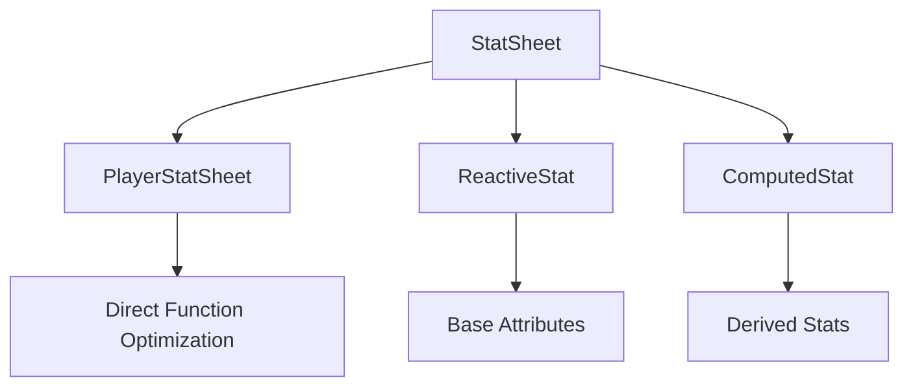
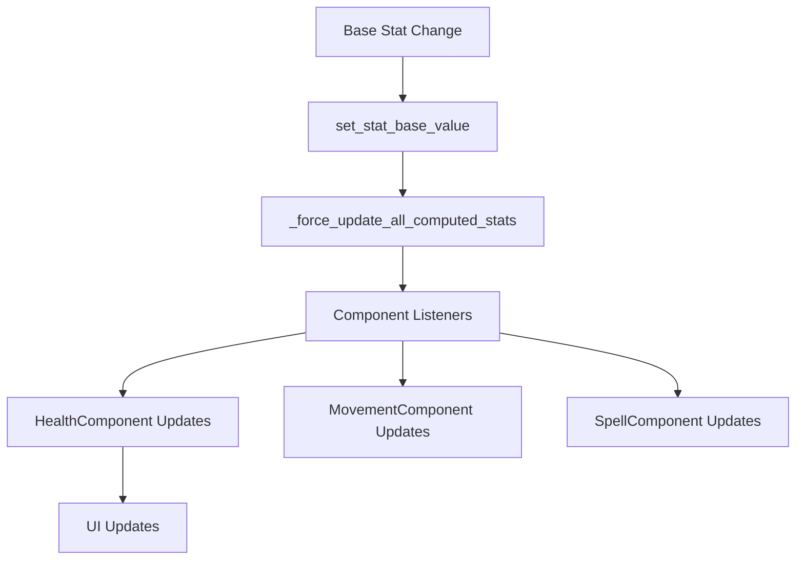

# Stats System Deep Dive

## Overview

The FFS Wizard RPG implements a sophisticated reactive stats system that combines performance optimization with flexible, formula-based calculations. The system supports real-time stat modifications, automatic dependency tracking, and seamless integration with all game systems through direct function optimization.

## Core Stats Architecture

### Architectural Principles

1. **Reactive Design**: Stats automatically notify dependents when values change
2. **Performance Optimization**: Direct function calls for critical calculations
3. **Dependency Injection**: Eliminates circular dependencies through controlled initialization
4. **Type Safety**: Strong typing prevents invalid stat operations
5. **Graceful Degradation**: Fallback values ensure game stability

### Class Hierarchy



## Core Classes Analysis

### 1. PlayerStatSheet.gd - Player-Specific Implementation

**File Path**: `res://scripts/stats/PlayerStatSheet.gd`  
**Purpose**: Extends StatSheet with player progression and direct function optimizations

#### Base Attribute System

**Core Attributes** (start at 10):
- **Intelligence**: Affects spell damage multiplier and mana pool
- **Wisdom**: Affects mana regeneration and cooldown reduction  
- **Vitality**: Affects health and health regeneration
- **Dexterity**: Affects movement speed and dodge chance

**Initialization Pattern**:
```gdscript
func setup_base_attributes():
    # Primary attributes - Start at 10, can be increased via stat points
    register_stat("intelligence", 10.0, "Raw Intelligence - affects mana and spell damage")
    register_stat("wisdom", 10.0, "Raw Wisdom - affects mana regeneration") 
    register_stat("vitality", 10.0, "Raw Vitality - affects health")
    register_stat("dexterity", 10.0, "Raw Dexterity - affects movement speed")
    register_stat("level", 1.0, "Character Level")
```

#### Performance Optimization - Direct Functions

Instead of using slow computed stats for critical calculations, PlayerStatSheet implements direct functions:

```gdscript
# Direct function for performance-critical calculations
func get_max_health() -> float:
    var base_value = 100.0 + get_stat_value("vitality") * 5.0 + get_stat_value("level") * 3.0
    return apply_modifiers_to_stat("max_health", base_value)

func get_max_mana() -> float:
    var base_value = 50.0 + get_stat_value("intelligence") * 3.0 + get_stat_value("wisdom") * 2.0 + get_stat_value("level") * 2.0
    return apply_modifiers_to_stat("max_mana", base_value)

func get_spell_damage_multiplier() -> float:
    var base_value = 1.0 + get_stat_value("intelligence") * 0.02
    return apply_modifiers_to_stat("spell_damage_multiplier", base_value)

func get_movement_speed() -> float:
    var base_value = 120.0 + get_stat_value("dexterity") * 2.0
    return apply_modifiers_to_stat("movement_speed", base_value)
```

#### Character Progression System

**Experience and Leveling**:
```gdscript
func gain_experience(amount: float) -> void:
    current_xp += amount
    total_xp += amount
    
    while current_xp >= xp_to_next_level:
        current_xp -= xp_to_next_level
        var current_level = int(get_stat_value("level"))
        current_level += 1
        set_stat_base_value("level", current_level)
        
        # Grant stat points (5 per level)
        available_stat_points += 5
        
        # Calculate next level XP requirement
        xp_to_next_level = base_xp_per_level * pow(xp_scaling_factor, current_level - 1)
        
        level_up.emit(current_level, 5)
```

**Stat Point Allocation**:
```gdscript
func increase_attribute(attribute_name: String, points: int) -> bool:
    if available_stat_points < points or points <= 0:
        return false
    
    # Apply the increase
    var old_value = get_stat_value(attribute_name)
    var new_value = old_value + points
    set_stat_base_value(attribute_name, new_value)
    available_stat_points -= points
    
    # Force immediate recalculation of ALL computed stats
    _force_update_all_computed_stats()
    
    attribute_increased.emit(attribute_name, new_value)
    return true
```

#### Milestone System

The PlayerStatSheet includes a comprehensive milestone-based progression system:

```gdscript
func apply_milestone_bonus(milestone_name: String):
    var modifier_source = "milestone_" + milestone_name
    
    match milestone_name:
        "first_blood":  # 25 kills - +25 flat health bonus
            add_flat_modifier_to_stat("max_health", 25.0, modifier_source)
        "apprentice_slayer":  # 50 kills - +1.0 flat mana regen bonus
            add_flat_modifier_to_stat("mana_regen_rate", 1.0, modifier_source)
        "monster_hunter":  # 100 kills - +2% flat critical chance bonus
            add_flat_modifier_to_stat("critical_chance", 0.02, modifier_source)
        "destroyer":  # 500 kills - Mixed bonuses
            add_flat_modifier_to_stat("max_health", 50.0, modifier_source)
            add_percent_modifier_to_stat("spell_damage_multiplier", 0.25, modifier_source)
        "legend":  # 1000 kills - Ultimate bonuses
            add_flat_modifier_to_stat("max_health", 100.0, modifier_source)
            add_percent_modifier_to_stat("spell_damage_multiplier", 0.50, modifier_source)
            add_flat_modifier_to_stat("critical_chance", 0.05, modifier_source)
```

### 2. Dependency Injection Architecture

The stats system uses explicit initialization to eliminate circular dependencies:

```gdscript
# In PlayerStatSheet.gd
func set_owner_entity(entity: Node):
    """Set owner entity without triggering initialization"""
    owner_entity = entity

func initialize():
    """Initialize stat sheet after all dependencies are set"""
    if _is_initialized:
        return
    
    setup_player_stats()
    _force_update_all_computed_stats()
    _is_initialized = true
```

### 3. Integration with Game Components

#### Health Component Integration

The HealthComponent uses dynamic properties that read from stats in real-time:

```gdscript
# In HealthComponent.gd
var max_health: float:
    get:
        if stat_sheet and stat_sheet.has_method("get_stat_value"):
            return stat_sheet.get_stat_value("max_health")
        return 100.0  # Fallback default

var max_mana: float:
    get:
        if stat_sheet and stat_sheet.has_method("get_stat_value"):
            return stat_sheet.get_stat_value("max_mana")
        return 50.0  # Fallback default
```

#### Reactive Updates

The HealthComponent automatically responds to stat changes:

```gdscript
func on_stats_changed():
    # Update regen rates from stats
    health_regen_rate = stat_sheet.get_stat_value("health_regen_rate")
    mana_regen_rate = stat_sheet.get_stat_value("mana_regen_rate")
    
    # Clamp current values to new maximums
    current_health = clamp(current_health, 0, max_health)
    current_mana = clamp(current_mana, 0, max_mana)
    
    # Emit health changed signal
    health_changed.emit(current_health, max_health)
```

#### Movement Component Integration

The MovementComponent connects to stat changes for real-time updates:

```gdscript
# In MovementComponent.gd
func _on_stat_changed(stat_name: String, old_value: float, new_value: float) -> void:
    match stat_name:
        "movement_speed":
            base_speed = new_value
        "dexterity":
            var new_speed = player_stat_sheet.get_stat_value("movement_speed")
            base_speed = new_speed
```

#### Spell Component Integration

The SpellComponent uses stats for enhanced damage calculations:

```gdscript
# In SpellComponent.gd
func _calculate_enhanced_damage(base_damage: float) -> float:
    if not player_stat_sheet:
        return base_damage
    
    # Get spell damage multiplier from Intelligence
    var damage_multiplier = player_stat_sheet.get_stat_value("spell_damage_multiplier")
    var modified_damage = base_damage * damage_multiplier
    
    # Check for critical hit based on Intelligence
    var critical_chance = player_stat_sheet.get_stat_value("critical_chance")
    if randf() < critical_chance:
        modified_damage *= 2.0
    
    return modified_damage
```

## Advanced Features

### Computed Stat Performance Optimization

The system uses direct function calls instead of string-based formulas:

```gdscript
func setup_optimized_computed_stats():
    var optimized_stats = [
        "max_health", "health_regen_rate", "max_mana", "mana_regen_rate",
        "spell_damage_multiplier", "critical_chance", "cooldown_reduction", "movement_speed"
    ]
    
    for stat_name in optimized_stats:
        var computed_stat = ComputedStat.new(stat_name, "", [], "Computed from attributes")
        computed_stat.use_direct_function = true
        computed_stat.stat_sheet = self
        computed_stats[stat_name] = computed_stat
```

### Modifier System

Stats support both flat and percentage modifiers:

```gdscript
func apply_modifiers_to_stat(stat_name: String, base_value: float) -> float:
    if not computed_stats.has(stat_name):
        return base_value
    
    var computed_stat = computed_stats[stat_name]
    var final_value = base_value
    
    # Apply flat modifiers first
    if computed_stat.has_metadata("flat_modifiers"):
        var flat_mods = computed_stat.get_metadata("flat_modifiers")
        for source in flat_mods:
            final_value += flat_mods[source]
    
    # Apply percent modifiers (multiplicative)
    if computed_stat.has_metadata("percent_modifiers"):
        var percent_mods = computed_stat.get_metadata("percent_modifiers")
        for source in percent_mods:
            final_value *= (1.0 + percent_mods[source])
    
    return final_value
```

### Reactive Update Chain



## Performance Considerations

### Caching Strategy

- **Direct Functions**: Critical calculations bypass signal overhead
- **Dirty Flagging**: Recalculation only when dependencies change
- **Component Caching**: Frequently accessed values cached until invalidated

### Memory Management

- **Weak References**: Prevent memory leaks in long-lived connections
- **Cleanup Systems**: Proper component cleanup on destruction
- **Validation**: Comprehensive bounds checking prevents invalid states

### Error Handling

#### Defensive Programming

```gdscript
func get_stat_value(stat_name: String) -> float:
    # DEFENSIVE: Ensure we're initialized before stat access
    if not _is_initialized:
        # Return sensible defaults for critical stats  
        match stat_name:
            "level": return 1.0
            "intelligence", "wisdom", "vitality", "dexterity": return 10.0
            "max_health": return 100.0
            "max_mana": return 50.0
            _: return 0.0
    
    # Check base stats first
    if stats.has(stat_name):
        return stats[stat_name].get_final_value()
    
    # Check computed stats with direct function optimization
    elif computed_stats.has(stat_name):
        var computed_stat = computed_stats[stat_name]
        if computed_stat.use_direct_function:
            var method_name = "get_" + stat_name
            if has_method(method_name):
                return call(method_name)
```

#### Validation Systems

```gdscript
func validate_health_bounds() -> bool:
    var was_valid = true
    
    # Check current health bounds
    if current_health > max_health:
        current_health = max_health
        was_valid = false
    elif current_health < 0:
        current_health = 0
        was_valid = false
    
    return was_valid
```

## UI Integration

### Real-Time Stat Display

The stat system integrates seamlessly with UI components:

```gdscript
# In StatAllocationPanel.gd
func _update_computed_stat_preview() -> void:
    # Calculate preview changes
    var preview_attributes = {}
    for attribute in pending_allocations.keys():
        preview_attributes[attribute] = current_attributes[attribute] + pending_allocations[attribute]
    
    # Calculate health changes
    var current_max_health = player_stat_sheet.get_stat_value("max_health")
    var preview_max_health = 100 + preview_attributes.vitality * 5 + current_level * 3
    var health_change = preview_max_health - current_max_health
```

### Live Stat Updates

```gdscript
# In PlayerUI.gd
func _get_live_max_health() -> float:
    if player_stat_sheet:
        return player_stat_sheet.get_stat_value("max_health")
    return 100.0

func _on_stat_changed(stat_name: String, old_value: float, new_value: float) -> void:
    if stat_name in ["vitality", "level", "intelligence", "wisdom"]:
        _schedule_update()
```

## Save/Load Integration

### State Serialization

```gdscript
func get_all_stats() -> Dictionary:
    var all_stats = {}
    
    # Base stats
    for stat_name in stats.keys():
        all_stats[stat_name] = get_stat_value(stat_name)
    
    # Computed stats  
    for stat_name in computed_stats.keys():
        all_stats[stat_name] = get_stat_value(stat_name)
    
    return all_stats
```

This sophisticated stats system provides the foundation for complex character progression while maintaining excellent performance through caching, direct function optimization, and reactive updates. The modular design allows for easy extension with new stats, modifiers, and calculation methods while ensuring type safety and preventing common errors like circular dependencies.