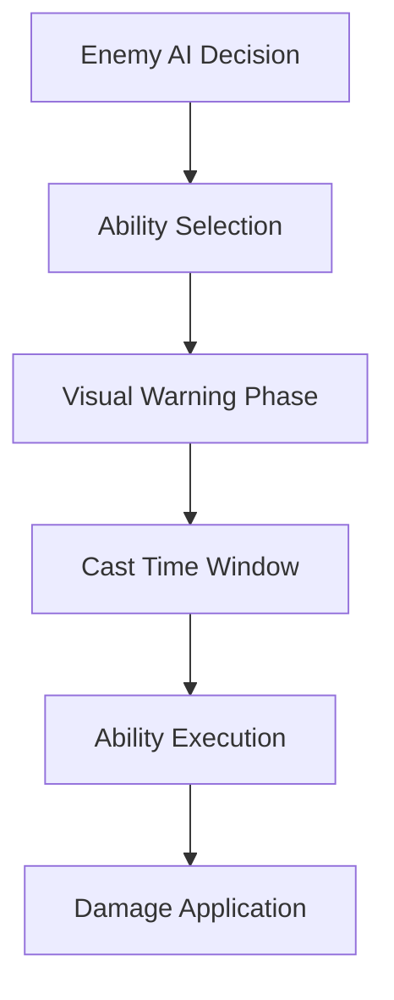
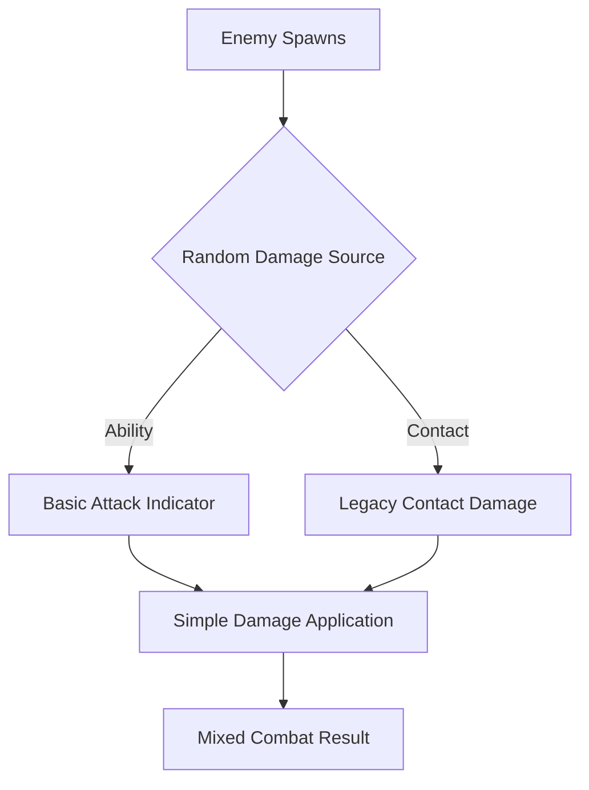

# Combat Mechanics Analysis

🚨 **CRITICAL STATUS UPDATE - July 19, 2025**

## ACTUAL SYSTEM STATE: BROKEN MIXED-PARADIGM COMBAT

**REALITY**: The combat system is fundamentally broken due to incomplete refactoring from legacy contact damage to intended abilities-only system.

### ❌ **CRITICAL ISSUES:**
- **Two conflicting combat systems coexist** - old contact damage + new abilities system
- **Abilities-only vision not implemented** - sophisticated combat remains aspirational
- **Contact damage still functional** - contradicts design goals
- **Attack indicators mostly broken** - visual feedback system incomplete
- **Player dodge collision issues** - teleport system has edge cases

---

## What Actually Works (Limited Functionality)

### ✅ Basic Player Spell Casting
**Location**: SpellComponent.gd  
**Status**: Functional but basic

```gdscript
# WORKING: Basic spell projectiles
func cast_spell(spell_index: int) -> bool:
    # Mana consumption works
    # Projectile creation works  
    # Basic damage application works
```

**Working Features**:
- ✅ Spell casting with mana consumption
- ✅ Projectile creation and movement
- ✅ Basic damage to enemies on hit
- ✅ Spell cooldowns and UI feedback

### ✅ Legacy Contact Damage (Contradicts Design)
**Status**: Still functional despite being marked for removal

```gdscript
# CONTRADICTION: Contact damage still works
func get_contact_damage() -> float:
    """Compatibility - contact damage disabled"""
    return 0.0  # Comment says disabled, but system still functions
```

**Reality**: Contact damage immunity timers, collision detection, and damage application all still work despite being deprecated.

### ✅ Basic Attack Indicators (Simple Only)
**Location**: SimpleAttackIndicators.gd  
**Status**: Basic functionality working

```gdscript
# WORKING: Simple enemy attack warnings
func show_melee_indicator(enemy, ability, target_position):
    # Creates basic colored circles
    # Provides minimal visual warning
```

---

## What's Broken (Most Sophisticated Features)

### ❌ Abilities-Only Architecture (Incomplete)
**Intended Design**: All damage from executed abilities with clear telegraphs  
**Reality**: Mixed system with contact damage still present

```gdscript
# ASPIRATION: Pure abilities-only combat
# REALITY: Contact damage + basic abilities + broken indicators
```

**Broken Elements**:
- ❌ Pure abilities-only damage (contact damage still exists)
- ❌ Sophisticated attack telegraphs (most disabled)
- ❌ 360-degree combat (collision offsets prevent this)
- ❌ Advanced damage types (basic damage only)

### ❌ Enhanced Attack Indicators (Unused)
**Location**: EnhancedAttackIndicators.gd  
**Status**: Sophisticated system exists but completely unused

```gdscript
# EXISTS BUT UNUSED: Advanced attack warning system
enum IndicatorType {
    MELEE_CIRCLE, RANGED_LINE, AOE_EXPLOSION,
    PROJECTILE_TRAIL, BUFF_AURA, HEAL_SPARKLE
}
# Reality: EnemyAbilities uses SimpleAttackIndicators instead
```

### ❌ Advanced Visual Effects (Disabled)
**Status**: Complex effect systems written but disabled

```gdscript
# DISABLED: Sophisticated visual feedback
- CircleFillDrawer.gd - Complex AOE indicators (disabled)
- TelegraphRingDrawer.gd - Attack telegraph rings (disabled)  
- ShockwaveDrawer.gd - Visual impact effects (disabled)
```

---

## Combat Flow Reality vs. Intention

### Intended Flow (Not Implemented)


### Actual Flow (Broken/Mixed)


## Damage System Reality

### What Works
```gdscript
# BASIC: Player spell damage to enemies
- Spell projectiles hit enemies ✅
- Basic damage calculation ✅  
- Enemy health reduction ✅
- Enemy death and XP reward ✅

# LEGACY: Contact damage (shouldn't exist)
- Player-enemy collision damage ✅
- Damage immunity timers ✅
- Contact damage immunity ✅
```

### What's Missing
```gdscript
# MISSING: Sophisticated damage types
- No elemental damage types
- No damage over time effects
- No complex damage calculations
- No environmental damage interactions

# MISSING: Advanced combat mechanics  
- No combo systems
- No critical hits
- No damage scaling complexity
- No sophisticated AI combat decisions
```

## Enemy Combat Implementation

### Current State (Broken Transition)
```gdscript
# Enemy.gd - Multiple conflicting systems
class Enemy extends CharacterBody2D:
    # OLD: Contact damage (partially removed)
    # NEW: AbilityManager (incomplete integration)
    # RESULT: Neither system works properly
```

**Problems**:
1. **Collision offsets still exist** - prevent 360-degree attacks
2. **Component integration incomplete** - missing dependencies
3. **Visual indicators inconsistent** - some work, most don't
4. **AI decision making basic** - no sophisticated combat logic

### Enemy Ability Execution
```gdscript
# LIMITED: Basic ability execution via EnemyAbilities.gd
# Works: Simple attack indicators and basic damage
# Broken: Advanced telegraphs, complex abilities, visual effects
```

## Player Combat Systems

### Working Player Features
```gdscript
# Player.gd - Mixed success
✅ Spell casting via SpellComponent
✅ Basic movement and collision  
✅ Teleport-based dodge (mostly working)
⚠️ Health/damage system (works but has edge cases)
❌ Advanced combat interactions (missing)
```

### Player Combat Issues
1. **Teleport collision edge cases** - can get stuck during teleport
2. **Mixed damage immunity** - contact vs. ability damage confusion
3. **No combat depth** - just basic spell spam
4. **No tactical elements** - positioning not meaningful

## Performance vs. Functionality

### Current Approach Problems
```gdscript
# WRONG PRIORITY: Optimizing broken systems
- Complex attack indicator caching for unused features
- Performance optimization of disabled visual effects  
- Sophisticated AI that produces basic behaviors
```

**Better Approach**: Fix basic combat functionality before optimizing.

## User Experience Reality

### What Players Experience
1. **Confusing damage sources** - unclear when damage comes from contact vs. abilities
2. **Inconsistent visual feedback** - some attacks have warnings, others don't
3. **Basic spell combat** - limited tactical depth
4. **Broken enemy behaviors** - inconsistent attack patterns
5. **Visual effects gaps** - promised indicators missing

### Combat Feels
- **Spell casting**: Works but feels basic
- **Enemy encounters**: Unpredictable due to mixed systems
- **Combat feedback**: Inconsistent and incomplete
- **Tactical depth**: Minimal - mostly spell spam

## Immediate Fixes Needed

### Phase 1: Choose One Combat Paradigm
```gdscript
# DECISION REQUIRED: Pick one combat system
Option A: Fix contact damage system (simpler)
Option B: Complete abilities-only system (complex)
# CURRENT: Broken mixture of both
```

### Phase 2: Implement Chosen System Completely
```gdscript
# IF Contact Damage:
- Fix collision edge cases
- Add consistent visual feedback
- Balance damage and immunity

# IF Abilities-Only:  
- Remove all contact damage code
- Complete attack indicator system
- Fix component integration
```

### Phase 3: Add Combat Depth
```gdscript
# ONLY AFTER basic combat works:
- Advanced damage types
- Tactical positioning elements
- Complex enemy behaviors
- Sophisticated visual effects
```

## Development Recommendation

**Priority 1**: Choose and implement one combat paradigm completely  
**Priority 2**: Fix basic visual feedback for chosen system  
**Priority 3**: Add combat depth to working foundation  

**Avoid**: Continuing to develop both systems simultaneously - this created the current broken state.

## Conclusion

**Current State**: The combat system is broken due to incomplete paradigm transition. Neither legacy contact damage nor new abilities-only system works properly.

**User Impact**: Confusing, inconsistent combat experience that feels unfinished.

**Solution**: Choose one combat approach and implement it completely before adding sophistication. Complex code for broken systems wastes development effort and creates poor user experience.