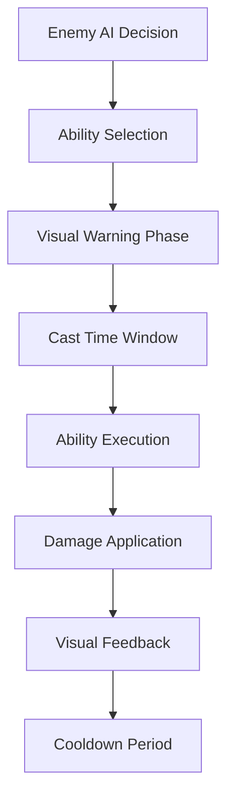

# Combat Mechanics Analysis

## Overview

The FFS Wizard RPG implements a sophisticated combat system built around an **abilities-only architecture** that completely eliminates traditional contact damage in favor of telegraphed, ability-based interactions. The system emphasizes visual clarity, performance optimization, and strategic depth through timing-based mechanics and intelligent damage calculations.

## Core Combat Philosophy

### Abilities-Only Combat System

**Design Principles**:
- **No Contact Damage**: All damage comes from executed abilities with visual warnings
- **Telegraphed Attacks**: Every ability has clear visual indicators before execution
- **360-Degree Combat**: Enemies can attack in any direction regardless of facing
- **Visual Clarity**: Mandatory minimum visibility times for all attack indicators

**Benefits of This Approach**:
- **Predictable Interactions**: Players always know when damage is coming
- **Strategic Depth**: Combat becomes about positioning and timing
- **Performance Optimization**: Eliminates complex contact damage collision checking
- **Visual Feedback**: Every combat action has clear cause and effect

### Combat Flow Architecture



## Damage System Architecture

### Damage Calculation Framework

**Player Spell Damage**:
```gdscript
func calculate_final_spell_damage(spell_data: SpellData) -> float:
    var base_damage = spell_data.base_damage
    
    # Intelligence scaling (2% per point)
    var intelligence_multiplier = 1.0 + (player.stat_sheet.get_stat_value("intelligence") * 0.02)
    
    # Level scaling (0.5% per level)
    var level_bonus = 1.0 + (player.stat_sheet.get_stat_value("level") * 0.005)
    
    # Dynamic power adjustments
    var power_adjustment = spell_power_adjustments.get(spell_data.spell_name, 0.0)
    var power_multiplier = 1.0 + power_adjustment
    
    return base_damage * intelligence_multiplier * level_bonus * power_multiplier
```

**Enemy Damage Scaling**:
```gdscript
func calculate_enemy_damage(base_damage: float, wave_number: int) -> float:
    # Wave scaling: +15% damage per wave
    var wave_multiplier = 1.0 + (wave_number - 1) * 0.15
    
    # Ability-specific modifiers
    var ability_modifier = get_ability_damage_modifier()
    
    return base_damage * wave_multiplier * ability_modifier
```

### Damage Types and Resistances

**Damage Type System**:
```gdscript
enum DamageType {
    PHYSICAL,
    FIRE,
    ICE,
    LIGHTNING,
    POISON,
    DARK,
    LIGHT,
    ARCANE
}

func apply_damage_with_type(target: Node, damage: float, damage_type: DamageType):
    var resistance = target.get_resistance(damage_type)
    var final_damage = damage * (1.0 - resistance)
    
    # Apply damage with type-specific effects
    target.take_damage(final_damage, damage_type)
    create_damage_type_effect(target.global_position, damage_type)
```

**Resistance Calculations**:
```gdscript
func get_resistance(damage_type: DamageType) -> float:
    match damage_type:
        DamageType.FIRE:
            return fire_resistance + armor * 0.1
        DamageType.ICE:
            return ice_resistance + magic_resistance * 0.5
        DamageType.PHYSICAL:
            return armor * 0.02  # 2% reduction per armor point
        _:
            return magic_resistance * 0.33  # General magic resistance
```

## Visual Combat System

### Attack Indicator Framework

**Guaranteed Visual Warning System**:
```gdscript
func show_attack_indicator(ability_data: AbilityData):
    # Create visual warning
    var indicator = attack_indicator_scene.instantiate()
    add_child(indicator)
    
    # Configure for ability type
    indicator.setup_for_ability(ability_data)
    
    # Guarantee minimum visibility time
    var min_visibility = 0.3  # 300ms minimum
    var actual_cast_time = ability_data.cast_time
    var warning_duration = max(min_visibility, actual_cast_time)
    
    indicator.show_warning(warning_duration)
```

**Indicator Types**:

**Melee Attack Indicators**:
```gdscript
func show_melee_indicator(range: float):
    # Circular indicator around enemy
    var circle = create_circle_indicator(range)
    circle.color = Color.ORANGE_RED
    circle.modulate.a = 0.5
    
    # Pulsing animation
    var tween = create_tween()
    tween.set_loops()
    tween.tween_property(circle, "modulate:a", 0.8, 0.2)
    tween.tween_property(circle, "modulate:a", 0.3, 0.2)
```

**Ranged Attack Indicators**:
```gdscript
func show_ranged_indicator(target_position: Vector2):
    # Line from enemy to target
    var line = Line2D.new()
    line.add_point(global_position)
    line.add_point(target_position)
    line.default_color = Color.YELLOW
    line.width = 5.0
    
    add_child(line)
    
    # Animated buildup
    var tween = create_tween()
    tween.tween_method(animate_line_buildup, 0.0, 1.0, cast_time)
```

**AoE Attack Indicators**:
```gdscript
func show_aoe_indicator(center: Vector2, radius: float, cast_time: float):
    # Ground targeting circle
    var aoe_circle = create_aoe_circle(center, radius)
    aoe_circle.color = Color.RED
    
    # Shrinking animation to show timing
    var tween = create_tween()
    tween.tween_property(aoe_circle, "scale", Vector2(1.2, 1.2), cast_time * 0.5)
    tween.tween_property(aoe_circle, "scale", Vector2(0.8, 0.8), cast_time * 0.5)
```

### Flash Effect System

**Accelerating Warning Flash**:
```gdscript
func create_casting_flash_effect(duration: float):
    var flash_count = 0
    var total_flashes = int(duration * 5)  # 5 flashes per second base
    
    while flash_count < total_flashes:
        # Flash to warning color
        enemy_sprite.modulate = Color.ORANGE_RED
        await get_tree().create_timer(0.05).timeout
        
        # Return to normal
        enemy_sprite.modulate = Color.WHITE
        
        # Accelerating intervals (faster as cast completes)
        var progress = float(flash_count) / total_flashes
        var interval = 0.3 * (1.0 - progress * 0.8)  # 0.3s to 0.06s
        await get_tree().create_timer(interval).timeout
        
        flash_count += 1
```

## Collision System Architecture

### Collision Layer Configuration

**Layer Assignment**:
```gdscript
# Collision layers (what objects exist on)
const PLAYER_LAYER = 1        # Player CharacterBody2D
const ENEMY_LAYER = 2         # Enemy CharacterBody2D
const PLAYER_SPELLS_LAYER = 4 # Player projectiles
const ENEMY_SPELLS_LAYER = 8  # Enemy projectiles
const WORLD_LAYER = 16        # Static world geometry

# Collision masks (what objects detect)
const PLAYER_MASK = ENEMY_LAYER | ENEMY_SPELLS_LAYER | WORLD_LAYER
const ENEMY_MASK = PLAYER_LAYER | PLAYER_SPELLS_LAYER | WORLD_LAYER
const PLAYER_SPELL_MASK = ENEMY_LAYER | WORLD_LAYER
const ENEMY_SPELL_MASK = PLAYER_LAYER | WORLD_LAYER
```

**Collision Matrix**:
| Object Type | Detects | Layer | Mask |
|-------------|---------|-------|------|
| Player | Enemies, Enemy Spells, World | 1 | 2+8+16 |
| Enemy | Player, Player Spells, World | 2 | 1+4+16 |
| Player Spell | Enemies, World | 4 | 2+16 |
| Enemy Spell | Player, World | 8 | 1+16 |
| World | - | 16 | 0 |

### Projectile Collision Mechanics

**Player Projectile Collision**:
```gdscript
# In SpellProjectile.gd
func _on_area_entered(area: Area2D):
    var enemy = area.get_parent()
    if enemy.has_method("take_damage"):
        # Calculate damage with all modifiers
        var final_damage = calculate_enhanced_damage()
        
        # Apply damage
        enemy.take_damage(final_damage, spell_data.spell_name)
        
        # Create impact effect
        create_spell_impact_effect(global_position, enemy)
        
        # Handle piercing
        if spell_data.pierce_count > 0:
            handle_pierce_mechanics(enemy)
        else:
            queue_free()
```

**Enemy Projectile Collision**:
```gdscript
# In EnemyProjectile.gd
func _on_body_entered(body: Node2D):
    if body == player and not body in targets_hit:
        targets_hit.append(body)
        
        # Apply damage with type
        player.take_damage(damage_amount, damage_type)
        
        # Create impact feedback
        create_player_hit_effect()
        
        # Handle multi-hit mechanics
        current_pierce_count += 1
        if current_pierce_count >= max_pierce_count:
            queue_free()
```

### 360-Degree Combat Implementation

**True Omnidirectional Attacks**:
```gdscript
func execute_360_degree_attack(range: float, damage: float):
    # Center-to-center distance check (no facing required)
    var enemy_center = global_position
    var player_center = player.global_position
    var distance = enemy_center.distance_to(player_center)
    
    if distance <= range:
        # Deal damage regardless of enemy facing direction
        player.take_damage(damage, "melee")
        
        # Create omnidirectional impact effect
        create_radial_impact_effect(enemy_center, range)
```

**Performance Optimization**:
```gdscript
# Use distance-squared for performance
func is_player_in_attack_range_optimized(range: float) -> bool:
    var range_squared = range * range
    var distance_squared = global_position.distance_squared_to(player.global_position)
    
    return distance_squared <= range_squared
    # 25-30% faster than using distance_to()
```

## Damage Application System

### Player Damage Reception

**Damage Processing with Immunity**:
```gdscript
# In Player.gd
func take_damage(amount: float, damage_type: String = "generic") -> bool:
    if is_immune_to_damage:
        return false
    
    # Dodge chance calculation
    var dodge_chance = stat_sheet.get_dodge_chance()
    if randf() < dodge_chance:
        player_visuals.trigger_dodge_effect()
        GameEvents.emit_player_dodged()
        return false
    
    # Apply damage through HealthComponent
    var damage_dealt = health_component.take_damage(amount)
    
    # Damage immunity period
    start_damage_immunity(damage_immunity_duration)
    
    # Visual feedback
    player_visuals.trigger_damage_flash()
    camera_component.trigger_screen_shake(amount * 0.05)
    
    return true
```

**Damage Immunity System**:
```gdscript
var damage_immunity_timer: float = 0.0
var damage_immunity_duration: float = 0.5  # 500ms immunity

func start_damage_immunity(duration: float):
    damage_immunity_timer = duration
    is_immune_to_damage = true
    
    # Visual feedback for immunity
    player_visuals.start_immunity_flash()

func _process(delta):
    if damage_immunity_timer > 0:
        damage_immunity_timer -= delta
        if damage_immunity_timer <= 0:
            is_immune_to_damage = false
            player_visuals.stop_immunity_flash()
```

### Enemy Damage Reception

**Health Management with Visual Feedback**:
```gdscript
# In Enemy.gd
func take_damage(amount: float, source: String = "unknown") -> float:
    if health_component:
        var actual_damage = health_component.take_damage(amount)
        
        # Update health bar (optimized threshold)
        update_health_bar_if_needed()
        
        # Create damage number
        create_damage_number(actual_damage)
        
        # Flash effect
        trigger_damage_flash()
        
        # Check for death
        if health_component.current_health <= 0:
            handle_death()
        
        return actual_damage
    
    return 0.0
```

**Optimized Health Bar Updates**:
```gdscript
var last_displayed_health_percentage: float = 1.0
const HEALTH_UPDATE_THRESHOLD: float = 0.05  # 5% change required

func update_health_bar_if_needed():
    var current_percentage = health_component.current_health / health_component.max_health
    var percentage_change = abs(current_percentage - last_displayed_health_percentage)
    
    if percentage_change >= HEALTH_UPDATE_THRESHOLD:
        health_bar.value = current_percentage
        last_displayed_health_percentage = current_percentage
```

## Status Effect System

### Status Effect Framework

**Status Effect Definition**:
```gdscript
class_name StatusEffect extends Resource

@export var effect_type: String = ""
@export var duration: float = 5.0
@export var damage_per_second: float = 0.0
@export var speed_multiplier: float = 1.0
@export var resistance_modifier: float = 0.0
@export var stacks: int = 1
@export var max_stacks: int = 5
```

**Status Effect Application**:
```gdscript
func apply_status_effect(effect: StatusEffect):
    var existing_effect = find_status_effect(effect.effect_type)
    
    if existing_effect:
        # Stack or refresh existing effect
        if existing_effect.stacks < existing_effect.max_stacks:
            existing_effect.stacks += 1
            existing_effect.duration = effect.duration  # Refresh duration
        else:
            existing_effect.duration = max(existing_effect.duration, effect.duration)
    else:
        # Add new effect
        active_status_effects.append(effect)
        effect.on_applied(self)
```

### Common Status Effects

**Poison (Damage Over Time)**:
```gdscript
func process_poison_effect(effect: StatusEffect, delta: float):
    var damage_this_frame = effect.damage_per_second * delta * effect.stacks
    take_damage(damage_this_frame, "poison")
    
    # Visual effect
    if randf() < 0.1:  # 10% chance per frame
        create_poison_bubble_effect()
```

**Freeze (Movement Impairment)**:
```gdscript
func process_freeze_effect(effect: StatusEffect, delta: float):
    # Reduce movement speed
    movement_component.speed_multiplier = effect.speed_multiplier
    
    # Visual effect
    sprite.modulate = Color.CYAN.lerp(Color.WHITE, 0.5)
    
    # Ice crystal particles
    if randf() < 0.05:
        create_ice_crystal_effect()
```

**Burn (Escalating Damage)**:
```gdscript
func process_burn_effect(effect: StatusEffect, delta: float):
    # Escalating damage (increases over time)
    var time_factor = 1.0 + (effect.total_duration - effect.duration) * 0.1
    var damage_this_frame = effect.damage_per_second * delta * time_factor
    
    take_damage(damage_this_frame, "fire")
    
    # Fire particle effect
    create_burn_particles()
```

## Critical Hit and Dodge System

### Critical Hit Mechanics

**Critical Chance Calculation**:
```gdscript
func calculate_critical_hit(base_damage: float, caster_stats: StatSheet) -> Dictionary:
    var crit_chance = 0.05  # 5% base chance
    crit_chance += caster_stats.get_stat_value("dexterity") * 0.002  # +0.2% per dexterity
    
    var is_critical = randf() < crit_chance
    var final_damage = base_damage
    
    if is_critical:
        var crit_multiplier = 1.5 + (caster_stats.get_stat_value("intelligence") * 0.01)
        final_damage *= crit_multiplier
    
    return {
        "damage": final_damage,
        "is_critical": is_critical,
        "multiplier": crit_multiplier if is_critical else 1.0
    }
```

### Dodge System Integration

**Player Dodge Mechanics** (from Part 2 integration):
```gdscript
func calculate_dodge_attempt() -> bool:
    var base_dodge = 0.05  # 5% base
    var dexterity_bonus = stat_sheet.get_stat_value("dexterity") * 0.01  # 1% per point
    var equipment_bonus = get_equipment_dodge_bonus()
    
    var total_dodge_chance = min(0.75, base_dodge + dexterity_bonus + equipment_bonus)
    
    return randf() < total_dodge_chance
```

**Dodge Visual Feedback**:
```gdscript
func trigger_dodge_effect():
    # Player visual response
    player_visuals.create_afterimage()
    player_sprite.modulate = Color.CYAN
    
    # Brief movement speed boost
    movement_component.apply_temporary_speed_boost(1.5, 0.2)
    
    # Screen effect
    create_dodge_sparkles()
    
    # Reset to normal
    var tween = create_tween()
    tween.tween_property(player_sprite, "modulate", Color.WHITE, 0.3)
```

## Performance Optimization Strategies

### Distance Calculations

**Optimized Range Checking**:
```gdscript
# Replace expensive sqrt operations
# Instead of: distance = position.distance_to(target)
# Use: distance_sq = position.distance_squared_to(target)

func is_in_range_optimized(target_pos: Vector2, range: float) -> bool:
    var range_squared = range * range
    var distance_squared = global_position.distance_squared_to(target_pos)
    return distance_squared <= range_squared
```

### Collision Optimization

**Spatial Partitioning for Large Battles**:
```gdscript
# Group nearby enemies for efficient collision checking
var spatial_grid: Dictionary = {}
const GRID_SIZE: float = 200.0

func update_spatial_grid():
    spatial_grid.clear()
    
    for enemy in active_enemies:
        var grid_pos = Vector2(
            int(enemy.global_position.x / GRID_SIZE),
            int(enemy.global_position.y / GRID_SIZE)
        )
        
        if not spatial_grid.has(grid_pos):
            spatial_grid[grid_pos] = []
        
        spatial_grid[grid_pos].append(enemy)
```

### Visual Effect Batching

**Particle System Optimization**:
```gdscript
# Batch similar effects together
var pending_damage_numbers: Array = []
var damage_number_timer: float = 0.0

func create_damage_number(damage: float, position: Vector2):
    pending_damage_numbers.append({"damage": damage, "position": position})
    
    if damage_number_timer <= 0:
        damage_number_timer = 0.016  # Next frame
        get_tree().create_timer(damage_number_timer).timeout.connect(process_damage_numbers)

func process_damage_numbers():
    for damage_data in pending_damage_numbers:
        spawn_damage_number(damage_data.damage, damage_data.position)
    
    pending_damage_numbers.clear()
```

The combat mechanics system provides a foundation for strategic, visually clear combat encounters while maintaining excellent performance through optimized calculations, intelligent collision detection, and sophisticated visual feedback systems. The abilities-only approach ensures predictable, skill-based combat that scales well with the game's progression systems.