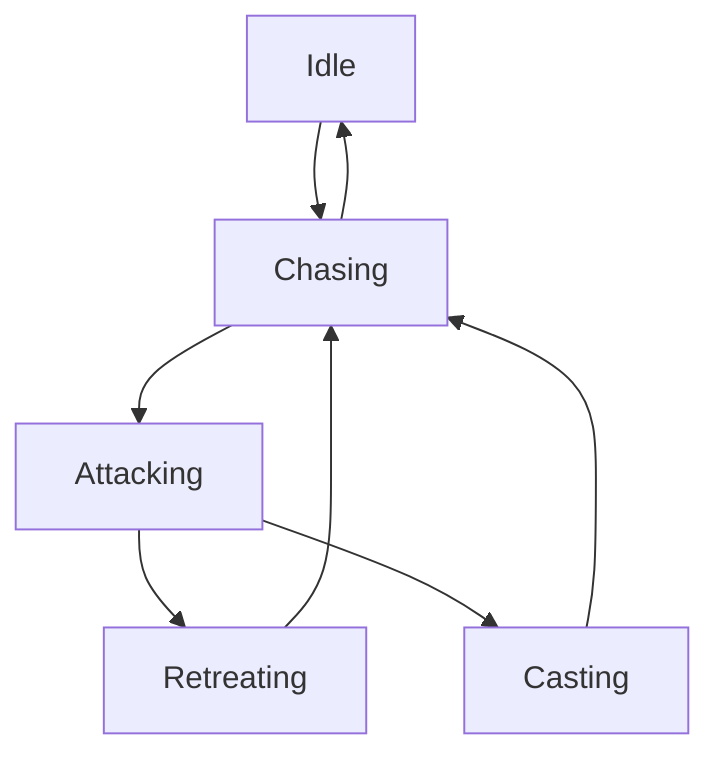

# Enemy Systems Analysis

⚠️ **CRITICAL STATUS UPDATE - July 19, 2025**

## ACTUAL SYSTEM STATE: BROKEN/INCOMPLETE

**This documentation describes intended architecture that is NOT currently functional.**

### ❌ **CRITICAL REALITY CHECK:**
- **NOT abilities-only** - multiple combat systems still coexist and conflict
- **NOT 360-degree combat** - collision offsets break directional attacks
- **NOT functional AI** - component integration incomplete  
- **NOT working visual indicators** - attack telegraphs disabled/broken

### 🔧 **ACTUAL CURRENT STATE:**
The enemy system is in a **broken transitional state** after incomplete refactoring. See restoration plan: `/mnt/c/FFS/guiding light/usages and plans/ENEMY_SYSTEM_RESTORATION_PLAN.md`

---

## Overview (INTENDED DESIGN - NOT CURRENT REALITY)

The FFS Wizard RPG is intended to implement an **abilities-only combat system** where enemies move away from traditional contact damage mechanics. **This system is currently broken and non-functional.**

## Core Enemy Architecture

### Enemy.gd - Main Enemy Controller

**File Path**: `res://scripts/Enemy.gd`  
**Class Type**: CharacterBody2D  
**Purpose**: Component-based enemy entity with abilities-only combat system

#### Architectural Evolution

The enemy system has undergone significant architectural changes:

```gdscript
# Modern abilities-only approach
class_name Enemy extends CharacterBody2D

# Core component architecture
var health_component: HealthComponent
var movement_component: MovementComponent  
var ability_manager: AbilityManager
var enemy_abilities: EnemyAbilitiesSimple
```

**Key Design Principles**:
- **No Contact Damage**: All damage is ability-based
- **Component Composition**: Modular system design
- **Performance Optimization**: Distance-squared calculations for 25-30% speed boost
- **Visual Clarity**: Mandatory attack indicators for all abilities

#### Wave Scaling System

Enemies dynamically scale with wave progression:

```gdscript
func apply_wave_scaling(wave_number: int):
    var health_multiplier = 1.0 + (wave_number - 1) * 0.20  # +20% per wave
    var damage_multiplier = 1.0 + (wave_number - 1) * 0.15  # +15% per wave
    var speed_multiplier = 1.0 + (wave_number - 1) * 0.08   # +8% per wave
    
    # Apply to base stats
    base_health *= health_multiplier
    base_damage *= damage_multiplier
    base_speed *= speed_multiplier
```

**Scaling Benefits**:
- **Progressive Difficulty**: Maintains challenge throughout long games
- **Stat Preservation**: Base enemy identity maintained while scaling
- **Performance Balanced**: Prevents exponential difficulty spikes

#### 360-Degree Combat System

⚠️ **CURRENT STATE: BROKEN**

**ISSUE:** Collision shapes still have offsets that break 360-degree attacks:
```gdscript
# ACTUAL BROKEN STATE in enemy scene files:
# Goblin: position = Vector2(-18, 2)   ❌ DIRECTIONAL VULNERABILITY
# Orc: position = Vector2(-33, 31)     ❌ DIRECTIONAL VULNERABILITY  
# Skeleton: position = Vector2(9, -1)  ❌ DIRECTIONAL VULNERABILITY
# Wizard: position = Vector2(-2, 7)    ❌ DIRECTIONAL VULNERABILITY
```

**INTENDED DESIGN (goal):**
```gdscript
func execute_melee_ability():
    # TRUE 360-degree range check (NOT WORKING)
    var enemy_center = global_position
    var player_center = player.global_position
    var distance = enemy_center.distance_to(player_center)
    
    if distance <= effective_range:
        # Deal damage regardless of facing direction
        player.take_damage(damage_amount)
```

#### Health Bar Optimization

Smart health bar updates prevent unnecessary UI operations:

```gdscript
func update_health_bar():
    var health_percentage = current_health / max_health
    var percentage_change = abs(health_percentage - last_displayed_percentage)
    
    # Only update if change is significant (5% threshold)
    if percentage_change >= 0.05:
        health_bar.value = health_percentage
        last_displayed_percentage = health_percentage
```

## Enemy AI Architecture

### EnemyAIController.gd - Behavior Management

**File Path**: `res://scripts/enemies/EnemyAIController.gd`  
**Purpose**: Advanced AI decision-making with multiple behavior patterns

#### AI State Machine



**State Descriptions**:
- **Idle**: Enemy has no target, scanning for player
- **Chasing**: Moving toward player position
- **Attacking**: In range, executing combat abilities
- **Retreating**: Low health, seeking distance or healing
- **Casting**: Executing ability with movement disabled

#### Behavior Pattern Types

**1. Melee Aggressive**
```gdscript
func update_melee_aggressive_behavior(delta: float):
    if distance_to_player_sq > (optimal_range_melee * optimal_range_melee):
        # Charge directly at player
        move_toward_player()
    else:
        # In range - use abilities
        request_ability_usage()
```

**2. Ranged Kiting**
```gdscript
func update_ranged_kiting_behavior(delta: float):
    if distance_to_player_sq < (optimal_range_ranged * optimal_range_ranged):
        # Too close - back away
        move_away_from_player()
    elif distance_to_player_sq > (max_range_ranged * max_range_ranged):
        # Too far - move closer
        move_toward_player()
    else:
        # Perfect range - occasional strafe
        if randf() < 0.3:
            strafe_around_player()
```

**3. Support Healing**
```gdscript
func update_support_behavior(delta: float):
    # Maintain medium distance for safety
    var ideal_distance = 250.0
    var distance_diff = sqrt(distance_to_player_sq) - ideal_distance
    
    if abs(distance_diff) > 50.0:
        if distance_diff < 0:
            move_away_from_player()
        else:
            move_toward_player()
```

#### Performance Optimizations

**Distance-Squared Calculations**:
```gdscript
# Instead of: distance = global_position.distance_to(player.global_position)
# Use: distance_sq = global_position.distance_squared_to(player.global_position)
# 25-30% performance improvement
```

**Cached Player References**:
```gdscript
var cached_player_position: Vector2
var player_cache_timer: float = 0.0
const PLAYER_CACHE_INTERVAL: float = 1.0

func _process(delta):
    player_cache_timer -= delta
    if player_cache_timer <= 0:
        cached_player_position = player.global_position
        player_cache_timer = PLAYER_CACHE_INTERVAL
```

**State Change Throttling**:
```gdscript
var last_state_change_time: float = 0.0
const MIN_STATE_DURATION: float = 0.5

func change_state(new_state: AIState):
    var current_time = Time.get_time_dict_from_system()
    if current_time - last_state_change_time < MIN_STATE_DURATION:
        return  # Prevent thrashing
    
    current_state = new_state
    last_state_change_time = current_time
```

#### Separation System

Prevents enemy clustering with intelligent positioning:

```gdscript
func apply_separation_force() -> Vector2:
    var separation_force = Vector2.ZERO
    var nearby_enemies = get_enemies_in_range(separation_distance)
    
    for enemy in nearby_enemies:
        var distance_vec = global_position - enemy.global_position
        var distance = distance_vec.length()
        
        if distance > 0 and distance < separation_distance:
            # Inverse square law for natural feeling
            var force_magnitude = separation_strength / (distance * distance)
            separation_force += distance_vec.normalized() * force_magnitude
    
    return separation_force
```

**Separation Features**:
- **Configurable Distance**: Adjustable per enemy type
- **Disabled During Abilities**: Charges and special moves ignore separation
- **Performance Aware**: Only checks nearby enemies, not all enemies

## Ability Management System

### AbilityManager.gd - Core Ability Selection

**File Path**: `res://scripts/components/AbilityManager.gd`  
**Purpose**: Intelligent ability selection with context awareness

#### Selection Algorithm

```gdscript
func select_best_ability() -> AbilityData:
    # 1. Context evaluation
    var health_ratio = health_component.current_health / health_component.max_health
    var distance_sq = global_position.distance_squared_to(player.global_position)
    var has_line_of_sight = check_line_of_sight_to_player()
    
    # 2. Filter available abilities
    var valid_abilities = []
    for ability in abilities:
        if ability.is_valid_for_context_squared(health_ratio, distance_sq, has_line_of_sight):
            valid_abilities.append(ability)
    
    # 3. Score and select best
    return score_and_select_ability(valid_abilities, health_ratio, distance_sq)
```

#### Context-Based Scoring

**Distance Scoring**:
```gdscript
func calculate_distance_score(ability: AbilityData, distance_sq: float) -> float:
    var distance = sqrt(distance_sq)
    var preferred = ability.preferred_distance
    var distance_diff = abs(distance - preferred)
    
    # Exponential decay for distance preference
    return exp(-distance_diff / 100.0) * 10.0
```

**Emergency Prioritization**:
```gdscript
func get_emergency_bonus(ability: AbilityData, health_ratio: float) -> float:
    if ability.is_emergency and health_ratio < 0.3:
        return 50.0  # High priority for emergency abilities
    elif ability.ability_type == AbilityType.HEAL and health_ratio < 0.5:
        return 30.0  # Moderate priority for healing
    return 0.0
```

#### Cooldown Management

**Global Cooldown System**:
```gdscript
var ability_cooldowns: Dictionary = {}

func is_ability_on_cooldown(ability_name: String) -> bool:
    if not ability_cooldowns.has(ability_name):
        return false
    
    var time_since_use = Time.get_time_dict_from_system() - ability_cooldowns[ability_name]
    return time_since_use < get_ability_cooldown(ability_name)

func start_ability_cooldown(ability_name: String):
    ability_cooldowns[ability_name] = Time.get_time_dict_from_system()
```

### EnemyAbilities.gd - Ability Execution

**File Path**: `res://scripts/enemies/EnemyAbilities.gd`  
**Purpose**: Handles actual ability execution with visual indicators

#### Execution Methods

**Ranged Abilities**:
```gdscript
func execute_ranged_ability(ability_data: AbilityData) -> bool:
    # Show attack indicator
    show_attack_indicator(ability_data.cast_time)
    
    # Wait for cast time
    await get_tree().create_timer(ability_data.cast_time).timeout
    
    # Create and fire projectile
    var projectile = create_enemy_projectile(ability_data)
    projectile.launch_toward_player()
    
    return true
```

**Melee Abilities (360-degree)**:
```gdscript
func execute_melee_ability(ability_data: AbilityData) -> bool:
    # Visual warning
    show_melee_indicator(ability_data.range)
    
    await get_tree().create_timer(ability_data.cast_time).timeout
    
    # 360-degree damage check
    var distance_to_player = enemy.global_position.distance_to(player.global_position)
    if distance_to_player <= ability_data.range:
        player.take_damage(ability_data.damage)
        create_impact_effect()
    
    return true
```

**Area of Effect Abilities**:
```gdscript
func execute_aoe_ability(ability_data: AbilityData) -> bool:
    var target_position = player.global_position
    
    # Show ground indicator
    show_aoe_indicator(target_position, ability_data.explosion_radius, ability_data.cast_time)
    
    await get_tree().create_timer(ability_data.cast_time).timeout
    
    # Check if player still in AoE
    var distance_to_explosion = player.global_position.distance_to(target_position)
    if distance_to_explosion <= ability_data.explosion_radius:
        player.take_damage(ability_data.damage)
    
    create_explosion_effect(target_position, ability_data.explosion_radius)
    return true
```

#### Visual Indicator System

**Attack Indicators Integration**:
```gdscript
func show_attack_indicator(cast_time: float):
    if attack_indicators:
        attack_indicators.show_indicator(cast_time)
        
        # Guarantee minimum visibility
        var min_visibility = 0.3
        if cast_time < min_visibility:
            await get_tree().create_timer(min_visibility).timeout
```

**Accelerating Flash Effects**:
```gdscript
func create_casting_flash_effect(duration: float):
    var flash_count = 0
    var max_flashes = int(duration * 5)  # 5 flashes per second
    
    while flash_count < max_flashes:
        enemy_sprite.modulate = Color.RED
        await get_tree().create_timer(0.1).timeout
        enemy_sprite.modulate = Color.WHITE
        
        # Accelerating intervals
        var interval = 0.2 * (1.0 - float(flash_count) / max_flashes)
        await get_tree().create_timer(interval).timeout
        flash_count += 1
```

## Specialized AI Systems

### WizardAbilityManager.gd - Cowardly AI

**File Path**: `res://scripts/components/WizardAbilityManager.gd`  
**Purpose**: Specialized AI for Wizard enemies with unique behavioral patterns

#### Wizard-Specific Traits

**Cowardly Nature**:
```gdscript
const EMERGENCY_HEALTH_THRESHOLD = 0.5  # Panic at 50% health
const PANIC_DISTANCE = 200.0           # Teleport if player closer than 200 units
const PREFERRED_DISTANCE = 400.0       # Stay 400+ units away

func select_custom_ability(health_ratio: float, distance: float, has_line_of_sight: bool) -> AbilityData:
    # Emergency behaviors (very low health)
    if health_ratio < 0.3:
        return select_emergency_ability(distance)
    
    # Panic behaviors (player too close)  
    if distance < PANIC_DISTANCE:
        return select_panic_ability(distance, health_ratio)
    
    # Normal combat at safe distance
    return select_normal_ability(distance, health_ratio)
```

**Emergency Responses**:
```gdscript
func select_emergency_ability(distance: float) -> AbilityData:
    # Priority: Teleport > Heal > Ranged Attack
    if has_teleport_ability() and not is_teleport_on_cooldown():
        return get_teleport_ability()
    elif has_heal_ability() and current_health < max_health * 0.6:
        return get_heal_ability()
    else:
        return get_safest_ranged_ability()
```

**Attack Variety System**:
```gdscript
var consecutive_ranged_attacks: int = 0
const MAX_CONSECUTIVE_RANGED: int = 3

func select_normal_ability(distance: float, health_ratio: float) -> AbilityData:
    # Prevent ranged attack spam
    if consecutive_ranged_attacks >= MAX_CONSECUTIVE_RANGED:
        consecutive_ranged_attacks = 0
        return select_non_ranged_ability()
    
    # Normal ranged preference
    var ability = select_ranged_ability()
    if ability.ability_type == AbilityType.RANGED:
        consecutive_ranged_attacks += 1
    else:
        consecutive_ranged_attacks = 0
    
    return ability
```

## Enemy Data Architecture

### EnemyData.gd - Configuration System

**File Path**: `res://scripts/data/EnemyData.gd`  
**Purpose**: Data-driven enemy configuration with comprehensive validation

#### Configuration Categories

**Basic Information**:
```gdscript
@export var enemy_name: String = "Unknown Enemy"
@export var enemy_type: String = "basic"
@export var description: String = ""
@export var lore_text: String = ""
```

**Combat Statistics**:
```gdscript
@export var base_health: float = 100.0
@export var base_damage: float = 25.0
@export var base_speed: float = 150.0
@export var xp_reward: int = 10
@export var armor: float = 0.0
@export var magic_resistance: float = 0.0
```

**AI Behavior Configuration**:
```gdscript
@export var ai_behavior_type: String = "melee_aggressive"
@export var attack_range: float = 100.0
@export var detection_range: float = 300.0
@export var optimal_distance: float = 50.0
@export var retreat_health_threshold: float = 0.2
```

**Visual and Audio Assets**:
```gdscript
@export var sprite_path: String = ""
@export var sprite_scale: Vector2 = Vector2(1.0, 1.0)
@export var health_bar_offset: Vector2 = Vector2(0, -50)
@export var sound_effects: Dictionary = {}
```

#### Auto-Adjustment Features

**Collision Auto-Sizing**:
```gdscript
func auto_adjust_collision_to_sprite() -> bool:
    if sprite_path.is_empty():
        return false
    
    var texture = load(sprite_path) as Texture2D
    if not texture:
        return false
    
    var sprite_size = texture.get_size()
    var scaled_size = sprite_size * sprite_scale
    
    # Calculate optimal collision sizes
    collision_radius = min(scaled_size.x, scaled_size.y) * 0.35
    damage_area_radius = min(scaled_size.x, scaled_size.y) * 0.425
    
    return true
```

### AbilityData.gd - Ability Definitions

**File Path**: `res://scripts/data/AbilityData.gd`  
**Purpose**: Comprehensive ability definition with AI integration

#### Core Ability Properties

**Timing and Range**:
```gdscript
@export var cooldown: float = 2.0
@export var cast_time: float = 1.0
@export var range: float = 100.0
@export var requires_line_of_sight: bool = true
```

**Damage and Effects**:
```gdscript
@export var damage: float = 25.0
@export var damage_type: String = "physical"
@export var elemental_type: String = "none"
@export var status_effects: Array[String] = []
```

**AI Decision Factors**:
```gdscript
@export var ai_priority: int = 1
@export var use_when_health_below: float = 1.0
@export var use_when_player_distance_min: float = 0.0
@export var use_when_player_distance_max: float = 1000.0
@export var preferred_distance: float = 100.0
@export var is_emergency: bool = false
```

#### Context Validation

**Optimized Validation**:
```gdscript
func is_valid_for_context_squared(health_ratio: float, distance_sq: float, has_line_of_sight: bool = true) -> bool:
    # Health requirement check
    if health_ratio > use_when_health_below:
        return false
    
    # Distance range check (using squared distance for performance)
    var min_dist_sq = use_when_player_distance_min * use_when_player_distance_min
    var max_dist_sq = use_when_player_distance_max * use_when_player_distance_max
    
    if distance_sq < min_dist_sq or distance_sq > max_dist_sq:
        return false
    
    # Line of sight requirement
    if requires_line_of_sight and not has_line_of_sight:
        return false
    
    return true
```

## Performance Optimizations

### Distance Calculations
- **Distance-squared usage**: 25-30% performance improvement in range checks
- **Cached player positions**: Reduces per-frame position queries
- **Spatial partitioning**: Enemies only check nearby enemies for separation

### Visual Optimizations
- **Health bar thresholds**: Only update when change exceeds 5%
- **Attack indicator pooling**: Reuse visual effect objects
- **Batch effect processing**: Group similar visual effects

### Memory Management
- **Component pooling**: Reuse ability and movement components
- **Texture caching**: Spell-specific textures loaded once
- **Signal cleanup**: Proper disconnection on enemy death

The enemy system architecture provides sophisticated AI behaviors while maintaining excellent performance through optimization patterns like distance-squared calculations, component composition, and intelligent caching strategies. The abilities-only combat system ensures consistent, predictable interactions while supporting complex visual feedback and emergent tactical gameplay.