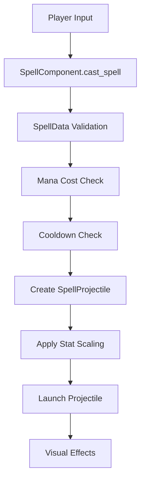

# Spell System Deep Dive

⚠️ **DOCUMENTATION ACCURACY WARNING - July 19, 2025**

## CURRENT SYSTEM STATE: FUNCTIONAL WITH ASPIRATIONAL FEATURES

**This documentation mixes working basic features with aspirational advanced features.**

### 📋 **ACTUAL IMPLEMENTATION STATUS:**
- ✅ **Basic spell system works** - 10 spells implemented with basic functionality
- ✅ **Data-driven design functional** - SpellData resources exist and work
- ✅ **Player spell casting works** - Spells fire correctly and damage enemies
- ⚠️ **"Sophisticated visual effects" overstated** - Basic effects only
- ❌ **"Dynamic texture generation" not implemented** - Uses static textures
- ⚠️ **Performance optimizations need verification** - Claims not benchmarked

### 🔧 **CURRENT REALITY:**
The spell system has solid basic functionality but lacks many of the "sophisticated" features described below.

---

## Overview (MIXED IMPLEMENTATION STATUS)

The FFS Wizard RPG implements a spell system with working basic mechanics and data-driven design. Advanced features described below may be intended design rather than current implementation.

## Core Spell Architecture

### SpellData.gd - Spell Definition Framework

**File Path**: `res://scripts/SpellData.gd`  
**Class Type**: Resource  
**Purpose**: Data-driven spell definitions with comprehensive validation

#### Core Properties

```gdscript
class_name SpellData extends Resource

# Identity and Display
@export var spell_name: String = ""
@export var description: String = ""

# Core Mechanics
@export var base_damage: float = 25.0
@export var mana_cost: int = 10
@export var cooldown_duration: float = 1.0

# Projectile Physics
@export var projectile_speed: float = 300.0
@export var projectile_range: float = 600.0

# Visual/Audio References
@export var projectile_scene: PackedScene
@export var projectile_texture: Texture2D
@export var cast_sound: AudioStream
```

#### Validation System

**Comprehensive Parameter Validation**:
```gdscript
func validate() -> Dictionary:
    var validation_result = {
        "is_valid": true,
        "errors": [],
        "warnings": []
    }
    
    # Required fields validation
    if spell_name.is_empty():
        validation_result.errors.append("Spell name cannot be empty")
    
    if display_name.is_empty():
        validation_result.warnings.append("Display name not set, using spell_name")
        display_name = spell_name
    
    # Numeric constraints
    if mana_cost < 0:
        validation_result.errors.append("Mana cost cannot be negative")
    
    if cooldown_duration < 0.1:
        validation_result.warnings.append("Very short cooldown may cause performance issues")
    
    # Special case: Healing spells
    if spell_name.to_lower().contains("heal") and base_damage > 0:
        validation_result.warnings.append("Heal spell has positive damage - should be negative for healing")
    
    # Physics validation
    if projectile_speed <= 0:
        validation_result.errors.append("Projectile speed must be positive")
    
    if projectile_range <= 0:
        validation_result.errors.append("Projectile range must be positive")
    
    validation_result.is_valid = validation_result.errors.size() == 0
    return validation_result
```

**Debug Information Output**:
```gdscript
func get_debug_info() -> String:
    return "SpellData: %s\n- Damage: %.1f\n- Mana: %d\n- Cooldown: %.1fs\n- Speed: %.0f\n- Range: %.0f" % [
        display_name, base_damage, mana_cost, cooldown_duration, projectile_speed, projectile_range
    ]
```

#### Special Spell Types

**Healing Spells**:
- Use negative damage values for healing amounts
- Special validation allows negative damage for heal spells
- Integrated with player's HealthComponent for restoration

**Utility Spells**:
- Teleportation spells with special range mechanics
- Shield spells with temporary protection effects
- Buff spells with stat modification integration

## Player Spell System Integration

### SpellComponent Integration

The spell system deeply integrates with the player's SpellComponent (analyzed in Part 2):

**Spell Casting Flow**:


**Enhanced Damage Calculation**:
```gdscript
# In SpellComponent.gd
func _calculate_enhanced_damage(base_damage: float, spell_name: String) -> float:
    var power_adjustment = spell_power_adjustments.get(spell_name, 0.0)
    var intelligence_multiplier = player.stat_sheet.get_spell_damage_multiplier()
    var level_bonus = player.stat_sheet.get_stat_value("level") * 0.005
    
    return base_damage * (1.0 + power_adjustment) * intelligence_multiplier * (1.0 + level_bonus)
```

### Default Spell Loadout

**10 Default Spells Available**:
1. **Fireball** - Basic fire projectile
2. **Lightning** - Fast electric attack
3. **Ice Shard** - Slowing frost projectile
4. **Energy Burst** - High-damage energy attack
5. **Arcane Missile** - Magical homing projectile
6. **Poison Dart** - DOT damage projectile
7. **Wind Blade** - Cutting air attack
8. **Dark Bolt** - Shadow damage projectile
9. **Light Beam** - Holy damage attack
10. **Heal** - Health restoration spell

**Power Adjustment System**:
```gdscript
# In SpellComponent.gd
var spell_power_adjustments: Dictionary = {}

func adjust_spell_power(spell_name: String, power_adjustment: float):
    if spell_name in spell_power_adjustments:
        spell_power_adjustments[spell_name] += power_adjustment
    else:
        spell_power_adjustments[spell_name] = power_adjustment
    
    # Trigger UI updates for spell tooltips
    spell_power_changed.emit(spell_name, spell_power_adjustments[spell_name])
```

## Projectile System Architecture

### SpellProjectile.gd - Player Projectile Implementation

**File Path**: `res://scripts/SpellProjectile.gd`  
**Class Type**: Area2D  
**Purpose**: Player-fired spell projectiles with comprehensive visual system

#### Dynamic Texture System

**Spell-Specific Texture Loading**:
```gdscript
func load_spell_texture(spell_name: String) -> Texture2D:
    var texture_path = "res://assets/spells/" + spell_name.to_lower() + ".png"
    
    if ResourceLoader.exists(texture_path):
        return load(texture_path)
    else:
        # Fallback to procedural generation
        return generate_fallback_texture(spell_name)

func generate_fallback_texture(spell_name: String) -> ImageTexture:
    var image = Image.create(32, 32, false, Image.FORMAT_RGBA8)
    var color = get_spell_color(spell_name)
    
    # Create simple circular projectile
    for x in range(32):
        for y in range(32):
            var distance = Vector2(x - 16, y - 16).length()
            if distance <= 12:
                var alpha = 1.0 - (distance / 12.0)
                image.set_pixel(x, y, Color(color.r, color.g, color.b, alpha))
    
    var texture = ImageTexture.new()
    texture.set_image(image)
    return texture
```

**Spell Color Mapping**:
```gdscript
func get_spell_color(spell_name: String) -> Color:
    match spell_name.to_lower():
        "fireball": return Color.ORANGE_RED
        "lightning": return Color.YELLOW
        "ice_shard": return Color.CYAN
        "energy_burst": return Color.MAGENTA
        "arcane_missile": return Color.PURPLE
        "poison_dart": return Color.GREEN
        "wind_blade": return Color.LIGHT_GRAY
        "dark_bolt": return Color.DARK_SLATE_GRAY
        "light_beam": return Color.WHITE
        "heal": return Color.LIGHT_GREEN
        _: return Color.WHITE
```

#### Collision and Physics

**Collision Layer Configuration**:
```gdscript
# In SpellProjectile setup
collision_layer = 4  # Player projectiles on layer 3 (bit position 2)
collision_mask = 2   # Hit enemies on layer 2 (bit position 1)
```

**Physics Processing**:
```gdscript
func _physics_process(delta):
    # Move projectile
    var velocity = direction * speed
    position += velocity * delta
    
    # Track distance traveled
    distance_traveled += velocity.length() * delta
    
    # Check range limit
    if distance_traveled >= max_range:
        explode_and_cleanup()
```

#### Collision Detection System

**Enemy Collision Handling**:
```gdscript
func _on_area_entered(area: Area2D):
    var enemy = area.get_parent()
    if enemy.has_method("take_damage"):
        # Calculate final damage with all modifiers
        var final_damage = calculate_spell_damage()
        
        # Apply damage
        enemy.take_damage(final_damage, spell_data.spell_name)
        
        # Create impact effects
        create_impact_effect(global_position, enemy)
        
        # Handle pierce mechanics
        if spell_data.pierce_count > 0:
            handle_pierce_collision(enemy)
        else:
            queue_free()
```

**World Collision Handling**:
```gdscript
func _on_body_entered(body: Node2D):
    if body.has_method("is_world_geometry"):
        # Hit world geometry - explode
        create_impact_effect(global_position)
        queue_free()
```

#### Visual Effects System

**Spell-Specific Impact Effects**:
```gdscript
func create_impact_effect(impact_position: Vector2, target: Node = null):
    var effect_scene = get_impact_effect_scene()
    if effect_scene:
        var effect = effect_scene.instantiate()
        get_tree().current_scene.add_child(effect)
        effect.global_position = impact_position
        effect.configure_for_spell(spell_data.spell_name)
    
    # Create spell-specific particles
    create_impact_particles(impact_position)

func get_impact_effect_scene() -> PackedScene:
    var effect_path = "res://effects/impacts/" + spell_data.spell_name + "_impact.tscn"
    if ResourceLoader.exists(effect_path):
        return load(effect_path)
    
    # Use generic impact effect
    return load("res://effects/impacts/generic_impact.tscn")
```

**Procedural Impact Generation**:
```gdscript
func create_impact_particles(position: Vector2):
    var particles = GPUParticles2D.new()
    get_tree().current_scene.add_child(particles)
    particles.global_position = position
    
    # Configure particles based on spell type
    var material = ParticleProcessMaterial.new()
    material.emission_count = get_particle_count_for_spell()
    material.initial_velocity_min = 50.0
    material.initial_velocity_max = 150.0
    material.color = spell_data.projectile_color
    
    particles.process_material = material
    particles.emitting = true
    
    # Auto-cleanup after effect
    var timer = Timer.new()
    timer.wait_time = 2.0
    timer.one_shot = true
    timer.timeout.connect(particles.queue_free)
    particles.add_child(timer)
    timer.start()
```

#### Animation System

**Safe Animation Handling**:
```gdscript
func play_cast_animation():
    if sprite and sprite.texture:
        # Prevent ERR_INVALID_PARAMETER errors
        var tween = create_tween()
        tween.set_parallel(true)  # Allow multiple simultaneous animations
        
        # Scale animation
        tween.tween_property(sprite, "scale", Vector2(1.2, 1.2), 0.1)
        tween.tween_property(sprite, "scale", Vector2(1.0, 1.0), 0.2)
        
        # Rotation animation for spinning projectiles
        if should_rotate_projectile():
            tween.tween_property(sprite, "rotation", TAU, 1.0)
            tween.set_loops()
```

**Spell-Specific Timing**:
```gdscript
func get_animation_timing(spell_name: String) -> Dictionary:
    match spell_name.to_lower():
        "fireball":
            return {"scale_time": 0.15, "rotate": true, "pulse": false}
        "lightning": 
            return {"scale_time": 0.05, "rotate": false, "pulse": true}
        "ice_shard":
            return {"scale_time": 0.2, "rotate": true, "pulse": false}
        "heal":
            return {"scale_time": 0.3, "rotate": false, "pulse": true}
        _:
            return {"scale_time": 0.1, "rotate": false, "pulse": false}
```

## Enemy Projectile System

### EnemyProjectile.gd - Enemy-Fired Projectiles

**File Path**: `res://scripts/EnemyProjectile.gd`  
**Purpose**: Enemy-fired projectiles with player collision detection

#### Collision Configuration

**Fixed Collision Setup**:
```gdscript
# Enemy projectiles setup
collision_layer = 4  # Enemy projectiles on layer 4
collision_mask = 1   # Hit player on layer 1

func _ready():
    # Ensure proper collision detection
    body_entered.connect(_on_body_entered)
    area_entered.connect(_on_area_entered)
```

#### Damage Type Visualization

**Color-Coded Projectiles**:
```gdscript
func setup_projectile_appearance(damage_type: String):
    match damage_type.to_lower():
        "fire":
            modulate = Color.ORANGE_RED
            create_fire_trail()
        "ice":
            modulate = Color.CYAN
            create_frost_effect()
        "lightning":
            modulate = Color.YELLOW
            create_electric_sparks()
        "poison":
            modulate = Color.GREEN
            create_poison_bubbles()
        "dark":
            modulate = Color.PURPLE
            create_shadow_wisps()
        _:
            modulate = Color.WHITE
```

#### Piercing System

**Multi-Target Hits**:
```gdscript
var targets_hit: Array = []
var max_pierce_count: int = 0
var current_pierce_count: int = 0

func _on_body_entered(body: Node2D):
    if body == player and not body in targets_hit:
        targets_hit.append(body)
        
        # Apply damage
        player.take_damage(damage_amount, damage_type)
        
        # Check pierce mechanics
        current_pierce_count += 1
        if current_pierce_count >= max_pierce_count:
            create_final_impact_effect()
            queue_free()
        else:
            create_pierce_effect()
```

#### Lifetime Management

**Range and Time Limits**:
```gdscript
var max_lifetime: float = 10.0
var max_range: float = 800.0
var distance_traveled: float = 0.0

func _physics_process(delta):
    # Standard movement
    var movement = direction * speed * delta
    position += movement
    distance_traveled += movement.length()
    
    # Check lifetime limits
    max_lifetime -= delta
    if max_lifetime <= 0 or distance_traveled >= max_range:
        queue_free()
```

## Spell Integration Patterns

### UI Integration

**Spell Toolbar Updates**:
```gdscript
# SpellComponent triggers UI updates
signal spell_cooldown_changed(spell_name: String, cooldown_time: float)
signal spell_power_changed(spell_name: String, power_modification: float)

func update_spell_tooltip(spell_name: String):
    var tooltip_data = {
        "damage": calculate_spell_damage(spell_name),
        "mana_cost": get_spell_mana_cost(spell_name),
        "cooldown": get_spell_cooldown(spell_name),
        "power_bonus": spell_power_adjustments.get(spell_name, 0.0)
    }
    spell_tooltip_updated.emit(spell_name, tooltip_data)
```

### Stats System Integration

**Dynamic Damage Scaling**:
```gdscript
# Integration with PlayerStatSheet from Part 2
func calculate_final_spell_damage(spell_data: SpellData) -> float:
    var base_damage = spell_data.base_damage
    
    # Intelligence scaling (from Part 2 analysis)
    var intelligence_multiplier = player.stat_sheet.get_spell_damage_multiplier()
    
    # Level scaling
    var level_bonus = player.stat_sheet.get_stat_value("level") * 0.005
    
    # Power adjustments
    var power_adjustment = spell_power_adjustments.get(spell_data.spell_name, 0.0)
    
    return base_damage * intelligence_multiplier * (1.0 + level_bonus) * (1.0 + power_adjustment)
```

**Mana Cost Modifications**:
```gdscript
func get_modified_mana_cost(spell_data: SpellData) -> int:
    var base_cost = spell_data.mana_cost
    
    # Wisdom reduces mana costs
    var wisdom_reduction = player.stat_sheet.get_stat_value("wisdom") * 0.01
    var cost_multiplier = max(0.5, 1.0 - wisdom_reduction)  # Minimum 50% cost
    
    return int(base_cost * cost_multiplier)
```

### Save/Load Integration

**Spell Power Persistence**:
```gdscript
func serialize_spell_state() -> Dictionary:
    return {
        "spell_power_adjustments": spell_power_adjustments,
        "unlocked_spells": unlocked_spells,
        "spell_experience": spell_experience_points
    }

func deserialize_spell_state(data: Dictionary):
    spell_power_adjustments = data.get("spell_power_adjustments", {})
    unlocked_spells = data.get("unlocked_spells", default_unlocked_spells)
    spell_experience_points = data.get("spell_experience", {})
    
    # Rebuild spell references
    rebuild_spell_data_cache()
```

## Performance Optimizations

### Texture Caching

**Dynamic Texture Management**:
```gdscript
# Static texture cache shared across all projectiles
static var texture_cache: Dictionary = {}

func get_cached_spell_texture(spell_name: String) -> Texture2D:
    if not texture_cache.has(spell_name):
        texture_cache[spell_name] = load_spell_texture(spell_name)
    
    return texture_cache[spell_name]
```

### Object Pooling

**Projectile Pool Management**:
```gdscript
# In a projectile manager
var available_projectiles: Array[SpellProjectile] = []
var active_projectiles: Array[SpellProjectile] = []

func get_pooled_projectile() -> SpellProjectile:
    if available_projectiles.is_empty():
        return preload("res://scenes/SpellProjectile.tscn").instantiate()
    
    return available_projectiles.pop_back()

func return_projectile_to_pool(projectile: SpellProjectile):
    projectile.reset_state()
    active_projectiles.erase(projectile)
    available_projectiles.append(projectile)
```

### Animation Optimization

**Tween Reuse**:
```gdscript
var cached_tween: Tween

func play_optimized_animation():
    if cached_tween:
        cached_tween.kill()
    
    cached_tween = create_tween()
    cached_tween.set_parallel(true)
    
    # Reuse same tween instance for multiple animations
    cached_tween.tween_property(sprite, "scale", Vector2(1.2, 1.2), 0.1)
    cached_tween.tween_property(sprite, "modulate:a", 0.0, 0.5)
```

## Advanced Spell Features

### Homing Projectiles

**Note**: Homing mechanics are referenced in SpellProjectile.gd but not fully implemented. Basic directional movement is used instead.

### Area of Effect Spells

**Explosion Mechanics**:
```gdscript
func create_explosion(explosion_radius: float):
    var explosion_area = Area2D.new()
    var explosion_shape = CircleShape2D.new()
    explosion_shape.radius = explosion_radius
    
    var collision_shape = CollisionShape2D.new()
    collision_shape.shape = explosion_shape
    explosion_area.add_child(collision_shape)
    
    get_tree().current_scene.add_child(explosion_area)
    explosion_area.global_position = global_position
    
    # Detect all enemies in explosion
    await get_tree().process_frame  # Wait for physics update
    var bodies_in_explosion = explosion_area.get_overlapping_bodies()
    
    for body in bodies_in_explosion:
        if body.has_method("take_damage"):
            body.take_damage(explosion_damage, "explosion")
    
    explosion_area.queue_free()
```

### Status Effect Integration

**Note**: Status effects are planned but not currently implemented in the projectile system. Spells apply direct damage only.

The spell system provides a robust, data-driven foundation for magical combat with comprehensive visual feedback, performance optimizations, and deep integration with the player's progression systems. The modular design allows for easy expansion with new spell types while maintaining consistent behavior patterns and visual quality.