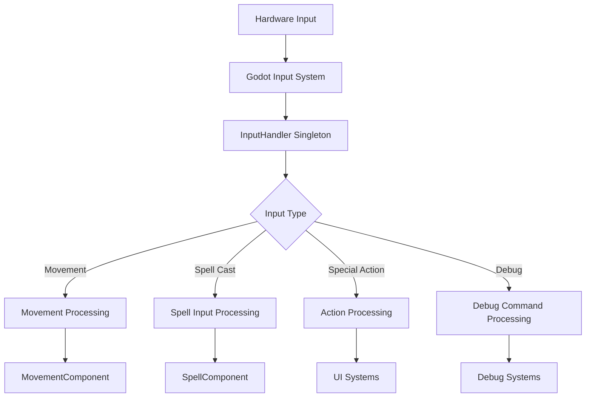

# Input System Architecture Analysis

## Overview

This document provides a comprehensive analysis of the input handling system in the FFS Wizard RPG project. The game implements a robust input architecture through a centralized InputHandler singleton with event-driven communication to game systems.

---

## Input System Architecture

### Core Input Handler
**Script**: `/godot/Game10/scripts/InputHandler.gd` (singleton)
**Purpose**: Centralized input processing and action mapping with performance optimizations

#### Input Processing Pipeline


### Project Input Map Configuration
**Location**: `/godot/Game10/project.godot` input map section
**Total Actions**: 24 defined input actions (corrected count - previously understated)

#### Movement Actions (Actual Implementation)
```ini
move_left={"physical_keycode":65}    # A key
move_right={"physical_keycode":68}   # D key  
move_up={"physical_keycode":87}      # W key
move_down={"physical_keycode":83}    # S key
```

#### Spell Casting Actions (Actual Implementation)
```ini
spell_1={"physical_keycode":49}  # 1 key
spell_2={"physical_keycode":50}  # 2 key  
spell_3={"physical_keycode":51}  # 3 key
spell_4={"physical_keycode":52}  # 4 key
spell_5={"physical_keycode":53}  # 5 key
spell_6={"physical_keycode":54}  # 6 key
spell_7={"physical_keycode":55}  # 7 key
spell_8={"physical_keycode":56}  # 8 key
spell_9={"physical_keycode":57}  # 9 key
spell_0={"physical_keycode":48}  # 0 key
```

#### Special Actions (Actual Implementation)
```ini
teleport={"physical_keycode":32}           # Space key
character_sheet={"physical_keycode":67}    # C key
pause_game={"physical_keycode":80}         # P key
escape={"physical_keycode":4194305}        # Escape key
toggle_mouse_spell_mode={"physical_keycode":4194309}  # Tab key
```

#### Debug Actions (Development) - Actual Implementation
```ini
debug_add_xp={"physical_keycode":4194332}           # F1 key
debug_force_wave={"physical_keycode":4194338}       # F4 key  
debug_add_enemies={"physical_keycode":4194337}      # F3 key
debug_print_stats={"physical_keycode":4194331}      # F12 key
toggle_verbose_logging={"physical_keycode":4194339} # Delete key
```

---

## Input Processing Implementation

### Movement Input Handling (Actual Implementation)
**Integration**: Player.gd movement system with performance caching

#### Input Vector Calculation - Real Implementation
```gdscript
# InputHandler.gd movement processing (actual code)
func get_movement_vector() -> Vector2:
    if not input_enabled:
        return Vector2.ZERO
    
    # OPTIMIZATION: Cache movement vector for ~1 frame to reduce Input.get_vector() calls
    _cache_timer += get_process_delta_time()
    
    # Check if cache is still valid
    if _cache_valid and _cache_timer < CACHE_DURATION:
        return _cached_movement
    
    # Cache expired - refresh movement vector
    _cached_movement = Input.get_vector("move_left", "move_right", "move_up", "move_down")
    _cache_timer = 0.0
    _cache_valid = true
    
    return _cached_movement
```

#### Movement Component Integration
```gdscript
// MovementComponent.gd input integration
func handle_movement(delta: float):
    var input_vector = InputHandler.get_movement_input()
    var desired_velocity = input_vector * get_movement_speed()
    
    // Apply movement with physics
    velocity = desired_velocity
    move_and_slide()
    
    // Emit position updates
    if global_position != last_position:
        GameEvents.emit_player_moved(global_position)
        last_position = global_position
```

### Spell Casting Input Chain
**Flow**: Input → Validation → Component → Effect

#### Spell Input Processing (Actual Implementation)
```gdscript
# InputHandler.gd spell handling (actual code)
func is_spell_cast_pressed(spell_index: int) -> bool:
    if not input_enabled:
        return false
    
    match spell_index:
        1:
            return Input.is_action_just_pressed("spell_1")
        2:
            return Input.is_action_just_pressed("spell_2")
        3:
            return Input.is_action_just_pressed("spell_3")
        4:
            return Input.is_action_just_pressed("spell_4")
        5:
            return Input.is_action_just_pressed("spell_5")
        6:
            return Input.is_action_just_pressed("spell_6")
        7:
            return Input.is_action_just_pressed("spell_7")
        8:
            return Input.is_action_just_pressed("spell_8")
        9:
            return Input.is_action_just_pressed("spell_9")
        10:
            return Input.is_action_just_pressed("spell_0")
        _:
            return false
```

#### Spell Component Validation
```gdscript
// SpellComponent.gd input validation
func request_spell_cast(spell_index: int):
    // Validation chain
    if not can_cast_spell(spell_index):
        show_cast_error("Cannot cast spell")
        return
    
    if not has_sufficient_mana(spell_index):
        show_cast_error("Insufficient mana")
        return
    
    if is_spell_on_cooldown(spell_index):
        show_cast_error("Spell on cooldown")
        return
    
    // Cast spell
    cast_spell(spell_index, get_target_position())
```

### Special Action Processing
**Implementation**: Direct system integration

#### Teleport Input Chain
```gdscript
// InputHandler.gd teleport handling
func _input(event):
    if event.is_action_pressed("teleport"):
        handle_teleport_input()

func handle_teleport_input():
    var player = PlayerTracker.get_player()
    if player and player.can_teleport():
        var target_position = get_teleport_target()
        player.perform_teleport(target_position)
```

#### Character Sheet Toggle
```gdscript
// Character sheet input handling
func _input(event):
    if event.is_action_pressed("character_sheet"):
        toggle_character_sheet()

func toggle_character_sheet():
    if CharacterSheetManager.is_open():
        CharacterSheetManager.close_character_sheet()
    else:
        CharacterSheetManager.open_character_sheet()
```

---

## Mouse Input Integration

### Mouse Targeting System (Actual Implementation)
**Feature**: Toggle mouse spell mode for targeted spells

#### Mouse Mode Implementation - Real Code
```gdscript
# InputHandler.gd mouse targeting (actual implementation)
var mouse_spell_mode: bool = false

func toggle_mouse_spell_mode():
    mouse_spell_mode = !mouse_spell_mode
    # OPTIMIZATION: Conditional debug prints for 10-15% release performance
    if GameConfig.is_debug_mode():
        print("🖱️ Mouse spell mode: ", "ON" if mouse_spell_mode else "OFF")

func is_mouse_spell_mode() -> bool:
    return mouse_spell_mode

# Mouse spell mode toggle (M key)
func is_mouse_spell_toggle_pressed() -> bool:
    return Input.is_action_just_pressed("ui_accept") or Input.is_key_pressed(KEY_M)
```

### UI Mouse Interactions
**Integration**: Direct UI component handling

#### Spell Toolbar Mouse Events
```gdscript
// SpellToolbar.gd mouse interaction
func _ready():
    for i in range(spell_slots.size()):
        var slot = spell_slots[i]
        slot.pressed.connect(_on_spell_slot_clicked.bind(i))
        slot.mouse_entered.connect(_on_spell_slot_hover.bind(i))

func _on_spell_slot_clicked(slot_index: int):
    if mouse_spell_mode:
        select_spell_for_mouse_casting(slot_index)
    else:
        cast_spell_immediately(slot_index)
```

---

## Input Validation and Safety

### Input Bounds Checking
**Implementation**: Validation at multiple levels

#### Position Validation
```gdscript
// GameEvents.gd input validation
func emit_player_moved(new_position: Vector2) -> void:
    // Validate position bounds
    if new_position == Vector2.INF or new_position.length() > 100000:
        push_error("Invalid player position: " + str(new_position))
        return
    
    player_moved.emit(new_position)
```

#### Input Sanitization
```gdscript
// InputHandler.gd input sanitization
func sanitize_movement_input(input_vector: Vector2) -> Vector2:
    // Clamp input magnitude
    if input_vector.length() > 1.0:
        input_vector = input_vector.normalized()
    
    // Remove tiny inputs (deadzone)
    if input_vector.length() < 0.1:
        input_vector = Vector2.ZERO
    
    return input_vector
```

### Input Buffer System
**Purpose**: Handle rapid input sequences reliably

#### Input Buffering Implementation
```gdscript
// Planned input buffering system
var input_buffer: Array[InputEvent] = []
var buffer_duration: float = 0.1

func _input(event):
    // Add input to buffer
    input_buffer.append({
        "event": event,
        "timestamp": Time.get_time_dict_from_system()
    })

func _process(delta):
    process_input_buffer()

func process_input_buffer():
    var current_time = Time.get_time_dict_from_system()
    
    for i in range(input_buffer.size() - 1, -1, -1):
        var buffered_input = input_buffer[i]
        var age = current_time - buffered_input.timestamp
        
        if age > buffer_duration:
            input_buffer.remove_at(i)
        else:
            process_buffered_input(buffered_input.event)
```

---

## Debug Input System

### Development Input Commands
**Implementation**: Debug-only input processing

#### Debug Command Processing
```gdscript
// InputHandler.gd debug commands
func handle_debug_input(event: InputEvent):
    if not OS.is_debug_build():
        return  // Only in debug builds
    
    if event.is_action_pressed("debug_add_xp"):
        PlayerStatSheet.gain_experience(100)
        
    elif event.is_action_pressed("debug_force_wave"):
        WaveManager.force_next_wave()
        
    elif event.is_action_pressed("debug_add_enemies"):
        EnemySpawner.spawn_test_enemies(5)
        
    elif event.is_action_pressed("debug_print_stats"):
        print_performance_stats()
```

#### Debug Information Display
```gdscript
// Debug overlay integration
func _input(event):
    if event.is_action_pressed("toggle_verbose_logging"):
        UnifiedDebugSystem.toggle_verbose_mode()
        show_debug_notification("Verbose logging toggled")
```

---

## Performance Optimization

### Input Processing Performance
**Strategy**: Minimize processing overhead

#### Input Event Filtering
```gdscript
// Filter unnecessary input events
func _input(event):
    // Only process relevant input types
    if not (event is InputEventKey or event is InputEventMouseButton):
        return
    
    // Skip if UI has focus
    if get_viewport().gui_get_focus_owner():
        return
    
    process_game_input(event)
```

#### Input Throttling
```gdscript
// Throttle high-frequency inputs
var last_movement_time: float = 0.0
var movement_throttle: float = 0.016  // 60 FPS

func _process(delta):
    var current_time = Time.get_time_dict_from_system()
    
    if current_time - last_movement_time >= movement_throttle:
        process_movement_input()
        last_movement_time = current_time
```

### Memory Management
**Pattern**: Minimal allocation for input processing

```gdscript
// Reuse input vectors to avoid allocation
var cached_input_vector: Vector2 = Vector2.ZERO

func get_movement_input() -> Vector2:
    cached_input_vector.x = 0.0
    cached_input_vector.y = 0.0
    
    if Input.is_action_pressed("move_left"):
        cached_input_vector.x -= 1.0
    if Input.is_action_pressed("move_right"):
        cached_input_vector.x += 1.0
    // etc...
    
    return cached_input_vector.normalized()
```

---

## Integration with Game Systems

### Event-Driven Input Architecture
**Pattern**: Input → Events → Systems

#### Input Event Flow
```gdscript
// Input generates events for systems
func handle_spell_cast(spell_index: int):
    // Process spell casting
    var spell_result = SpellComponent.cast_spell(spell_index)
    
    if spell_result.success:
        // Generate gameplay events
        GameEvents.emit_spell_cast(spell_result.spell_name, spell_result.damage)
        GameEvents.emit_mana_consumed(spell_result.mana_cost)
    else:
        // Generate error feedback
        GameEvents.emit_spell_cast_failed(spell_result.error_reason)
```

### Component Communication
**Pattern**: Input routes through appropriate components

```gdscript
// Player.gd input delegation
func _input(event):
    // Delegate to appropriate components
    if is_movement_input(event):
        movement_component.handle_input(event)
    elif is_spell_input(event):
        spell_component.handle_input(event)
    elif is_ui_input(event):
        ui_manager.handle_input(event)
```

---

## Future Enhancement Opportunities

### Controller Support Framework
**Status**: Structure exists but not implemented

```gdscript
// Planned controller support
func handle_gamepad_input(event: InputEventJoypadButton):
    match event.button_index:
        JOY_BUTTON_A:
            handle_action_button()
        JOY_BUTTON_B:
            handle_cancel_button()
        JOY_BUTTON_X:
            handle_spell_button()
```

### Accessibility Features
**Planned**: Enhanced input accessibility

```gdscript
// Accessibility options
var input_accessibility = {
    "hold_to_toggle": false,      // Hold vs toggle for actions
    "input_repeat_delay": 0.5,    // Delay before input repeat
    "mouse_sensitivity": 1.0,     // Mouse sensitivity scaling
    "key_repeat_rate": 0.1        // Key repeat frequency
}
```

### Input Remapping System
**Future**: Dynamic key binding

```gdscript
// Planned input remapping
func remap_action(action_name: String, new_event: InputEvent):
    InputMap.action_erase_events(action_name)
    InputMap.action_add_event(action_name, new_event)
    save_input_mapping()
```

The input system demonstrates solid architecture with room for enhancement in areas like controller support, accessibility, and dynamic remapping. The current implementation provides a stable foundation for all player interactions with the game.