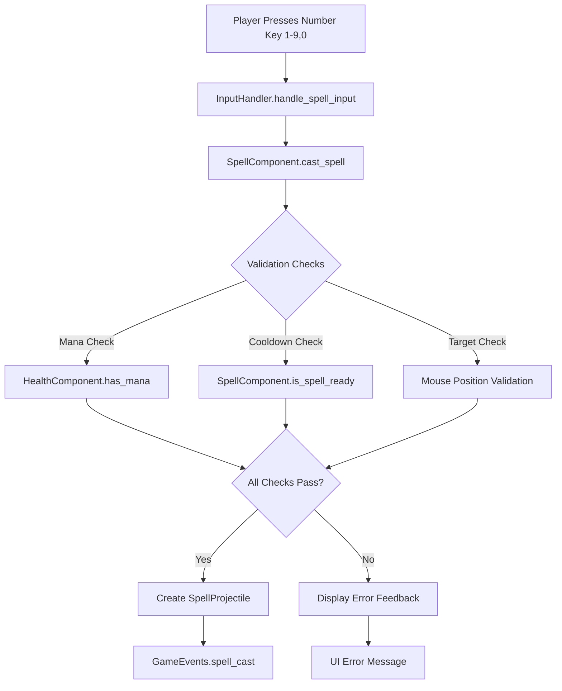
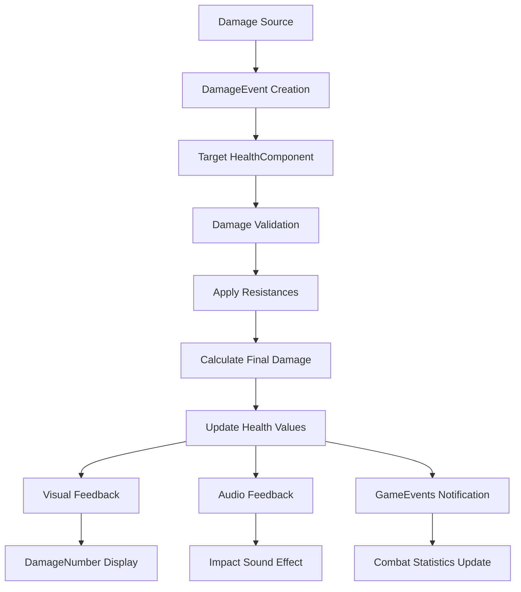

# Interaction Systems

## Overview

This document maps all interaction systems in the FFS Wizard RPG, including player input handling, collision interactions, trigger zones, combat mechanics, and UI interactions. The analysis covers the complete interaction matrix and system integration patterns.

---

## Player Input to Action Mapping

### Core Input System
**Handler**: `/godot/Game10/scripts/InputHandler.gd` (singleton)  
**Configuration**: `/godot/Game10/project.godot` input map section

#### Movement Input Mapping (Actual Implementation)
```gdscript
# Actual input map configuration from project.godot
move_left={"physical_keycode":65}    # A key
move_right={"physical_keycode":68}   # D key  
move_up={"physical_keycode":87}      # W key
move_down={"physical_keycode":83}    # S key

# InputHandler.gd processing (actual implementation)
func get_movement_vector() -> Vector2:
    if not input_enabled:
        return Vector2.ZERO
    
    # OPTIMIZATION: Cache movement vector for ~1 frame
    _cache_timer += get_process_delta_time()
    
    if _cache_valid and _cache_timer < CACHE_DURATION:
        return _cached_movement
    
    # Use Godot's built-in Input.get_vector() for normalized diagonal movement
    _cached_movement = Input.get_vector("move_left", "move_right", "move_up", "move_down")
    _cache_timer = 0.0
    _cache_valid = true
    
    return _cached_movement
```

#### Spell Casting Input Chain


#### Special Action Mapping (Actual Implementation)
```gdscript
# Special abilities and menus (from project.godot)
teleport={"physical_keycode":32}           # Space key
character_sheet={"physical_keycode":67}    # C key
pause_game={"physical_keycode":80}         # P key
escape={"physical_keycode":4194305}        # Escape key
toggle_mouse_spell_mode={"physical_keycode":4194309}  # Tab key

# Debug controls (development)
debug_add_xp={"physical_keycode":4194332}           # F1 key
debug_force_wave={"physical_keycode":4194338}       # F4 key
debug_add_enemies={"physical_keycode":4194337}      # F3 key
debug_print_stats={"physical_keycode":4194331}      # F12 key
toggle_verbose_logging={"physical_keycode":4194339} # Delete key
```

---

## Collision Interaction Matrix

### Physics Layer Configuration (Actual Implementation)
**System**: Godot Physics2D with 4-layer collision system from `/godot/Game10/project.godot`

#### Layer Names (Verified from project.godot)
```ini
[layer_names]
2d_physics/layer_1="player"      # Player character collision
2d_physics/layer_2="enemies"     # Enemy collision layer  
2d_physics/layer_3="projectiles" # Spell/projectile layer
2d_physics/layer_4="environment" # World/terrain collision
```

#### Layer Interaction Matrix
```
           Player(1)  Enemies(2)  Projectiles(3)  Environment(4)
Player(1)      ❌        ✅           ❌             ✅
Enemies(2)     ✅        ❌           ❌             ✅  
Projectiles(3) ✅        ✅           ❌             ✅
Environment(4) ✅        ✅           ✅             ❌
```

#### Collision Processing Examples

##### Player-Enemy Collision
**Handler**: `/godot/Game10/scripts/entities/Player.gd`
```gdscript
func _on_damage_receiver_body_entered(body):
    if body.is_in_group("enemies"):
        handle_enemy_collision(body)

func handle_enemy_collision(enemy: Node2D):
    if contact_damage_immunity_timer <= 0:
        var contact_damage = enemy.get_contact_damage()
        take_contact_damage(contact_damage, enemy.name)
        
        # Apply immunity period
        contact_damage_immunity_timer = contact_damage_immunity
        
        # Visual feedback
        GameEvents.emit_screen_shake(0.2, 3.0)
        player_visuals.flash_damage_color()
```

##### Projectile-Enemy Collision (Actual Implementation)
**Handler**: `/godot/Game10/scripts/SpellProjectile.gd`
```gdscript
# Actual implementation from SpellProjectile.gd
func _on_body_entered(body):
    if body.is_in_group("enemies"):
        # Apply damage to enemy
        if body.has_method("take_damage"):
            body.take_damage(damage)
            
        # Create damage number
        if not damage_number_created:
            create_damage_number(body.global_position)
            damage_number_created = true
        
        # Cleanup
        queue_free()

# Collision setup in _ready()
func _ready():
    collision_layer = 4  # Layer 3 = Projectiles, bitmask value = 4
    collision_mask = 2   # Hit enemies(2) only - no self damage
    
    # Connect collision signals
    if not body_entered.is_connected(_on_body_entered):
        body_entered.connect(_on_body_entered)
```

##### Environment Collision
**Handler**: All entities respect environment boundaries
```gdscript
# Movement component boundary checking
func handle_movement(delta: float):
    var new_velocity = calculate_desired_velocity()
    
    # Environment collision handled by CharacterBody2D
    velocity = new_velocity
    move_and_slide()
    
    # Check for world boundaries
    if global_position.length() > world_boundary_radius:
        global_position = global_position.normalized() * world_boundary_radius
```

---

## Trigger Zones and Effects

### Area2D Trigger System
**Base Pattern**: All trigger zones extend Area2D with standardized signal handling

#### XP Orb Collection Trigger (Actual Implementation)
**Script**: `/godot/Game10/scripts/items/XPOrb.gd`
```gdscript
# Actual pickup implementation from XPOrb.gd
@export var xp_value: int = 10
@export var magnet_range: float = 150.0
@export var magnet_speed: float = 400.0

var can_pickup: bool = false
var target_player: Node2D = null

func _ready():
    body_entered.connect(_on_body_entered)
    pickup_timer.timeout.connect(_on_pickup_timer_timeout)
    
    # Spawn and floating animations
    scale = Vector2(0.5, 0.5)
    var tween = create_tween()
    tween.tween_property(self, "scale", Vector2(1.0, 1.0), 0.3)

func _physics_process(delta):
    if not can_pickup:
        return
    
    # Magnet effect - move toward player
    var player = get_player_in_range()
    if player:
        var direction = (player.global_position - global_position).normalized()
        global_position += direction * magnet_speed * delta
```

#### Spell Area Effects
**Implementation**: Dynamic Area2D creation for AOE spells
```gdscript
# SpellComponent.gd AOE spell implementation
func create_aoe_spell(spell_data: SpellData, center_position: Vector2):
    var aoe_area = Area2D.new()
    var collision_shape = CollisionShape2D.new()
    var circle_shape = CircleShape2D.new()
    
    circle_shape.radius = spell_data.aoe_radius
    collision_shape.shape = circle_shape
    aoe_area.add_child(collision_shape)
    
    aoe_area.body_entered.connect(_on_aoe_body_entered.bind(spell_data))
    get_tree().current_scene.add_child(aoe_area)
    aoe_area.global_position = center_position
    
    # Auto-cleanup after spell duration
    var timer = Timer.new()
    timer.wait_time = spell_data.duration
    timer.one_shot = true
    timer.timeout.connect(aoe_area.queue_free)
    aoe_area.add_child(timer)
    timer.start()
```

### Environmental Triggers
**Implementation**: Biome-based environmental effects

#### Biome Transition Triggers
```gdscript
# BiomeService.gd environmental interaction
func check_biome_effects(player_position: Vector2):
    var current_biome = get_biome_at_position(player_position)
    var previous_biome = player_previous_biome
    
    if current_biome != previous_biome:
        trigger_biome_transition(previous_biome, current_biome)
        apply_biome_effects(current_biome)

func apply_biome_effects(biome: String):
    match biome:
        "fire_caves":
            # Heat damage over time
            GameEvents.emit_environmental_damage(5.0, "heat")
        "ice_fields":
            # Movement speed reduction
            GameEvents.emit_movement_modifier(-0.3, "cold")
        "poison_swamps":
            # Poison damage over time
            GameEvents.emit_status_effect("poison", 10.0)
```

---

## Interactive Object Patterns

### Interactable Base Pattern
**Future Enhancement**: Standardized interaction system

#### Proposed Interaction Interface
```gdscript
# Planned interaction system
extends Area2D
class_name InteractableObject

signal interaction_available(interactable)
signal interaction_unavailable(interactable)
signal interacted(interactable, player)

@export var interaction_prompt: String = "Press E to interact"
@export var interaction_range: float = 50.0
@export var requires_facing: bool = false

func _ready():
    body_entered.connect(_on_player_entered_range)
    body_exited.connect(_on_player_exited_range)

func _on_player_entered_range(body):
    if body.is_in_group("player"):
        if can_interact(body):
            show_interaction_prompt()
            interaction_available.emit(self)

func interact(player: Node):
    # Override in specific interactable objects
    pass
```

### Current Interactive Elements

#### Spell Toolbar Interaction (Actual Implementation)
**Script**: `/godot/Game10/scripts/ui/SpellToolbar.gd`
```gdscript
# Actual implementation from SpellToolbar.gd
extends Control
class_name SpellToolbar

# Configuration (actual exported properties)
@export var slot_count: int = 10
@export var slot_size: Vector2 = Vector2(64, 64)
@export var slot_spacing: int = 8
@export var show_keybinds: bool = true
@export var show_cooldowns: bool = true
@export var show_mana_cost: bool = true

# UI Elements
@onready var toolbar_container: HBoxContainer = $ToolbarContainer
@onready var spell_slots: Array[SpellSlot] = []

func _ready():
    # Get references
    input_handler = get_node_or_null("/root/InputHandler")
    if not input_handler:
        print("⚠️ SpellToolbar: InputHandler not found at /root/InputHandler")
    else:
        print("✅ SpellToolbar: InputHandler connected successfully")
```

#### Character Sheet Interaction
**Script**: `scripts/ui/DraggableCharacterSheet.gd`
```gdscript
# Stat allocation interaction
func _on_stat_increase_button_pressed(stat_name: String):
    if PlayerStatSheet.available_stat_points > 0:
        PlayerStatSheet.allocate_stat_point(stat_name)
        update_stat_displays()
        play_stat_allocation_feedback()

func _on_stat_hover(stat_name: String):
    show_stat_tooltip(stat_name)
    highlight_affected_computed_stats(stat_name)
```

---

## Combat/Damage Systems

### Damage Calculation Pipeline
**Primary Handler**: Component-based damage system

#### Damage Processing Flow


#### Spell Damage Calculation
**Script**: `scripts/components/SpellComponent.gd`
```gdscript
func calculate_spell_damage(base_damage: float) -> float:
    var stat_sheet = get_player_stat_sheet()
    if not stat_sheet:
        return base_damage
    
    # Base damage modified by intelligence
    var spell_power = stat_sheet.get_computed_stat_value("spell_damage_multiplier")
    var final_damage = base_damage * spell_power * spell_power_modifier
    
    # Apply any active spell power buffs
    final_damage *= get_active_spell_power_multiplier()
    
    return final_damage

func get_active_spell_power_multiplier() -> float:
    # Check for temporary spell power bonuses
    var multiplier = 1.0
    
    # Level-based spell power bonus
    var player_level = PlayerStatSheet.current_level
    multiplier += (player_level - 1) * 0.02  # 2% per level
    
    return multiplier
```

#### Enemy Damage Processing
**Script**: `scripts/Enemy.gd`
```gdscript
func take_damage(amount: float, source: String):
    if health_component:
        # Apply wave scaling resistance
        var wave_defense = 1.0 + (WaveManager.current_wave - 1) * 0.05
        var reduced_damage = amount / wave_defense
        
        health_component.take_damage(reduced_damage)
        
        # Combat feedback
        create_damage_number(reduced_damage)
        play_hit_animation()
        
        # Check for death
        if health_component.current_health <= 0:
            handle_death()
```

### Status Effect System
**Current**: Basic implementation  
**Future**: Enhanced status effect framework

#### Planned Status Effect Architecture
```gdscript
class_name StatusEffect
extends Resource

@export var effect_name: String
@export var duration: float
@export var tick_interval: float = 1.0
@export var stacks_count: int = 1
@export var max_stacks: int = 1

# Status effect types
enum EffectType {
    DAMAGE_OVER_TIME,
    HEAL_OVER_TIME,
    STAT_MODIFIER,
    MOVEMENT_MODIFIER,
    CUSTOM
}

func apply_effect(target: Node):
    # Override in specific status effects
    pass

func tick_effect(target: Node):
    # Called every tick_interval
    pass
```

---

## Dialogue/Conversation Triggers

### Current Implementation
**Status**: No dialogue system currently implemented  
**Future Enhancement**: NPC interaction system

#### Planned Dialogue Architecture
```gdscript
class_name DialogueSystem
extends Node

signal dialogue_started(npc_name: String)
signal dialogue_ended()
signal dialogue_choice_made(choice_index: int)

func start_dialogue(npc: Node, dialogue_data: DialogueData):
    current_dialogue = dialogue_data
    current_npc = npc
    display_dialogue_ui()
    dialogue_started.emit(npc.name)

func process_dialogue_choice(choice_index: int):
    var choice = current_dialogue.get_choice(choice_index)
    dialogue_choice_made.emit(choice_index)
    
    if choice.has_consequence():
        apply_dialogue_consequence(choice)
    
    if choice.leads_to_next():
        advance_dialogue(choice.next_dialogue_id)
    else:
        end_dialogue()
```

---

## UI Interaction Patterns

### Menu Navigation System
**Pattern**: Consistent button interaction across all menus

#### Standard Menu Interaction
```gdscript
# Common pattern across all menu scripts
func _ready():
    setup_button_connections()
    setup_hover_effects()
    setup_keyboard_navigation()

func setup_button_connections():
    for button in get_menu_buttons():
        button.pressed.connect(_on_button_pressed.bind(button.name))
        button.mouse_entered.connect(_on_button_hover.bind(button))
        button.focus_entered.connect(_on_button_focus.bind(button))

func _on_button_hover(button: Button):
    play_hover_sound()
    animate_button_hover(button)

func _on_button_pressed(button_name: String):
    play_click_sound()
    animate_button_press(button_name)
    handle_button_action(button_name)
```

### Drag and Drop System
**Implementation**: Character sheet stat allocation

#### Draggable Component Pattern
```gdscript
# DraggableCharacterSheet.gd interaction
func _gui_input(event):
    if event is InputEventMouseButton:
        if event.button_index == MOUSE_BUTTON_LEFT:
            if event.pressed:
                start_dragging(event.position)
            else:
                stop_dragging()
    
    elif event is InputEventMouseMotion and is_dragging:
        update_drag_position(event.relative)

func start_dragging(start_pos: Vector2):
    is_dragging = true
    drag_offset = start_pos
    modulate = Color(1, 1, 1, 0.8)  # Semi-transparent while dragging

func stop_dragging():
    is_dragging = false
    modulate = Color.WHITE
    snap_to_valid_position()
```

### Hover and Tooltip System
**Implementation**: Spell slot tooltips and stat previews

```gdscript
# Tooltip system for UI elements
func _on_mouse_entered():
    if assigned_spell:
        var tooltip_text = create_spell_tooltip(assigned_spell)
        TooltipManager.show_tooltip(tooltip_text, global_position)

func create_spell_tooltip(spell: SpellData) -> String:
    var tooltip = "Spell: " + spell.spell_name + "\n"
    tooltip += "Damage: " + str(spell.damage) + "\n"
    tooltip += "Mana Cost: " + str(spell.mana_cost) + "\n"
    tooltip += "Cooldown: " + str(spell.cooldown) + "s"
    return tooltip

func _on_mouse_exited():
    TooltipManager.hide_tooltip()
```

---

## Performance Interaction Optimizations

### Input Buffering System
**Purpose**: Handle rapid input sequences reliably

```gdscript
# InputHandler.gd input buffering
var input_buffer: Array[InputEvent] = []
var buffer_duration: float = 0.1

func _input(event):
    # Add input to buffer for processing
    input_buffer.append({
        "event": event,
        "timestamp": Time.get_time_dict_from_system()
    })

func _process(delta):
    process_input_buffer()

func process_input_buffer():
    var current_time = Time.get_time_dict_from_system()
    
    for i in range(input_buffer.size() - 1, -1, -1):
        var buffered_input = input_buffer[i]
        var age = current_time - buffered_input.timestamp
        
        if age > buffer_duration:
            input_buffer.remove_at(i)
        else:
            process_buffered_input(buffered_input.event)
```

### Interaction Culling
**Purpose**: Limit interaction processing based on distance and relevance

```gdscript
# Optimize interaction checking based on player distance
func _process(delta):
    var player_position = PlayerTracker.get_player_position()
    var distance_to_player = global_position.distance_squared_to(player_position)
    
    # Only process interactions for nearby objects
    if distance_to_player < interaction_range_squared:
        process_interactions()
    else:
        # Disable interaction processing for distant objects
        set_process(false)
        # Re-enable when player comes closer (handled by area detection)
```

This comprehensive interaction mapping demonstrates a well-structured interaction system with clear separation between input handling, collision processing, UI interactions, and combat mechanics, providing multiple layers of player engagement and system feedback.